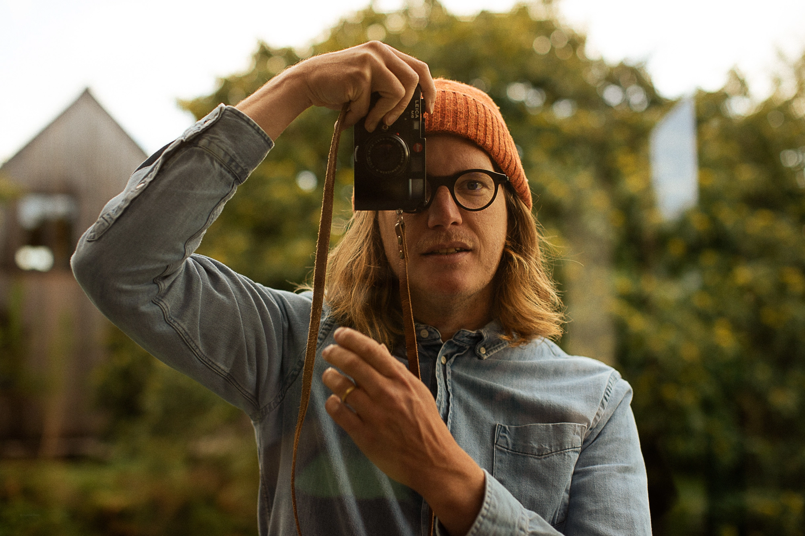
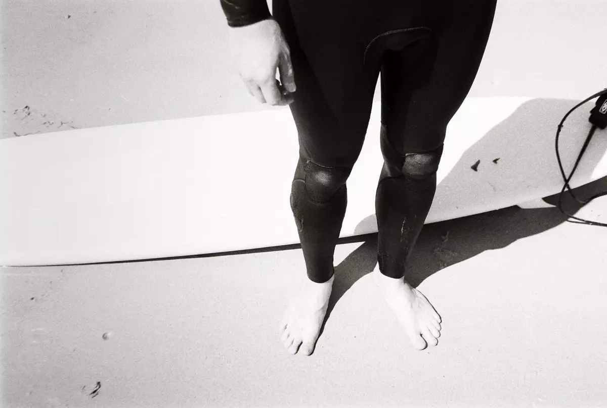

I am a **documentary style photographer** living in Finistère, France.

Feel free to contact me at [hello@yannickschutz.com](mailto:hello@yannickschutz.com). 

I really enjoy **telling stories and capturing moments of life.**  

If you are looking for me, you'll probably find me brewing a cup of black coffee, surfing some mellow waves, capturing moments on film or spending some quality time with the family.

We launched an amazing project with Cloé. You should take a look at [@douarenn](https://instagram.com/douarenn) or visit [douarenn.fr](https://douarenn.fr). This is our cabin, disconnected from the internets in the middle of Finistère, in a place called "les Monts d'Arrée". 

---

This website has so much [more](/more) in it than what you see in the menu. 
Feel free to browse and see what I am doing [now](/now)

## Photography

Current gear:
- Leica M10-P
- [Leica M6](/leica-m6)
- A small Contax T3
- [Nikonos V](/nikonos-v) with a 35mm

I send most of my films to [Malvarrosa Film Lab](https://malvarrosafilmlab.com/). They are great and have a really good service.

## Surf

I started taking [pictures in the water](/nikonos-glaz) with some fins and a Nikonos. Salty water is my favorite kind of drug. I got my first longboard shaped by [Mimosa](https://mimosa-surfboards.com). It is a beauty. But I am still a kook. But at least a kook with a damn good looking board. I try to avoid Neoprene and prefer Yulex

## Coffee

I love a good cup of coffee. Using v60, Kalita or aeropress. My heart says stop but I keep drinking it. We got an espresso machine cause it is hard to get a good flat white around here but my latte art sucks.

## Writing

I am writing a [small letter in french](/bonjour) about all and nothing every two weeks. It is quite delightful. It forces me to write on a regular basis. I don't have many readers but they respond to those letters. So that makes me happy.

## Favorites

📷 → Negatives get developed and scanned mostly by [Malvarrosa Film Lab](https://malvarrosafilmlab.com).

☕️ → Most of my coffee beans comes from [Miche Coffee](https://michecoffee.com) & [Horizon Café](https://www.instagram.com/horizoncafe.nantes/), a cave à café. But I still like to try new roasters from time to time. Looking for suggestions

🖨 → Prints come from [Ooblik](https://ooblik.com) & [Négatif+](https://negatifplus.com). I soldout [my first zine](/shop/a-thousand-tides) with [Ex Why Zed](https://exwhyzed.co.uk) but you can find other fun stuff I printed on the [shop](/shop).

## Colophon

This is a static website built with [Hugo](https://gohugo.io). Hosting is provided by [Vercel](https://vercel.co). Optimized with my own two hands and a lot of patience. The source of it lives on [GitHub](https://github.com/ys/bonjour). Images are optimised by a GitHub Action from [Calibre](https://calibreapp.com/blog/compress-images-in-prs).

Most of the content is copyrighted but open to discussion if you wanna re-use some of it.

**Contact:** [hello@yannickschutz.com](mailto://hello@yannickschutz.com)

