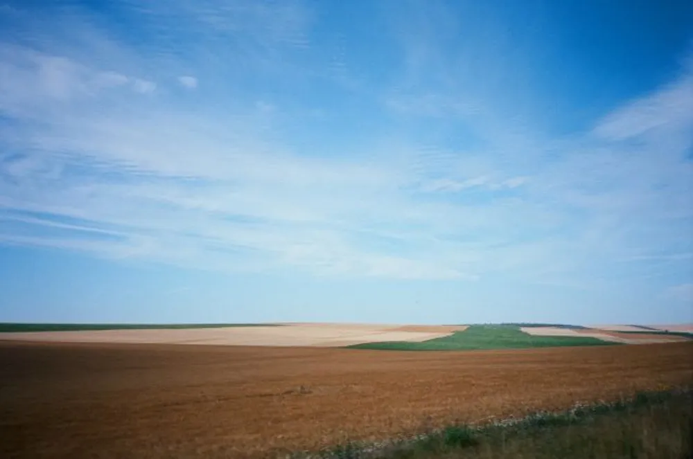

---
categories:
- lettre
letter: "bonjouryannick"
date: 2020-10-10T00:00:00Z
newsletter: true
resources:
  - src: "*.webp"
tags:
- la lettre
emoji: 💌
color: red

title: "1 - Bonjour, Pedro's bay et l'utopie"
slug: "1"
description: "C'est une première, un retour aux choses simples. Une envie d'écrire, une envie de partager."
---

Bonjour,

C'est une première, un retour aux choses simples. Une envie d'écrire, une envie de partager. Je ne sais pas vraiment où je vais mais ce qui a bien, c'est que vous y venez avec moi. J'ai recommencé cette année à écrire des longs mails à des potes. Quand tu bouges dans le centre Finistère depuis la Belgique, en fait tu es plutôt loin. Puis y'a eu le confinement cette année qui a encore réduit le nombre de gens que l'on croisait. On finissait par saluer les vaches en balade. 

Alors je me suis dit, pourquoi ne pas écrire des petites cartes postales et les envoyer comme des bouteilles à la mer. J'avais envie de parler de ces quelques choses que je lis, que je vois et que je croise. Juste pouvoir partager mes humeurs aussi. J'avais envie d'envoyer plus qu'un emoji dans une bulle verte ou bleue. Et puis tu te demandes si cela vaut la peine. Et puis, tu te dis juste fais le.

Alors voilà, Bienvenue dans ma petite carte numérique! Pas digitale.
 

* * *

Cette semaine, j'ai maté une assez chouette [vidéo de Vissla](https://www.youtube.com/watch?v=DAFwpaCPXIw), Pedro's Bay. Comme vous le savez peut-être, je suis plutôt à fond sur l'océan ces derniers temps. On surfe chaque week-end avec Tom dans les eaux froides de Bretagne. Donc je mate plus de vidéos de gens dans l'eau salée.

J'ai aussi adoré dans cette vidéo le livre et sa couverture. Ce genre de détail me fait aimer une vidéo
 

* * *

Je lis pas mal de bouquins de manière générale et ces derniers temps, je ne sais plus trop quoi lire. Enfin, ça c'était avant de voir [Rebel Book Club](https://rebelbook.club) et ils ont un paquet de [supers lectures](https://rebelbook.club/library/)! 

Là j'ai commencé [Utopia for Realists](https://www.librairiesindependantes.com/product/9781408893210/) et pour le moment, le livre délivre bien! Je finis les passages sur le revenu universel et comment réduire ou anéantir la pauvreté dans le monde. Basé sur pas mal d'études, beaucoup de références et une écriture qui passe bien. C'est clairement un cocktail qui marche chez moi.

Je pense alterner entre fictions francophones et bouquins anglais sur des sujets variés.
 

* * *

Cela fait un moment que je suis [Damien Aresta](https://damien.cool). Je lui pique ses idées d'ailleurs. Cette newsletter, ses vannes pourries, etc. Mais aussi sa page [now](https://damien.cool/now).

Le concept est simple, tu écris juste sur ce qui t'arrive en ce moment, quelles sont les choses qui occupent ton esprit et tes mains en ce moment. Étant plutôt changeant, cela me permet de ne pas simplement me définir sur un temps indéfini mais bien de dater la définition. Ma famille sait que les passions vont et viennent chez moi telles les marées. Mais y'a des constantes quand même. Alors voilà, [https://yannickschutz.com/now](https://yannickschutz.com/now) c'est parti.

Comme cette newsletter au final, c'est parti. Une première. Mais pas dernière. J'espère qu'elle vous a plu! Hésitez pas à y répondre, me dire ce que vous en pensez, ce que vous avez aimé. Si vous avez des idées de choses à partager.

_\*Aucun lien n'est sponsorisé\*_
