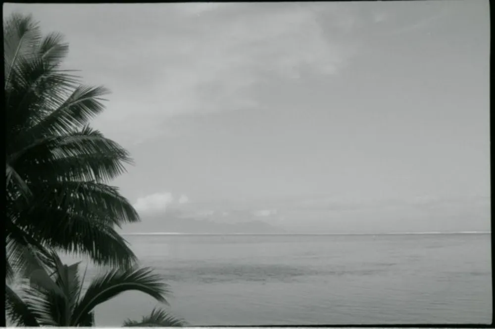

---
categories:
- lettre
letter: "bonjouryannick"
date: 2021-01-30T00:00:00Z
newsletter: true
resources:
  - src: "*.webp"
tags:
- la lettre
emoji: 💌
color: rosewater

title: "10 - Bouquins, caravanes et Z-Boys"
slug: "10"
description: "Cette semaine, je suis tombé sur une vidéo de Matt Day qui est un photographe argentique. Il est pas mal actif sur Youtube."
---

👋

Bonjour à tous,

Cette semaine, je suis tombé sur une vidéo de [Matt Day](https://www.youtube.com/channel/UCopwCE5bVtffQif8IFkbUuw) qui est un photographe argentique. Il est pas mal actif sur Youtube. C'est assez drôle parce que en fait [il interviewe un photographe](https://www.youtube.com/watch?v=IvRhi0udkEg) qui vient de sortir un bouquin qui traîne dans mes meilleurs livres photos à la maison. Ce photographe, c'est Jason Lee.

Je ne sais pas si vous avez vu cette série de tweet sur des marques qui font de tout et de rien? Ca va un peu comme ceci:

    moi: je voudrais un stylo 4 couleurs.
    bic: ok
    moi: je cherche aussi une planche à voile et un briquet, vous me conseillez d’aller où ?
    bic: alors, vous allez rire mais...

Je l'ai volé chez une amie celui-là mais comme ça vous voyez le genre. Quel rapport avec Jason Lee vous allez me dire. Et qui est Jason Lee? En gros ce gars, je le suis depuis des années. D'abord pour son skate, puis pour son jeu d'acteur (Si vous avez vu "My name is Earl", c'est Earl) et maintenant pour [sa photographie](https://www.jasonleefilm.com). Apparement, il faisait déjà de la photo avant que je ne le suive pour ça, vous le croyez vous? Moi, il m'a fallu voir [ce set](https://www.jasonleefilm.com/shop/trailer-park-print-set) prit sur le tournage de la série.

En fait dans cette interview, c'est assez fou car ils parlent de papier, de tests d'impressions et autres détails assez fou sur la création de ce livre photo. Je vous laisse le lien ici si ça vous dit: [le lien en question](https://www.stanleybarker.co.uk/collections/frontpage/products/jason-lee) (Il est sold out en fait). Et en fait c'est juste passionnant à entendre. Je vous le conseille.

De parler de skate, cela me rappelle [une assez longue interview de Tony Hawk](https://www.youtube.com/watch?v=z4pwm37EVyw) chez the Nine club. La voix du présentateur et son style, c'est juste parfait. La discussion est assez intéressante. On entend parler de tous les skateparks sponsorisés par Tony Hawk, de ses goodies, de son 900 bien sûr et de sa vie de famille. Cela m'avait pris plusieurs jours pour l'écouter je me rappelle. Je vous resort cela car je me dis que peut-être cela peut vous intéresser. Et moi, en attendant, je commence à regarder celle de [Steve-O](https://www.youtube.com/watch?v=Jp7VCqNGSx4), il a bien vieilli mais sa voix est top.

Petite parenthèse, si vous ne l'avez pas encore vu, je vous conseille le film [Lords of Dogtown](https://www.youtube.com/watch?v=KHwimJTfvxE) sur les [Z-boys](https://en.wikipedia.org/wiki/Z-Boys).

J'ai toujours ma planche ici de mon adolescence, je la prend de temps en temps en espérant inspirer Tom. J'arrive encore à claquer un ollie mais c'est à peu près tout. Je suis content de m'être mis au surf, je suis encore loin d'être bon mais cela me ramène le même style de sensations qu'à l'époque. La glisse, la sensation, le fun. Je vous souhaite aussi de garder du fun toute votre vie, que cela vienne de quelque chose que vous faisiez depuis toujours ou pas. Soyez passionné par les choses qui vous plaisent. N'en faites pas des métiers, faites en de la joie. Voilà c'est tout pour ce samedi. 

Bon week-end à tous,

P.S.: Je suis [goofy](https://skateboard-academy.com/goofy-ou-regular.html).

Yannick

💌
