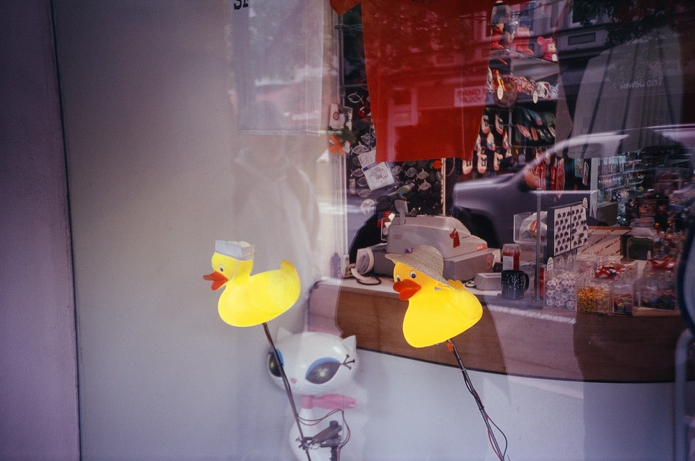

---
categories:
- lettre
letter: "bonjouryannick"
date: 2021-02-13T06:30:39.020000Z
newsletter: true
resources:
  - src: "*.webp"
tags:
- la lettre
emoji: 💌
color: red

title: "11 - Des livres, du CSV et Mowgli"
slug: "11"
---

👋

Bonjour,

C'est l'histoire d'un gars qui se rend compte que Amazon détient Goodreads depuis 2013. Il le savait déjà en fait mais l'avait astucieusement oublié. Dans l'optique d'avoir la main mise sur ces données, il se dit qu'il doit faire quelque chose.

Je ne sais pas vous mais moi dernièrement, j'aime bien posséder mes données. J'ai fermé mon compte Facebook entre autre en ce début d'année. Et j'en suis plutôt content.

Alors pour les livres que faire? Le petiot ici, il est un peu informaticien. Genre il peut réparer votre imprimante et tout ça. Enfin dans la théorie. Son père avait très vite compris que il ne le ferait plus. Et donc il s'est dit. Je vais exporter toutes mes données de GoodReads et en faire des pages sur mon site. Un truc simple, géré par mes petites mimines et voilà.

Me voilà à exporter un CSV (Comme un fichier excel minimum pour ceux qui ne savent pas). Et à le transformer à coup de scripts et autres petites manipulations pour en sortir... 300 nouveaux fichiers pour mon blog. Une fiche par livre.
Et pouf, ça donne en première version: [yannickschutz.com/books](https://yannickschutz.com/books). Je vous laisse mettre un GIF de hacker ici

Mon but sera de rajouter des pages individuelles avec des liens vers des revendeurs comme [recyclivre](https://recyclivre.com) et [Librairies indépendantes](https://librairiesindependantes.com). Histoire de leur faire un rien de pub.

Par contre, entre temps, je découvre aussi ce [super article](https://macwright.com/2020/12/24/the-new-reading-stack.html) de MacWright. Un blog que j'aime particulièrement lire et qui est plutôt visuellement plaisant. Cet article parle de ces sujets de nouvelles librairies, des concurrents d'Amazon et de GoodReads.

*Oui ma page est inspirée de sa page reading, et alors? Après tout, [tout est un remix](https://www.everythingisaremix.info). Oui comme ces animations de Disney [entre le livre de la Jungle et Winnie l'ourson](https://twitter.com/talkclub100/status/1359249923393413128)*

Ce qui me rappelle aussi que j'avais décidé en début d'année de ne pas acheter de livres neufs cette année. Cela me fait penser que je dois aller me faire une carte à la bibliothèque du village aussi. Et que j'avais un compte [readng.co](https://beta.readng.co/user/yannick) sorte de Goodreads plus plaisant au regard et n'appartenant pas à Amazon.

Bon pour les livres neufs, j'y arrive. Sauf pour ce qui est livres photos. J'ai craqué pour des beaux livres de surf et d'autres avec une couverture en tissu. Non, c'est toi qui est faible une fois que la couverture est en tissu.
J'ai craqué pour [Nippon 2010-2020](https://www.shashasha.co/en/book/nippon-2010-2020) de Shuhei Motoyama que j'ai croisé sur le feed de Craig Mod. Et aussi pour le bouquin de Jason Lee, [In the gold dust rush](https://www.stanleybarker.co.uk/products/jason-lee). Et si le livre est en tissu et à de belles photos de surf, c'est combo comme pour [Hooro](https://www.thegoldenrays.com/collections/photography-books/products/hooroo-by-john-p-brodie?variant=32896734789707) de John Patrick Brodie. J'ai eu l'avant dernier sur les 100. Enfin voilà, c'est simple de ne pas acheter de neuf, avec une astérisque sur les bouquins photos.

*Pour info, pour facilement trouver les bouquins en seconde main, j'utilise pas mal Vinted et Leboncoin. En plus de recyclivre*

Faut toujours que le papier passe par là dans mes petites lettres, je sais.

Voilà le petit récit de la semaine,

J'espère qu'il t'a plu!

Bon samedi,

Yannick

💌
