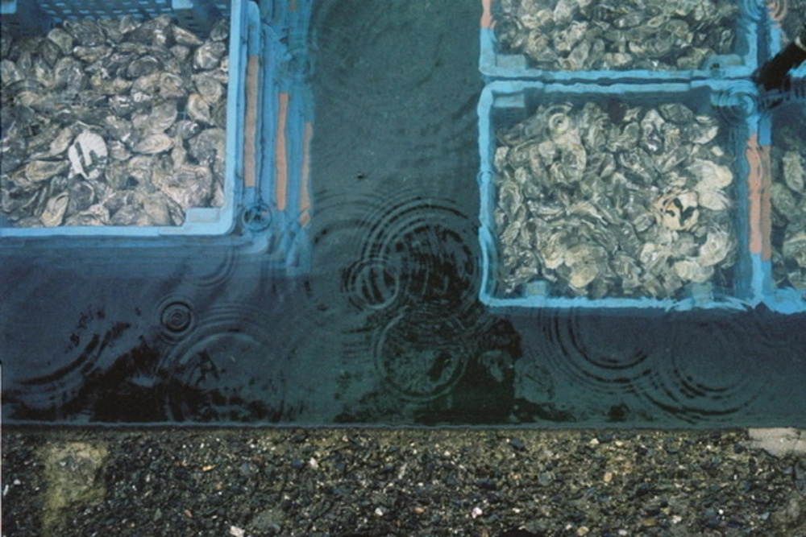

---
categories:
- lettre
letter: "bonjouryannick"
date: 2021-02-26T23:00:00Z
newsletter: true
resources:
  - src: "*.webp"
tags:
- la lettre
emoji: 💌
color: rosewater

title: "12 - Du web, des beaux mots et aussi des liens"
slug: "12"
---

👋
Bonjour,

J'ai toujours adoré trainer sur internet, c'est une source plutôt intarissable d'informations. J'y suis depuis des années, j'ai eu des CDs pour me connecter avec un modem 56k, etc. Le bon vieux temps comme dirait l'autre. Et je repensais d'ailleurs à ce bon vieux temps en me promenant sur des blogs et autres ressources où les gens ne pensent pas en termes d'algorithme Instagram ou Google. Un monde non infesté de trackers divers et variés.

Je ne sais pas si vous êtes attirés par ce web-là, mais pour moi le côté indépendant du web me plaît beaucoup. Les gens mettent du coeur dans leurs pages, dans leurs mots, et dans ce qu'ils partagent. Ces gens le font pour le plaisir. Ils s'en foutent de ce que tu penses enfin pas tous mais certains. Et ce web me refait aussi penser à cet article de [Sylvain qui fait de l'ordi](https://jefaisdelordi.com/2021/02/04/quand-est-ce-quon-sait-quon-est-photographe/)

> C’est l’inconvénient de la société du spectacle, on commence toujours par faire les choses pour les autres, avant de comprendre qu’il faut d’abord les faire pour soi.

Mais j'aimais bien ce moment où on allait sur internet. Il n'était pas partout, on voulait y aller. Maintenant, on toque chez Google et on voit ce qu'il a pour nous. Parce que notre recherche doit être précise. Plus de temps pour la [sérendipité](https://fr.wikipedia.org/wiki/Sérendipité) et perso, ça me manque. Vous avez connu les annuaires du web ou les Webrings? Et bien, vous saviez que cela existe toujours? Plus dur de tomber dessus, mais une fois que j'en ai un, je le fouille. Un peu comme un archéologue des réseaux. Une envie de découvrir et de partager. C'est comme ça que je suis tombé sur quelques pages de partage qui m'ont marqué. Deux beaux exemples, [jondueck.ca/subscribed](https://jondueck.ca/subscribed/) et [thenewsprint.co/fresh-links](https://thenewsprint.co/fresh-links/) que j'ai récemment partagés.

Je ne sais pas vous, mais j'adore le concept d'**omakase** dans un restaurant. Que l'on peut traduire par l'humeur du chef si ça vous dit ! Perso, j'adore la curation pour cela. Faire confiance à certaines personnes qui partagent et les lire. Je sais que cela peut impliquer certains problèmes et me faire vivre dans une bulle. Je pense ne pas m'en sortir trop mal. Et là, vous me dites: "Yannick quand Google te donne des résultats, c'est Omakase". Je rajouterai que le chef n'est pas un algorithme, il a une nuance humaine et une nuance non mercantile. Et là, je me dis que j'ai utilisé un paquet beaux mots pour aujourd'hui!

Si vous avez de beaux webrings, des favoris de lectures, des abonnements qui vous émoustillent à chaque nouvelle entrée, des flux RSS pas piqués des hannetons, partagez-les moi ici.

PS: Au cas où, voici ma petite sélection: [yannickschutz.com/subscribed](https://yannickschutz.com/subscribed)

💌
