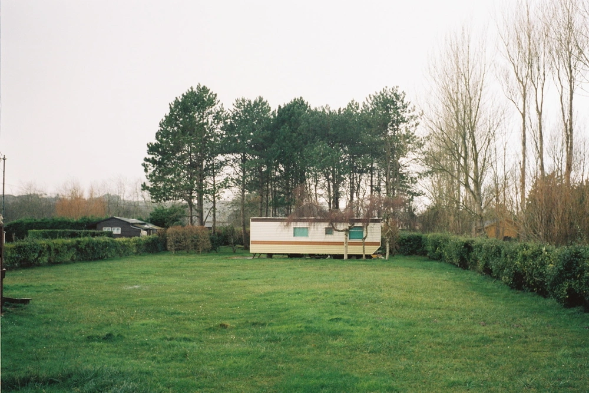

---
categories:
- lettre
letter: "bonjouryannick"
date: 2021-03-13T06:12:00Z
newsletter: true
resources:
  - src: "*.webp"
tags:
- la lettre
emoji: 💌
color: rosewater

title: "13 - Du breton, de la mini cabine et des piments"
slug: "13"
---

_Cette newsletter est écrite par [Yannick](https://yannickschutz.com/now), il aime les petites maisons et les grands espaces. C'est chouette de vivre dehors. Il aime plein d'autres choses comme vous l'avez sans doute déjà vu. Vous lisez ceci parce que vous avez signé de votre encre son formulaire ou parce que quelqu'un vous a transmis ce mail, merci à lui et à vous. Elle vous arrive en ce beau samedi 13 mars 2021. Un 13 pour la 13ème._

***
👋

Bonjour,

Je ne sais plus si je vous ai déjà parlé de notre petit projet de fleurs à couper et de petite cabane écologique. En tout cas, ces dernières semaines, cela à commencé à bouger. Le projet a même [un site](https://douarenn.fr) et un nom.

> Douarenn: \dwaʁɛn\ féminin
>   1. Lopin (de terre)
>   2. Terrier (trou d'un animal)

Donc en soi, ce nom est totalement adapté et breton. Oui, on s'intègre comme on peut. Mais un nom féminin comme celui là, on n'en trouve pas tous les jours. Ce double sens de terre et de lieu de vie de l'animal colle assez bien à notre concept donc, approuvé.

C'est assez beau ce que l'on prépare pour là-bas. On a vu les premières brouillons et esquisses. On avait passé de l'inspiration comme cette [superbe cabane](https://denoutdoors.com/collections/modern-cabin-plans/products/updated-loft-cabin) de Den Outdoors. Ou alors cette [petite cabane](https://chalkroad.co.uk) tout en bois brûlé de la campagne anglaise. Enfin, cela sera superbe je vous le dit déjà. Mais donc tout ça pour vous parler de mon amour des petits espaces. J'ai en projet toujours de construire mon petit bureau sur le fond du terrain. Un lieu calme avec un petit poêle à bois, un bureau, une chaise et quelques rangements. Un petit lieu de retraite pour le boulot et la méditation. Là aussi, encore une fois, plein d'inspiration comme cette [microcabine](https://www.miscellaneousadventures.co.uk/logbook/2019/10/22/micro-cabin-building-wc54a) par les amis de Misc. Adventures. Ou plus récemment, ce [refuge de travail™](https://mobile.twitter.com/LukesBeard/status/1351568496963018754) de Luke Beard. Je suis fan de ces micros lieux qui sont dédiés à une seule chose. J'ai depuis deux ans l'envie de construire le mien. J'y arriverai. Me faut plus que... beaucoup de motivation. Mais entre temps, j'ai découvert ces Vosgiens qui font une [micro cabane](https://www.instagram.com/p/CJ8Or37oVGq/) similaire et locale. Donc, est-ce que je la construirai ou la ferai venir? On verra bien ce que 2021 nous amène.

Je dois déjà commencer par creuser une fondation stable pour un abris de jardin pour ranger nos super nouveaux outils pour Douarenn. Il est déjà sur le terrain, je devrai le démonter pour le remonter. Je suis un peu un shaddock. Ce sera une sorte d'épreuve test pour moi et mes deux mains gauches! Enfin, peut-être que c'est deux droites mais en tout cas elles ne sont pas coordonnées.

Pour changer de sujet mais pas totalement, hier j'ai reçu des négatifs photos que je scannais pour la première fois avec mon nouveau système. Je ne suis pas encore au point totalement pour la couleur. Mais j'ai de belles photos de nos [deux petits moutons de Ouessant](https://fr.wikipedia.org/wiki/Ouessant_(race_ovine)). Leurs petits noms sont Oufti et Ozone. Un cadeau des anciens propriétaires. Si vous êtes fins connaisseurs, vous pouvez même savoir d'où viennent les anciens propriétaires. Si vous ne trouvez pas, ils aiment aussi les boulets avec une certain sauce avec un certain sirop. Comme quoi le monde est tout petit.

On a commencé à planter et faire pousser des légumes pour cette saison, ils iront sur le terrain, on laisse le potager de la maison en jachère. Enfin, je dis on, mais c'est principalement Cloé qui a tout fait. Moi, j'ai plutôt saboté une des serres sans faire exprès. Pas amusant de ramasser toute la terre. J'espère avoir bientôt des photos de nos piments del Padron à vous partager. C'est un délice au barbecue après les avoir salés et huilés, un vrai délice. Avec les jours qui rallongent, j'ai hâte.

Voilà les dernières news des semaines qui viennent de passer. J'ai aussi repris le surf, me suis gelé le cerveau. Mais c'est pour une future histoire les enfants.

Je vous laisse profiter de votre week-end et vous dis à très bientôt,

Yannick

*PS: Si tu aimes mes expérimentations, voici en exclu un lien qui ne sera publié que dans la semaine: [Détail](https://yannickschutz.com/details/intro/) , une sorte de soft launch pour toi!*

💌
