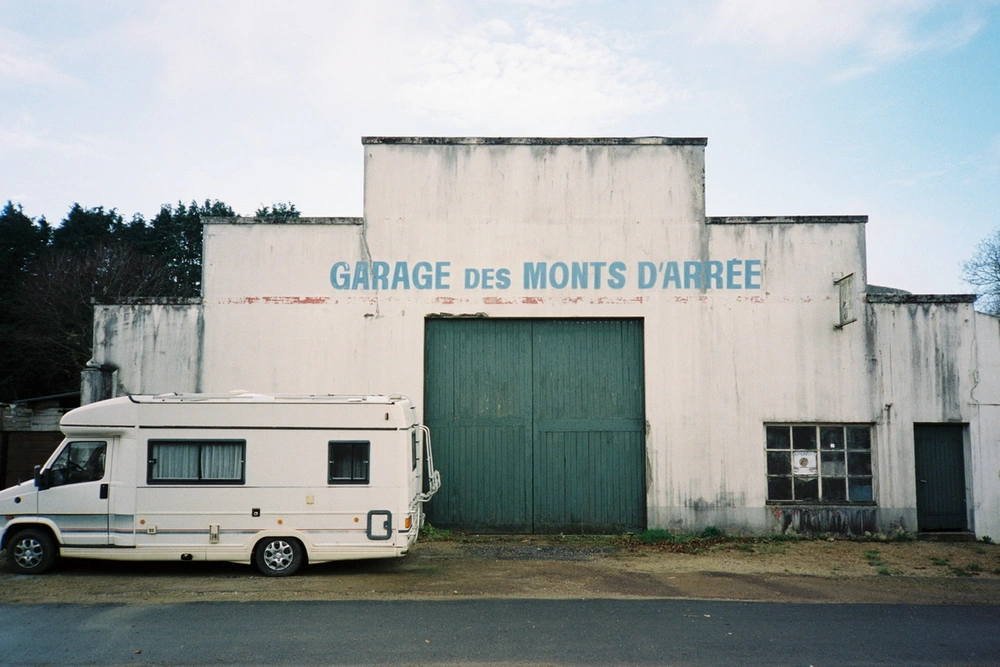

---
categories:
- lettre
letter: "bonjouryannick"
date: 2021-03-27T02:47:00Z
newsletter: true
resources:
  - src: "*.webp"
tags:
- la lettre
emoji: 💌
color: red

title: "14 - Haikus, barbecue et activisme"
slug: "14"
---

_Cette newsletter est écrite par [Yannick](https://yannickschutz.com/now), il aime écrire de tout et n'importe quoi. Il aime plein d'autres choses comme vous l'avez sans doute déjà vu. Vous lisez ceci parce que vous avez signé de votre encre son formulaire ou parce que quelqu'un vous a transmis ce mail, merci à lui et à vous._

👋

Bonjour,

Cette semaine, j'étais chez le docteur tranquillement pour des doigts tout blancs. Un petit [syndrôme de Raynaud](https://www.ameli.fr/assure/sante/themes/phenomene-raynaud/definition-symptomes-causes) pas piqué des hannetons. Mais rien de grave en fait. J'étais là dans la salle d'attente à attendre. Puis j'ai décidé de sortir mon carnet et de faire un peu de poésie. Est-ce que c'est le lieu qui me donnait envie? Je ne sais pas. Mais en tout cas, je me suis dit que je pourrais vous le partager. Peut-être que cela vous plaira. Voici donc un petit trio rien que pour vous.

> Épaule à jeter
> Es-tu déjà défaillante?
> Épaulée jetée

> Remplir des cahiers
> Qu'en est-il de ta pensée?
> Noter, recopier

> Un bout de caillou
> Le long du GR34
> Crachin de printemps

Je les ai nommés dans l'ordre haiku médecin, haiku de notes, haiku hike hou. Voilà. C'est une première pour moi. Cela me donne envie de lire un peu de poésie. Si vous avez des conseils lectures, je suis preneur.

Cette semaine, j'ai aussi envoyé la première photo dans [Détail](https://yannickschutz.com/details/001). Je suis plutôt satisfait. Même si je pense pouvoir améliorer quelques détails. Tu le vois le jeu de mot? Si tu es pas encore inscrit, fonce.

Aujourd'hui, c'est samedi et je pars pour la plage. Le surf a repris. Mais avant ça, on va nettoyer la plage. C'est le retour des jours de nettoyages de plages. Je prend le temps de vous rappeller que cela ne prend que [deux minutes](https://yannickschutz.com/juste-deux-minutes/) pour aider. Et je vous invite aussi à regarder [cette chouette vidéo](https://www.youtube.com/channel/UCe736xPCf6KlYjO-jrFF8dQ) d'un petit activiste de 8 ans. Il n'est jamais trop tôt pour commencer. Cela me donne une idée. Je pourrais en faire quelques petits poèmes tiens. On verra ce que cela donne. Mixer Activisme et écriture, cela me plaît.

> Prendre deux minutes
> Du plastique plein le sable
> Un déchet de moins

Voilà, une petit impro micro plastique haiku pour vous, juste avant de terminer! Je vous laisse m'écrire un titre et un haiku en plus. En attendant, la saison du barbecue et des pieds nus a redémarré! On a fait notre première grillade pour l'arrivée du printemps. Il était temps. J'ai hâte de pouvoir regriller des légumes avec des amis tranquillement dehors. Si cela vous dit, passez dans le coin. On se tiendra à distance et on rigolera bien.

Passez un bon samedi, écoutez vos légumes et mangez vos parents.

Yannick

💌
