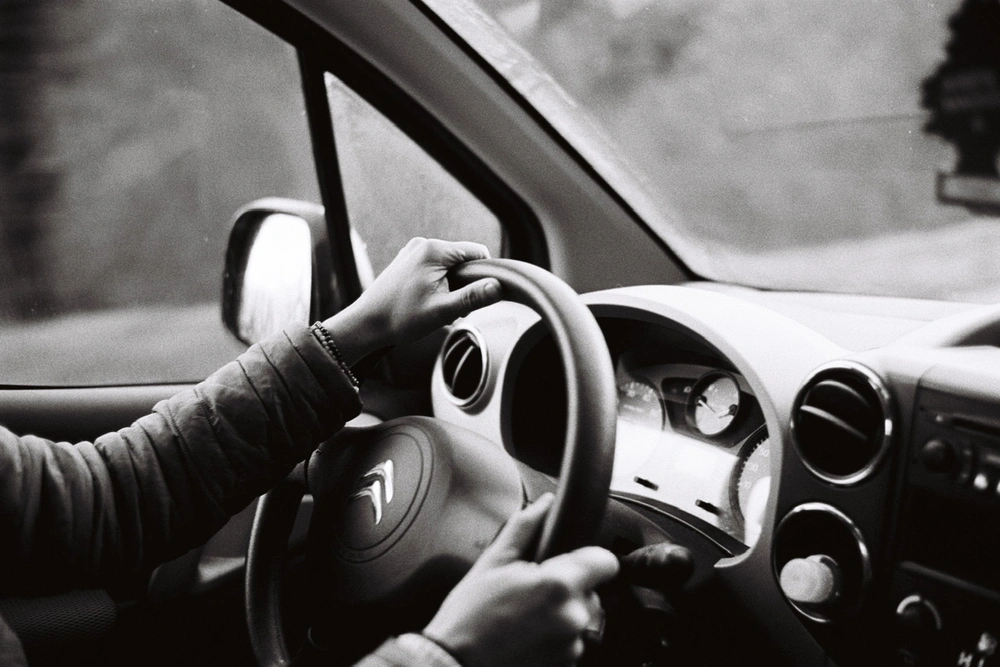

---
categories:
- lettre
letter: "bonjouryannick"
date: 2021-04-10T01:47:00Z
newsletter: true
resources:
  - src: "*.webp"
tags:
- la lettre
emoji: 💌
color: rosewater

title: "15 - Capitaine, tatouages et SMS"
slug: "15"
---

_Cette newsletter est écrite par [Yannick](https://yannickschutz.com/now), il aime écrire de tout et n'importe quoi. Il va encore vous raconter sa vie et ce qu'il a vu/lu/entendu. Soyez prêt! Et merci, d'être là._

👋

Bonjour,

Cette semaine, je suis tombé sur [un documentaire sur Léa Nahon](https://meganemurgia.com/capitaine-lea). Vous ne la connaissez sans doute pas. Elle tatouait à Bruxelles quand j'y habitais. Et maintenant, elle tatoue en Bretagne. Je ne sais pas si je vous l'ai déjà dit mais j'ai quelques tatouages, malins ou pas. Si vous me voyez en maillot, vous saurez. Mais donc pour en revenir à ce documentaire, j'ai découvert que Léa avait fait le même trajet que nous. Liège → la Bretagne. Elle vit maintenant à Douarnenez et tatoue sur un bateau. Pas n'importe lequel. En fait, le documentaire parle justement de ce bateau qui vient de Liège. Là ou nous avons fait le trajet par la route, elle l'a fait via la Meuse et la mer. Capitaine Léa. Et la réalisatrice a d'autres documentaires que je me réjouis de mater.

Et en parlant de tatouages, l'envie d'une pièce relative à la mer m'a envahi, comme mon amour pour la mer. Je ne sais pas encore par qui ni quand ni où. On verra quand je trouverai. J'aime laisser cela au hasard. Plutôt confiant en la sérendipité. Cela fait pourtant bien longtemps que aucune aiguille ne m'a approché. J'ai évité les dates de naissances et les prénoms de mes enfants. Et je ne le ferai pas tant qu'on aura pas 7 enfants sinon cela porte malheur. Cela fait partie des nombreuses superstitions qui règlent ma vie. Je ne vous dirai pas les autres et vous laisserai les imaginer. C'est beau d'utiliser son imagination.

Depuis la dernière lettre, j'ai eu le temps de vous envoyer deux photos si vous êtes aussi abonné à [détail](https://yannickschutz.com/details). Je ne sais pas combien de personnes les ont vues ni même si elles les ont aimé. J'aime assez l'approche au final. C'est juste étrange de trouver les bonnes photos. J'ai choisi un thème et j'essaye de m'y tenir. Les bords du sentier des douaniers. De la photo bretonnante. J'essaye de ne faire que hors de ma collection d'argentique. J'ai eu un ou deux retours plutôt positifs. Je me demande si cela pourrait inspirer d'autres personnes aussi. J'ai envie de penser à d'autres projets de ce type. J'ai vu celui de Craig Mod où [il envoie chaque jour une photo par MMS](https://craigmod.com/essays/sms_publishing/). Je trouve l'idée top. Je ferai peut-être ça pendant un road trip en van. Cela pourrait être drôle de mettre une plateforme en place pour ça. Où une galerie en ligne par SMS. Des expos d'art par SMS. Ça serait drôle.

En parlant de Craig Mod, il a sorti une vidéo super contemplative sur [les toasts pizza](https://youtu.be/i5SLi-GZ0Z4). Il a aussi un bouquin là-dessus et c'est franchement dans mes gros kifs de la semaine! Je vous le conseille vivement.

En attendant, il est temps de se reposer un peu. On se voit dans deux semaines.

À bientôt,

Yannick

💌
