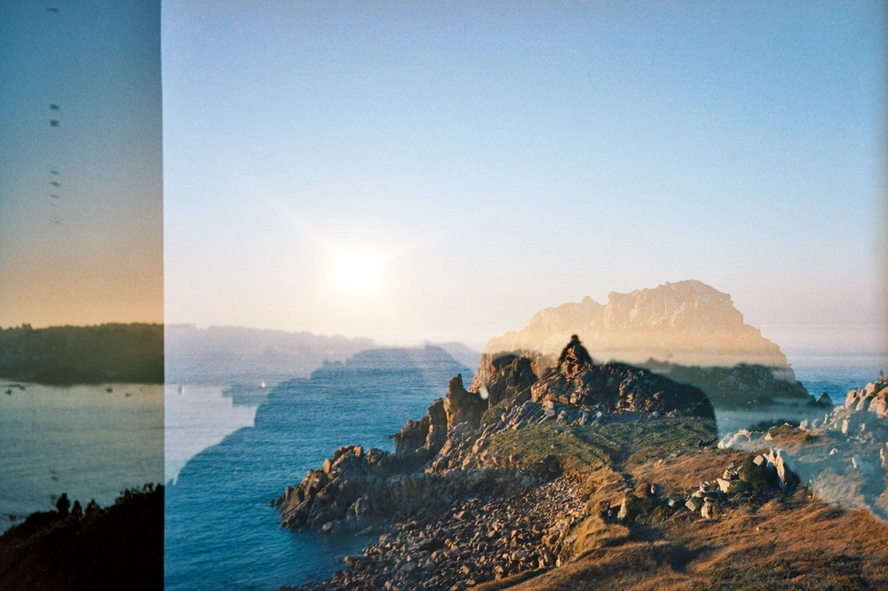

---
categories:
- lettre
letter: "bonjouryannick"
date: 2021-04-24T01:47:00Z
newsletter: true
resources:
  - src: "*.webp"
tags:
- la lettre
emoji: 💌
color: rosewater

title: "16 - Vagues, méditation et peintures"
slug: "16"
---

_Cette newsletter est écrite par [Yannick](https://yannickschutz.com/now), il aime apprendre à surfer des vagues, la méditation et les grillades de fin de journée. Vous lisez ceci parce que vous avez rempli un formulaire ou parce que quelqu'un vous a transmis ce mail, merci à lui et à vous._

👋

Bonjour,

Cette semaine, j'avais pris du temps hors du boulot pour être en famille. Comme vous le savez, le gouvernement français avait déplacé les vacances scolaires. J'en profite donc pour me reposer... La bonne blague. On le sait tous qu'on est bien plus fatigué durant les vacances que au boulot.

Cela faisait un an qu'on devait repeindre les fenêtres et c'est enfin chose faite. Plus de chassis bleus, ils sont dans un beau [_breakfast room green_](https://www.farrow-ball.com/fr/couleurs/breakfast-room-green) maintenant, le nº81 pour être exact. On a aussi découvert qu'il fallait changer une des fenêtres du côté. Poncer les fenêtres m'a fait me replonger dans Karaté Kid. Frotter, lustrer. C'est en fait une super pratique de pleine conscience que voilà. Vous ne faites rien d'autre que de faire un avec la ponceuse pour un résultat vibrant et parfait. Je peux facilement comptabiliser 1h par jour de méditation sur cette semaine!

C'est aussi la semaine où j'ai enfin pu repartir surfer grâce au changement de règle pour les écoles de surf. Un peu moins absurdes, toujours étranges mais maintenant je peux retourner à l'eau. On y est allé deux fois avec Tom et j'y suis allé seul le dimanche. Je peux vous dire que je redécouvre certains muscles. Les abdos travaillent par 12 là facilement. Mais quel plaisir. D'ailleurs, en parlant de l'océan, j'ai aussi reçu des tirages de [mes photos faites au Nikonos](/nikonos-glaz/) le premier de l'an. Je pense faire une petite série limitée de 5 prints des 3 ou 4 sélectionnés. Voudriez-vous que cela soit d'abord en exclu ici? Je ne sais pas encore le format de la chose. Juste que les photos de seront pas énormes et pourront être envoyées n'importe où.

Pour la peine, j'ai commencé à me renseigner sur le status nécessaire en France pour pouvoir vendre quelques tirages sans trop me faire de souci au niveau légal de la chose. Merci à tous ceux qui ont répondu et pris le temps de m'aider. Je pense bientôt ouvrir le conglomérat d'entreprises Bonjour Yannick LLC établi au Delaware afin de pouvoir vous envoyer ces photos. Pas mal non? Ou alors juste un petit status d'auto entrepreneur qui ne sera pas côté au CAC40 et qui ne participera pas à des repas clandestins. Je pense que cela sera déjà pas mal.

Cette semaine, c'était aussi la journée de la Terre. Et cela me rappelle ce super [Ted talk de Oliver Jeffers](https://www.ted.com/talks/oliver_jeffers_an_ode_to_living_on_earth/transcript) qui est un super illustrateur! Il a sorti un super livre sur la vie sur la planète Terre qui fut adapté en une [super vidéo pour Apple TV](https://www.oliverjeffers.com/here-we-are-film). J'adorerais un jour posséder un de ses originaux comme ce [deep](https://ojstuff.com/collections/ltd-edition-prints/products/deep-limited-edition). Si ça vous dit de vous cotiser, n'hésitez pas mais mon anniversaire est passé. Et pour ceux qui ont des enfants, oui c'est bien lui qui as illustré "Rebellion chez les crayons".

Bon, ça a été beaucoup de blabla et peu de liens mais j'espère que vous achèterez des actions de ma société quand elle deviendra publique, après la fin du capitalisme. Et n'oubliez pas de [signer cette pétition](https://www.weareoneocean.org/petition) si vous aimez l'eau salée.

Bon samedi et profitez bien si y'a du soleil chez vous.

Yannick

💌
