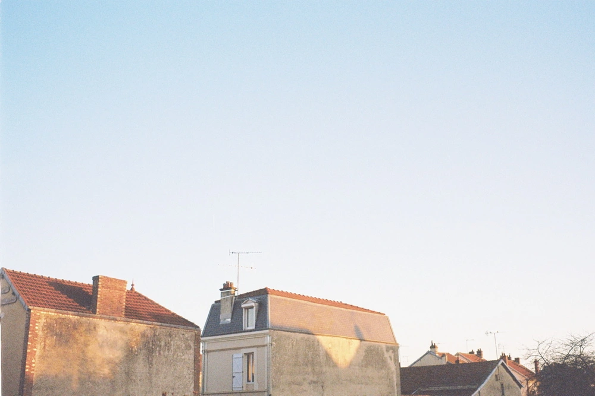

---
categories:
- lettre
letter: "bonjouryannick"
date: 2021-05-08T01:47:00Z
newsletter: true
resources:
  - src: "*.webp"
tags:
- la lettre
emoji: 💌
color: rosewater

title: "17 - Vacances, inconnues et la poule"
slug: "17"
---

_Cette newsletter est écrite par [Yannick](https://yannickschutz.com/now), il aime être pieds nus, la côte sauvage de Crozon et se plaindre de l'absurdité de certaines règles. Il va encore vous raconter sa vie et ce qu'il a vu/lu/entendu. Soyez prêt! Et merci, d'être là._

👋🏻

Bonjour,

Avec bal de Bamako qui tourne en boucle dans la maison, (Chanson préférée de Tom pour le moment) on commence à penser aux vacances d'été. On a cette audace, cette folie même je dirais. On se projette en ne sachant pas trop ce que cet été nous réserve. Mais on a envie d'y penser. On ne pense pas partir bien loin. On partirait avec le van. On aimerait la côte atlantique et puis on pense au monde, à la foule. On pense alors à la côte atlantique mais proche de chez nous. On se voit même bien simplement dans un camping à Crozon. Si vous ne connaissez pas Crozon, c'est mon énorme coup de coeur nature à la pointe du Finistère.

C'est dur de prévoir avec autant d'inconnues. On aimerait que les choses redeviennent un peu plus simple. Je ne les veux pas du tout comme avant mais juste moins compliquées. Alors on danse. On sait que quoi qu'il arrive ce sera bien. Même si on doit rester au jardin. Apprendre à tirer le meilleur de toute situation est un art qu'il faut maîtriser quand les dirigeants font dans l'absurde. C'était déjà le cas en Belgique (qui [n'existe pas d'ailleurs](https://www.zapatopi.net/belgium/)) avant mais parfois je pense que l'absurde est nécessaire sur le CV d'un politicien. Enfin voilà, c'était ma petite minute thérapie ici.

C'est le retour des jours en tongs en Bretagne. Et vous savez ce que cela veut dire. Les beaux jours, c'est café sur glace ou glaces. D'ailleurs, si vous voulez [ma recette](https://yannickschutz.com/recette-cafe-glace/) servez-vous. Un an mois pour mois que j'ai écrit ceci. On refait griller les repas sur le Weber et on nettoie le jardin. On a perdu une poule malheureusement. On va en adopter une nouvelle assez vite. On commence à bien nettoyer [Douarenn](https://douarenn.fr) aussi. Vraiment agréable de voir les choses avancer.

Comme je vous l'avais dit, je pensais faire imprimer quelques photos et les vendre. J'ai pris le temps de monter un tout petit quelque chose sur mon site. Un [premier print au Nikonos](https://yannickschutz.com/shop/sunrise-i) est dispo en édition super limitée. Parlez en à vos amis et vos mamies.

Maintenant je dois vous laisser, c'est vendredi soir et on regarde un film avec Tom. Il a enfin fini "Harry Potter et l'ordre du Phoenix". On peut enfin regarder le cinquième épisode.

Tiens, avant de partir, une [petite vidéo](https://vimeo.com/517147655) qui m'a bien plu et qui parle de mon autre thérapie, la bleue. Simplement être à l'eau, simplement voir le soleil se lever. Avoir les cheveux plein de sel.

Bon samedi,

Yannick

💌

*P.S.: Désolé pour le simple bla-bla de ma vie. J'aime bien parler pour ne rien dire. Dites moi ce que vous en pensez.*
