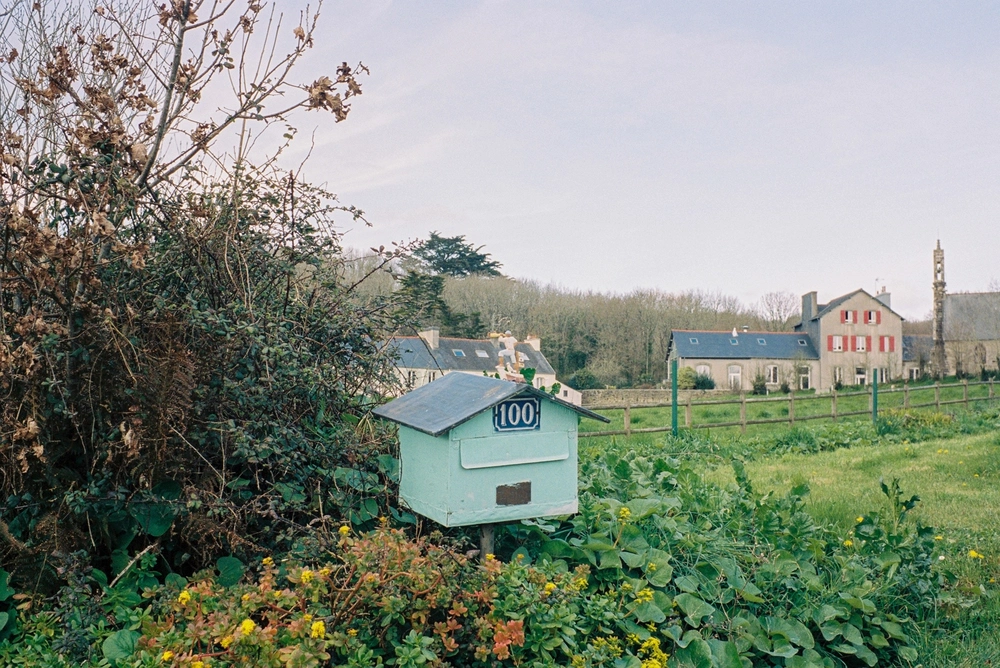

---
categories:
- lettre
letter: "bonjouryannick"
date: 2021-05-22T01:47:00Z
newsletter: true
resources:
  - src: "*.webp"
tags:
- la lettre
emoji: 💌
color: rosewater

title: "18 - Michel Berger, les amis et la mer"
slug: "18"
---

_Cette newsletter est écrite par [Yannick](https://yannickschutz.com/now), il n'aime pas être indécis, il oublie souvent et écrit parfois. Il va encore vous raconter sa vie et ce qu'il a vu/lu/entendu. Soyez prêt! Et merci, d'être là._

👋🏻

Bonjour,

Je me suis rendu compte d'un truc assez important cette semaine. Je suis plutôt nul pour me rappeler des choses. C'est encore plus frappant quand ces choses concernent des humains que tu apprécies mais qui vivent trop loin. Au fond, c'est rien de grave. C'est normal même sans doute. Comme on dit: "loin des yeux..."

Avec le boom du travail à distance, la façon de travailler des gens changent. Tout doit devenir beaucoup plus explicite et intentionnel. C'est ce que je fais depuis 7-8 ans et qui marche pas mal. C'est même un truc où je suis plutôt bon. Même si je suis assez désorganisé.

Et là, ça me frappe. Je dois, en fait, faire comme au boulot dans la vie avec mes potes et ma famille. Être beaucoup plus intentionnel. Documenter beaucoup plus les choses pour ne pas oublier. Prendre le temps et faire du temps pour les gens qui sont loin. Toi dans le fond qui a commencé à [chanter Laam](https://twitter.com/FannyRuwet/status/1393939796200886272), sache que je ne t'en veux pas. Mais c'est eux qui sont loin de chez moi. Pas eux qui sont loins de chez eux. C'est là que je comprend soudainement le succès des outils genre gestion de clients mais pour les amis. Qui t'aident à garder le contact. J'ai essayé les mails, mais ça ne marche pas pour tous, car contrairement aux messageries, "il faut prendre le temps".

Quand tu rajoutes à cela le fait que j'essaye d'[être moins présent sur les réseaux sociaux](https://yannickschutz.com/un-mois-de-disette/), que j'ai supprimé mon compte facebook, que j'avais supprimé Whatsapp. Là tu comprends comme je décide en fait de gérer mes relations amicales en mode Hardcore. Supprimer ces comptes m'a permis de mieux me sentir mais je sais que j'ai perdu certaines choses qui ne sont pas accessibles ailleurs. Et donc, en grand indécis de la vie, je suis en plein doute, de tout, toujours.

En attendant, la vie continue. J'ai encore été à l'eau, surfé des vagues et pris d'autres sur la tête. Question de timing. L'océan continue de m'offrir une cure, comme pour Lottie Lewis qui [écrit sur ses baignades chez Finisterre](https://finisterre.com/blogs/broadcast/peace-found-in-saltwater). A croire que l'eau salée a vraiment de nombreuses vertus. J'ai pris le temps d'écrire sur [mon boîtier du commandant Cousteau](https://yannickschutz.com/nikonos-v) aussi d'ailleurs. Il me force à continuer ma thérapie. Tom aussi continue le surf et j'adore le regarder se marrer sur sa planche. Il prend ça beaucoup plus comme un jeu. J'approche cela comme un apprentissage d'adulte. Peut-être que reprendre des yeux d'enfants là dessus aiderait aussi à progresser différemment. Aujourd'hui, j'ai eu la chance de partager une matinée à l'école avec lui sur le cycle de l'eau par [Eldrine de la Water Family](https://waterfamily.org/), une des associations que je supporte dans le coin. Je vous conseille leur site.

En fin de lettre, j'ai envie de vous partager aussi quelques lectures que je viens de finir. J'ai lu [Encabanée](https://www.babelio.com/livres/Filteau-Chiba-Encabanee/1023675). Il donne vraiment envie d'aller s'encabaner dans les forêts du Québec ou toute autre forêt. J'ai aussi lu [Le grand Marin](https://www.babelio.com/livres/Poulain-Le-grand-marin/928548) qui lui, malgré les blessures diverses, donne envie d'aller s'engager sur un bateau de pêche au bout du monde, l'Alaska, pas le Finistère. Note que... Qui sait... Peut-être...

Y'en a eu d'autres lectures mais bon, je vais pas vous faire un pâté là dessus. Allez, profitez bien de votre samedi les amis et à très bientôt,

Yannick

💌
