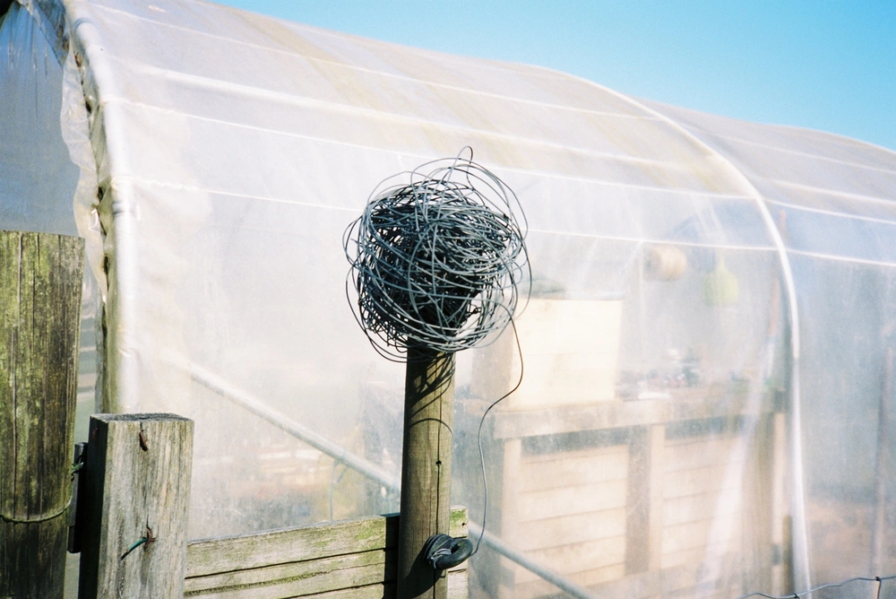

---
categories:
- lettre
letter: "bonjouryannick"
date: 2021-06-05T01:47:00Z
newsletter: true
resources:
  - src: "*.webp"
tags:
- la lettre
emoji: 💌
color: rosewater

title: "19 - Bidouille, activisme et cannette"
slug: "19"
---

_Cette newsletter est écrite par [Yannick](https://yannickschutz.com/now), il a reçu sa première dose de vaccin, il a mal au bras droit et a des films photos au frigo. Il va encore vous raconter sa vie et ce qu'il a vu/lu/entendu. Soyez prêt! Et merci, d'être là._

👋🏻

Bonjour,

Aujourd'hui, cela fait deux jours que j'ai reçu ma première dose de vaccin. Hier, j'étais dans le gaz un peu et j'avais mal au bras. J'espère que cela ira mieux aujourd'hui.

Maintenant, c'est plus simple d'avoir un rendez-vous en France. Du moins en ville. Mais à la campagne, les rendez-vous partent vite. J'ai eu un coup de chance... que j'ai provoqué. Je suis un peu bidouilleur et y'a plein de petits projets pour le covid. J'ai cherché sur GitHub un projet pour m'aider à surveiller Doctolib. J'ai trouvé [BDelacour/DoctolibChecker](https://github.com/BDelacour/DoctolibChecker). Ni une, ni deux, je le déploie sur [Heroku](https://heroku.com) où je bosse. Je configure le tout et dix minutes après, me voilà avec une notification sur Telegram. Je prend mon rendez-vous pour le lendemain et voilà. C'était pas si compliqué au final et plutôt drôle.

Ce bot Telegram me donne des idées pour d'autres futurs projets. J'aime faire des petits projets créatifs inutiles. Je pense à une newsletter photo sur Signal ou Telegram. Un rappel de météo du surf par message. Des choses de ce goût. Je vous dirai si cela reste de l'imaginaire ou non.

Il y a deux semaines, la [Water Family](https://waterfamily.org) est venue dans la classe de Tom. D'ailleurs, je vous en parle sur le [blog](/water-family). Cela m'a inspiré à essayer d'être un micro activiste un peu plus actif. Finisterre a justement prévu une super série de workshops et talks sous la bannière de [Sea7](https://sea7.finisterre.com). Je me réjouis d'écouter cela. C'est le 10 juin. J'aime beaucoup le logo aussi qu'ils ont fait. Je vous dirai si cela valait le coup. J'ai aussi enfin commencé le bouquin de Patagonia "[Tools for grassroots activists](https://www.patagonia.com/product/tools-for-grassroots-activists-paperback-book/BK740.html)". Des infos utiles et pas que pour les activistes. Comme disent les vieux réacs: "on va pas se laisser se faire emmerder".

Depuis le début d'année, j'avais plutôt arrêter de boire. Ces derniers temps, je me suis laisser tenter par quelques verres. Au final, cela ne me goûte plus tellement. J'arrête pour de bon. D'ailleurs les bières sans alcools sont top de nos jours. Rien à avoir avec les Jupiler NA du passé. J'ai passé commande chez [Gueule de joie](https://gueuledejoie.com), je les avais contacté par mail et ils ont été super agréables et m'ont fait un pack de cannettes sur mesure. Vraiment super content. Hâte de les goûter. Oui je leur fait un peu de pub. Ils ne m'ont rien offert pour cela. Juste envie de partager avec vous.

J'ai commencé à lire "[sans alcool](https://www.leslibraires.fr/livre/17913852-sans-alcool-le-jour-ou-j-ai-arrete-de-boire-claire-touzard-flammarion)" de Claire Touzard. J'aime beaucoup le ton de son récit et je me retrouve dans certains passages. Je vois aussi certaines choses d'une tout autre manière après lecture.  Je vous le conseille, que vous pensiez à arrêter, que vous ne buviez pas ou juste comme cela. C'est une belle lecture.

Bon samedi, écoutez vos légumes et mangez vos parents,

Yannick
