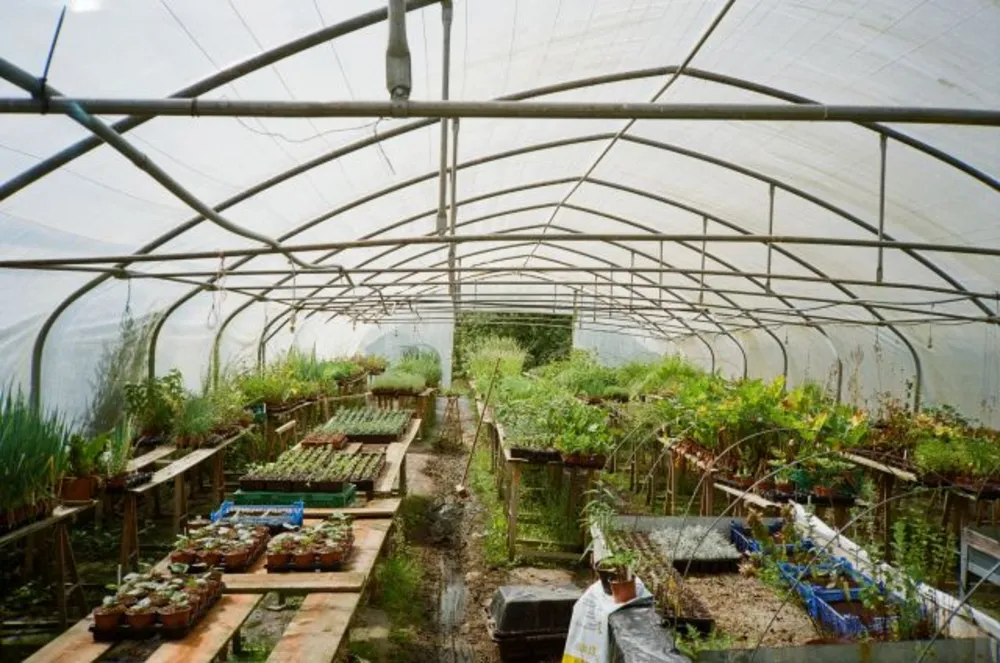

---
categories:
- lettre
letter: "bonjouryannick"
date: 2020-10-24T00:00:00Z
newsletter: true
resources:
  - src: "*.webp"
tags:
- la lettre
emoji: 💌
color: rosewater

title: "2 - Fire lookout, auto portraits et photo de chasse"
slug: "2"
description: "Cette lettre me permet d'écrire et d'expérimenter plus que sur le blog. J'avais envie de partager avec vous différemment. "
---

👋

Bonjour, et surtout bienvenue. C'est Yannick, vous m'avez peut-être vu parler de café, de bouquins et autres joyeusetés sur les réseaux sociaux. Sinon, vous pouvez vous rattraper sur [yannickschutz.com](https://yannickschutz.com/). J'aurais du me présenter un peu plus la première fois. Mais nous y voilà.

Cette lettre me permet d'écrire et d'expérimenter plus que sur le blog. J'avais envie de partager avec vous différemment. A l'ancienne, vous envoyer une lettre dans votre boîte aux lettres. Mais soyons réaliste, cela n'aurait pas été super simple. Alors je me suis rabattu sur l'email.

En plus, une lettre, c'est pas simple pour cliquer sur les liens et vous imprimer à tous une photo... ça me coûterait les yeux de la tête. Je ne dirai pas combien vous êtes. Mais je n'aurais pas été capable de lécher tous les timbres.

Je vous avoue, je suis un peu nostalgique des photos imprimées pleine de grain et des lettres papier. Cette nostalgie que j'ai retrouvé en regardant cette super vidéo sur les [Fire lookout du Mt Desolation](https://vimeo.com/442567494). J'avoue avoir été touché en regardant cette vidéo, elle m'a donné envie de sortir les boîtes de photos, un pot de glace et de la bonne musique folk.

En parlant de nostalgie et d'amour des choses tangibles, j'ai adoré ce projet de portraits. Les photos sont magiques et imparfaites comme il le faut et la vidéo d'explication est chouette. [6 mois d'auto portraits en argentique](https://jtobiason.com/6-months-of-self-portraits-on-film/) durant le confinement. Juste parfait. Si vous ne saviez pas quoi faire durant le prochain confinement, je vous envoie un film et un appareil si vous voulez. Cela ne marche pas pour le couvre-feu.

Et pour finir, une petite pépite un peu hors de tout, une newsletter que je suis et que j'admire. Ses projets photos sont top et aléatoires. Mais j'ai adoré [cette newsletter](https://mailchi.mp/84483ebaf7c6/newsletter-24-trail-camera), en particulier, où il parle de son appareil photo de chasse qu'il a placé derrière chez lui dans le bois. Noah Kalina est un vrai génie et sa newsletter devrait vous plaire.

Voilà, c'est tout pour aujourd'hui. N'hésitez pas à répondre à ceci, ça me fera plaisir de papoter avec vous autour de tout, de rien. Je pense que vous avez compris, le rythme de cette lettre sera bimensuel.

À bientôt,

Yannick
