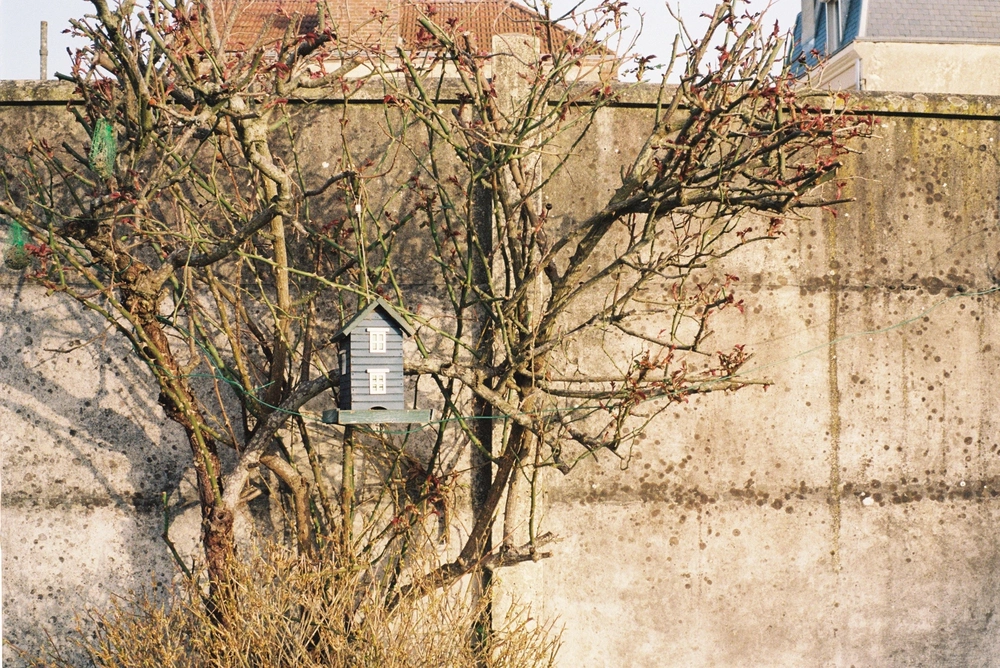

---
categories:
- lettre
letter: "bonjouryannick"
date: 2021-06-19T01:47:00Z
newsletter: true
resources:
  - src: "*.webp"
tags:
- la lettre
emoji: 💌
color: rosewater

title: "20 - hippie, petits mickeys et grimpe"
slug: "20"
---

_Cette newsletter est écrite par [Yannick](https://yannickschutz.com/now), il a reçu sa première planche de surf, a mangé une crêpe dans un restaurant et aime bien lire en seconde main. Il va encore vous raconter sa vie et ce qu'il a vu/lu/entendu. Soyez prêt! Et merci, d'être là._

👋🏻

Bonjour,

Cette semaine, enfin la semaine dernière, j'ai reçu ma planche de surf. Saint Graal de ces derniers mois. Je suis comme un gosse dans un magasin de bonbons. Elle est belle, elle est rose pâle. Une [dead Hippie](https://spookedkooks.com/products/dead-hippie-8?variant=15390439407689) de son petit nom. Une planche en mousse de 8 pieds de long. J'adore le fait que cette marque fasse dans le recyclage. Ce fut une des raisons de mon choix. Mais vous voyez aussi ce visuel rétro, quel plaisir. J'ai un petit faible ces derniers temps pour des designers qui ont un style un peu retro. J'ai adoré découvrir [Fried Cactus](https://friedcactusdc.com) et ses designs très propres mais qui ont ce petit côté bien rétro. J'ai une board pinterest pleine de ce genre de chouettes visuels. Je voyais [cette nouvelle école de surf Bretonne](https://www.zephyrsurfschool.com) aussi qui a une superbe identité. Je me rend compte que j'adore mater plein de choses liées au design, à la typographie et autre. Sujet qui m'intéresse toujours tant!

Je viens de finir le volume du printemps de la [revue dessinée](https://www.4revues.fr/la-revue-dessinee/). Si vous ne connaissez pas, c'est une super revue lente, un trimestriel. De super récits BDs sur des sujets divers et variés. Cet exemplaire contient par exemple un super article sur l'augmentation du nombre de caméras en France, un autre sur les aires d'accueil des "gens du voyage", un super passage sur les fake news et de plus petits récits sur divers évènements historiques dont une prise d'une cave à vin en Corse. J'aime vraiment consommer des news de cette manière-ci. Prendre le temps, ne pas être dans la gloire du direct, laisser le temps aux journalistes de faire leur travail. Ils ont aussi des superbe éditions spéciales sur des sujets comme les violences policières, l'enfouissement des déchets nucléaires ou le nationalisme corse. Si vous voulez en lire facilement, je me ferai un plaisir de vous en envoyer un en prêt.

Tom vient de finir le volume 6 de Harry Potter. Sa tête quand il apprend ce qui se passe à la fin. Il a eu les mêmes réactions que moi. C'est un plaisir de voir que la lecture peut l'émouvoir autant. En parlant de lecture, je viens de découvrir une super petite librairie à Brest. Et dans cette librairie, j'ai découvert le nouveau bouquin de ‌William Finnegan qui a écrit le fabuleux ["Jours barbares"](https://www.babelio.com/livres/Finnegan-Jours-barbares/927362), une super biographie. Son nouveau bouquin, ["Avec Mollie"](https://www.babelio.com/livres/Finnegan-Avec-Mollie/1320613), parle de sa fille qui fait de la grimpe. J'ai tellement hâte de le lire, je vais me dépécher de finir mon actuel, ["Le syndrôme de Palo Alto"](https://www.babelio.com/livres/Hecht-Le-syndrome-de-Palo-Alto/1195609). Enfin, on me retrouve encore à parler de bouquins. Désolé, mais c'est une des habitudes qui tient bien chez moi. Lire, lire, lire. Dernière petite stat: Sur l'année, je pense être à un livre sur 7 en neuf. Le reste vient de Vinted. Et vous, ils viennent d'où vos livres?

Bon samedi les amis,

Yannick

💌
