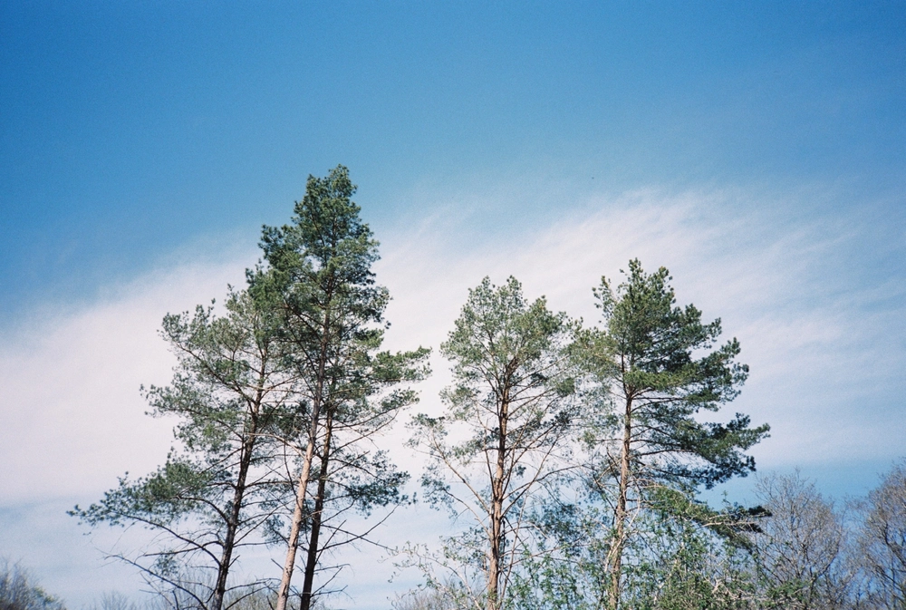

---
categories:
- lettre
letter: "bonjouryannick"
date: 2021-07-31T18:15:38.358469Z
newsletter: true
resources:
  - src: "*.webp"
tags:
- la lettre
emoji: 💌
color: rosewater

title: "22 - Une mesure loupée, une dame en blocs et du repos"
slug: "22"
---

_Cette newsletter est écrite par [Yannick](https://yannickschutz.com/now), Il a loupé un ou deux épisodes mais n'a pas fait de chassé croisé. Il va encore vous raconter sa vie et ce qu'il a vu/lu/entendu. Soyez prêt! Et merci, d'être là._

👋🏻

Bonjour,

Désolé pour le retard. Enfin pas tellement, disons que j'ai pris des vacances. Un peu de repos pour vous poser quelques mots en plein milieu de ce chasser croiser des juilletistes et des aoutiens. Bison futé m'a dit que c'était noir les newsletters en juillet, donc j'ai attendu août. Je fais tout à la dernière minute et donc parfois j'oublie et si j'oublie une fois, souvent je perds le pas. Je ne trébuche pas toujours mais ça arriver.

Depuis un mois ou deux, Tom a reçu un jeu d'échec Harry Potter en Lego. On fait de plus en plus de parties et il me bat parfois. Pas toujours mais il réfléchit quelques coups à l'avance et a une bonne vision du jeu. Je loupe ses attaques sur ma dame. C'est comme ça. Voilà à quoi on a passé un moment de notre mois de juillet. C'est pas dû au jeu de la dame, car lui n'y a pas accès dans sa partie enfant sur les Internets. Je ne sais plus d'où lui est venue cette envie. Sans doute de Harry Potter, il vit à moitié dans cet univers. Je lui redemande souvent quelle pièce est quoi, pas que je ne les connaisse pas, juste que je ne les reconnais pas.

On vient de passer la première quinzaine de mes vacances et sincèrement, cela fait du bien de se lever sans les horaires de boulot pendant un moment. On a décidé de pratiquer [le voyage lent](https://beside.media/fr/ailleurs/pratiquer-le-voyage-lent/). On revient de quelques jours près de la pointe du Raz. J'ai enfin pu visiter la boutique de mes carnets, [Monsieur Papier](https://www.monsieurpapier.fr/). Je vous suggère tant leur papeterie que leurs desserts. Ils ont une terrasse et un jardin avec une vue d'enfer. On venait de faire la moitié de notre rando du jour quand on est arrivé. Un cheesecake plus tard, on repartait. Avec bien sur un paquet de nouveaux carnets pour mes pensées du quotidien. On testait pour la première fois le sac Osprey Poco Ag et si tu as un enfant et que tu aimes la rando, c'est un must have. Comme beaucoup, on a trouvé le nôtre sur Vinted.

Avec les vacances, j'ai plus de temps pour le surf. Y'a plein de monde à l'eau sur mon spot principal vu que c'est les vacances. Je sens bien les progrès et c'est amusant de croiser les habitués, c'est comme au café sauf que y'a pas de bière. J'ai du galérer à monter des barres de toit sur le Berlingo, mais au moins je peux transporter ma planche simplement. Vous auriez ri à me voir assis sur le toit, mon voisin a ri en tout cas. L'envie de surfer me fait mater quelques vidéos ces derniers temps, quelques magazines aussi. J'ai adoré [la vidéo de Lost in the swell](https://www.youtube.com/watch?v=8AythkboAeQ) qui part à la rencontre du nomade des mers, le bateau des [Low-tech](https://lowtechlab.org). Je vous la conseille pour le surf et ce bateau merveilleux. Si vous ne connaissez ni l'un ni l'autre, c'est 30 minutes sympa, rigolotes et instructives. En plus, le surf c'est aux JO maintenant donc c'est mainstream.

Voilà, c'est déjà tout, je repars me reposer.
Bon samedi,

Yannick
