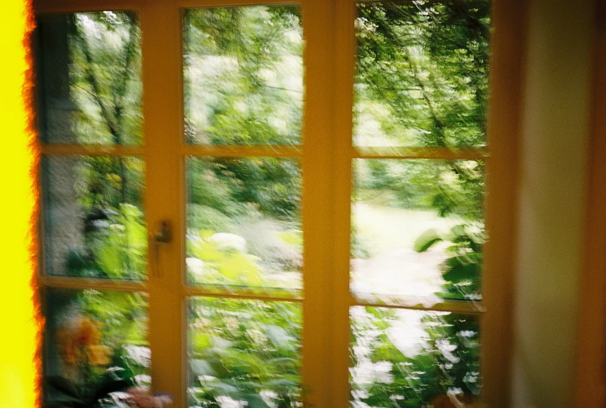

---
categories:
- lettre
letter: "bonjouryannick"
date: 2021-08-21T01:47:00Z
newsletter: true
resources:
  - src: "*.webp"
tags:
- la lettre
emoji: 💌
color: red

title: "23 - habitudes, lectures et psychologie"
slug: "23"
---

_Cette newsletter est écrite par [Yannick](https://yannickschutz.com/now), il ne voit pas le temps passer, il a eu un été mi figue niveau météo et il porte un pull jaune. Il va encore vous raconter sa vie et ce qu'il a vu/lu/entendu. Soyez prêt! Et merci, d'être là._

👋🏻

Bonjour,

Les vacances et l'été ont fait que je ne suis pas régulier. Je ne suis déjà pas doué dans la régularité. Soyez étonnés que je n'ai pas foiré avant. Je m'excuse pour les trois du fond qui attendaient la lettre avec impatience. Je peux même pas dire que la poste ou DHL a foiré. C'est moi, juste moi, tout moi.

J'ai beau avoir suivi tous les influenceurs sur la gestion du temps et la productivité, je n'y arrive pas. Je pense que je suis fait pour ne pas être productif. Pas oisif non plus vous savez mais en tout cas rien pour remplir mon temps. Comme un morceau de mon cerveau qui se bat contre cela. Je n'oublie plus grand chose, mes listes de tâches sont correctement remplies mais ne débordent pas. Je suis juste mauvais en cas de grain de sable dans la machinerie. Je laisse tomber des choses et j'oublie comment c'était pour que cela reste stable dans mes habitudes. Rien de grave en soi. Je suis juste impressioné par ceux qui y arrivent.

Je viens de finir un [livre sur l'histoire du surf](https://www.librairiesindependantes.com/product/9782918682448/) et je pense que j'aurais pu être dépeind par les calvinistes de l'époque comme une personne oisive. Je préfère travailler juste ce qu'il faut et pouvoir avoir du temps pour le reste. Au final, commencer le surf n'est qu'une juste continuité de ce mode de vie du nécessaire. Vu de l'extérieur, cela peut sonner fénéant. Mais aussi, je ne documente plus ma vie en long et en large partout. Je n'aime plus étaler tout ce que l'on fait partout. Enfin, je vous parle comme si vous étiez mon psy. Veuillez tous répondre par "huhum", ce petit bruit classique du j'écoute et je juge.

Je ne sais pas vraiment où je vais avec ces mots. Donc je vais sans doute diverger et vous parler de livres. J'ai encore craqué pas mal ces derniers temps. Le papier, c'est une histoire d'amour. C'est comme des arbres gravés à l'histoire humaine.

- [Grand Océan](https://www.babelio.com/livres/Grolleau-Grand-Ocean/1177886) commence sur les vers de Baudelaire, "Homme libre...". Ce livre raconte l'histoire d'hommes vivant sur la mer et des créatures qui vivent dessous. Le dessin est simple mais beau, l'histoire est juste belle. La couverture, une des créatures reines de l'océan.
- [Avec Mollie](https://www.editions-du-sous-sol.com/publication/avec-mollie/), si vous avez aimé les jours barbares, je vous le conseille. William Finnegan revient avec sa fille cette fois-ci. Je vous en parlait dans le [bonjour #20](https://yannickschutz.com/bonjour/20). Il se lit très vite mais vous donnera sans doute envie de rentrer dans une salle de grimpe, même si vos articulations sont aussi rouillées que les miennes.
- [Au prochain arrêt](https://www.babelio.com/livres/Arikawa-Au-prochain-arret/1317430), un livre que j'ai d'abord pris à cause de sa couverture et des cerisiers en fleurs. Une belle histoire de transports. On est transporté sur une ligne de train japonais. On suit les histoires de plusieurs personnes le long de cette ligne. Des moments simples, des rencontres, des discussions. Une lecture plutôt douce et humaine, parfaite pour moi qui adore m'asseoir dans un train et écouter.

Voilà, trois livres pour votre rentrée litéraire. C'est comme ça quand je ne sais plus quoi dire!
Si vous les lisez dites moi ce que vous en avez pensé et bon samedi à vous,

Yannick
