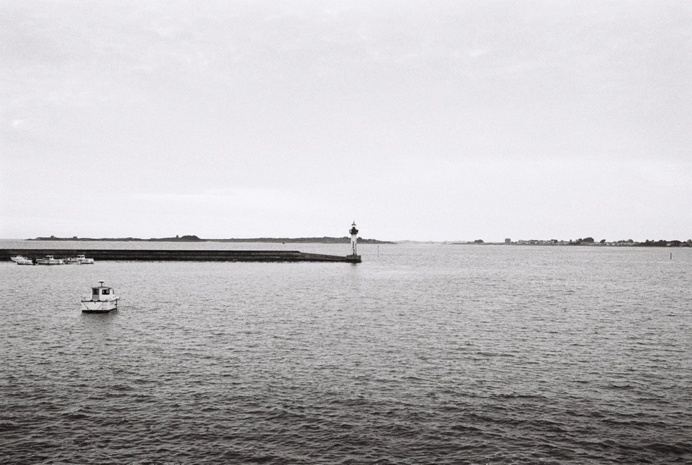

---
categories:
- lettre
letter: "bonjouryannick"
date: 2021-09-11T01:47:00Z
newsletter: true
resources:
  - src: "*.webp"
tags:
- la lettre
emoji: 💌
color: rosewater

title: "24 - Idées déco, surf et Gustave Eiffel"
slug: "24"
---

_Cette newsletter est écrite par \[Yannick\](_[_https://yannickschutz.com/now_](https://yannickschutz.com/now)_). Il aime les listes, partager et découvrir. Il va encore vous raconter sa vie et ce qu'il a vu/lu/entendu. Soyez prêt! Et merci, d'être là._

👋🏻

Bonjour,

C'est la rentrée. Tom a repris les chemins de l'école, Louise celui de l'assistante maternelle. Et moi, celui de mon bureau. Qui ne me plait plus. Trop large, trop épais. Donc je me suis mis à la recherche de son remplacant. Ou juste d'un nouveau top pour le mien. Rien de trouvé encore. Les classiques assis debouts sont moches quand même. Les autres aussi en fait. J'adore ces super photos des bureaux des gens. Je finirai bien par trouver celui qui me plait assez et ne me ruine pas. Et vous, vous bossez sur quoi? C'est quoi votre bureau?

J'ai commencé une liste de chansons parlant de surf en réécoutant le blue album de Weezer, à cause de \[Damien et du podcast At this moment\]([https://amourchips.com/atthismomentpodcast/#10](https://amourchips.com/atthismomentpodcast/#10)). C'est assez amusant de faire ces listes et ce podcast est chouette aussi, allez l'écouter. J'ai plusieurs listes comme ça. Par exemple, une liste des articles que j'ai aimé lire, vidéos regardées, newsletters et autres joyeusetés dans Day one. C'est chouette les listes pour les newsletter, c'est rempli de choses à partager. En parlant de surf et de bidules à partager, je vous conseille \[ce petit podcast\]([https://www.franceculture.fr/emissions/eureka/eureka-emission-du-mardi-24-aout-2021](https://www.franceculture.fr/emissions/eureka/eureka-emission-du-mardi-24-aout-2021)) sur l'histoire du surf.

J'ai aussi une liste des phares que j'ai vu ici en Finistère. Et dans cette liste, il y a ce petit phare un peu spécial de Moguériec. Un phare qui a voyagé, on pourrait même dire qu'il a vu du pays. Il est né juste à côté d'une grande dame qui partait pour New-York. Conçu par un certain Gustave Eiffel, ce phare a d'abord servi à Honfleur. Il est arrivé à Moguériec grâce aux pécheurs et une taxe sur le poisson débarqué. Et là cette semaine, il est parti pour rénovation. Je vous laisse \[une vidéo qui montre son démontage et transport\]([https://youtu.be/Jeuy5-a03Pw](https://youtu.be/Jeuy5-a03Pw)). Il y a un joli petit camping avec un cuistot d'enfer juste à côté, je vous le recommande.

Voilà, c'est tout pour cette semaine.

Bon samedi et à bientôt,

Yannick
