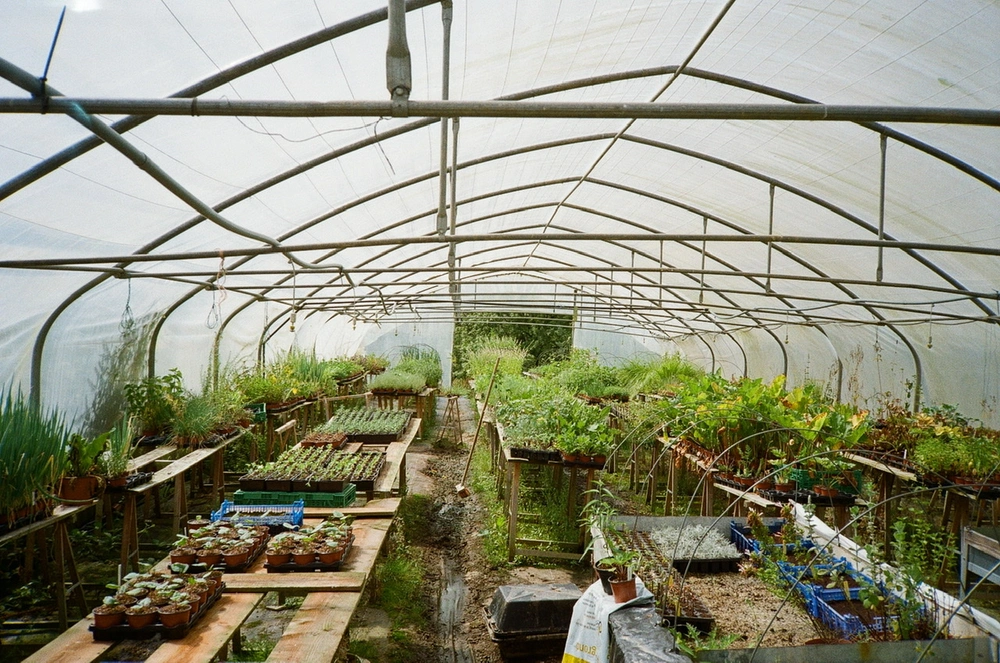

---
categories:
- lettre
letter: "bonjouryannick"
date: 2021-10-16T01:47:00Z
newsletter: true
resources:
  - src: "*.webp"
tags:
- la lettre
emoji: 💌
color: red

title: "25 - Baguette, opportunités et un brin de magie"
slug: "25"
---

_Cette newsletter est écrite par \[Yannick\](_[_https://yannickschutz.com/now_](https://yannickschutz.com/now)_). Dans un monde de sorciers, il aurait été heureux. Il va encore vous raconter sa vie et ce qu'il a vu/lu/entendu. Soyez prêt! Et merci, d'être là._

👋

Bonjour,

Se poser et écrire, vider son esprit. Laisser le temps ralentir. On voudrait tous prendre plus le temps pour cela. Je me rends compte que ces derniers temps, j'aimerais bien vivre dans une certaine école de sorcellerie. Prendre le train à Londres et finir à Poudlard. Enfiler ma robe de sorcier et suivre des cours, apprendre des choses que mon esprit ne saurait imaginer.

Pourquoi penser à Harry Potter? Mon fils en est dingue donc on se les refait en même temps qu'il lit les livres. Mais ce n'est pas seulement pour cela en fait. Certains objets de la série me feraient absolument plaisir pour le moment.

La pensine de Dumbledore me permettrait de vider mon esprit, ne pas oublier et garder les souvenirs qui s'effacent trop facilement de mon esprit. Mais avec tout ce que j'ai dans la tête en ce moment, j'aimerais bien pouvoir juste retirer un peu de la pression qui s'y trouve. Calmement du bout de ma baguette et laisser tout cela tremper.

Le retourneur de temps de Miss Granger me permettrait de trouver ce temps que je ne prend pas toujours et d'allonger les opportunités. Mais aussi de revivre ces beaux moments que je vois passer et que j'aimerais voir durer. On n'arrête pas de dire que les enfants grandissent trop vite. J'ai déjà oublié comment était Louise il y a quelques mois.

D'autres objets au final sont déjà dans nos poches. La carte du Maraudeur et la position de chacun dans Poudlard. Ouvrez votre téléphone et utilisez find my sur iOS. C'est magique. Savoir où sont les gens, où sont vos objets, c'est tout simplement magique. Clairement moins jolie que la carte que Harry balade partout.

J'aurais adoré trainer dans la bibliothèque de Poudlard, moi qui adore le papier, j'aurais été comblé. La magie aussi m'aurait mis des étoiles dans les yeux. Je ne sais pas vous, mais cela me fait garder mon âme d'enfant. Je me réjouis de partir à Londres avec Tom et découvrir ensemble ce monde dans les studios et autres lieux qui ont fait toute une partie d'un imaginaire magique.

Bon samedi à vous,

Yannick

PS: Je reconnais bien sûr toutes les polémiques qui entourent l'autrice. Je n'étais pas là pour parler de ça.
