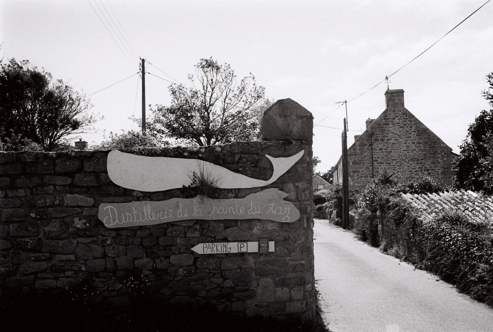

---
categories:
- lettre
letter: "bonjouryannick"
date: 2021-11-10T19:43:20.056003Z
newsletter: true
resources:
  - src: "*.webp"
tags:
- la lettre
emoji: 💌
color: rosewater

title: "26 - Cantine, papier et Aziz Ansari"
slug: "26"
---

-----

_C'est gentil d'être passé! J'espère que vous appréciez ce que vous lisez. Moi c'est Yannick, je suis plutôt indécis, j'aime le papier et vous raconter tout et n'importe quoi_

_Vous lisez [Bonjour](https://yannickschutz.com/bonjour), une newsletter sur tout et rien écrite par [Yannick](https://yannickschutz.com/now)._

-----

👋

Bonjour,

C'est fou comme se mettre à écrire suffisamment tôt accroit les chances d'envoyer la lettre à temps. Les habitudes et la rigueur, ça a parfois du bon. Me voici, lundi, deux semaines avant de vous envoyer cette lettre, à déjà la taper. Est-ce que cela aide pour savoir de quoi on va parler? Certainement pas, mais en même temps, c'est la beauté de l'écriture.

... du temps qui passe ...

Bon, il m'aura quand même fallu deux semaines de plus pour continuer à écrire cette lettre. J'étais trop occupé à tester 14 applications différentes pour écrire pour finir par revenir à iA Writer. J'étais trop occupé à tester 14 claviers pour revenir au premier. J'étais trop occupé à essayer 14 applications pour gérer mes photos et revenir à Lightroom. Enfin, je dis j'étais busy comme disent les anglais. Sembler occupé pour ne pas avancer sur les choses importantes. Bon y'a aussi eu des choses importantes qui ont avancé. Les travaux pour la cabane ont enfin commencé, merci les gens qui nous aident pour ça d'ailleurs et qui ne liront jamais ceci.

J'ai envie de tester des catégories pour vous partager des choses que j'ai vu, lu, entendu. Alors c'est parti

## 📺

Cette semaine, j'ai regardé [Less is more](https://youtu.be/u70ibusP7HM), une vidéo de voyage et de surf. Une famille qui vit pour le surf. C'est agréable de les voir vivre et voyager dans leur vieille ambulance. Un rien trop extrême comme style de vie pour nous mais il y a des choses à prendre. Tom a bien aimé aussi. Ca donne envie de partir se perdre en Irlande.

On a aussi continué de regarder Parcs and Recreation. Une série très drôle. Ces séries qui n'ont pas un énorme scénario mais qui vous divertissent juste ce qu'il faut. Ron Swanson est mon totem. Il me fait mourir à chaque épisode. Je vous la conseille vraiment, elle est sur Amazon Prime ou ailleurs peut-être aussi.

## 📚

Je viens de commencer le [volume 2](https://www.librairiesindependantes.com/product/9782353481019/) de la Cantine de minuit. Un ton léger pour ces tranches de vies vues au travers des plats commandés dans ce restaurant ouvert la nuit. Tant qu'il a les ingrédients, le chef vous cuisine ce que vous voulez. On a commencé aussi la série sur Netflix, c'est plutôt agréable et différent des autres choses que l'on regarde en général. Merci à [Juliette](https://www.jenesaispaschoisir.com) pour cette découverte.

## 📷

J'ai fait imprimer des photos chez [Ooblik](https://ooblik.com), découvert en lisant des posts sur [comment faire son zine photo](https://richielem.com/faire-un-zine-photo/). Vraiment satisfait du résultat et, en plus, ce sont deux artisans passionnés. Je repasserai par chez eux pour d'autres travaux et qui sait peut-être pour un petit zine bientôt aussi! Dites moi si cela vous intéresse.

Imprimer ses photos, les avoir en main, les passer, pouvoir les partager, en faire des cartes postales, un cadeau, une note, c'est tellement mieux que un jpg ou jeton non fongible. Pouvoir les toucher, cela donne une toute autre dimension à ces moments vécus et capturés, si vous ne le faites pas, pensez-y. Ici, j'ai imprimé une sélection de mes photos de l'année dans toutes les conditions pour voir ce que cela donne chez eux et franchement, je suis super content!

Voilà, c'est tout pour le moment.

Bonne soirée,

Yannick

PS: J'ai décidé d'envoyer la lettre quand je le voulais et plus forcément au même moment. Est-ce un souci pour vous? Aimez-vous ce genre de surprise?
