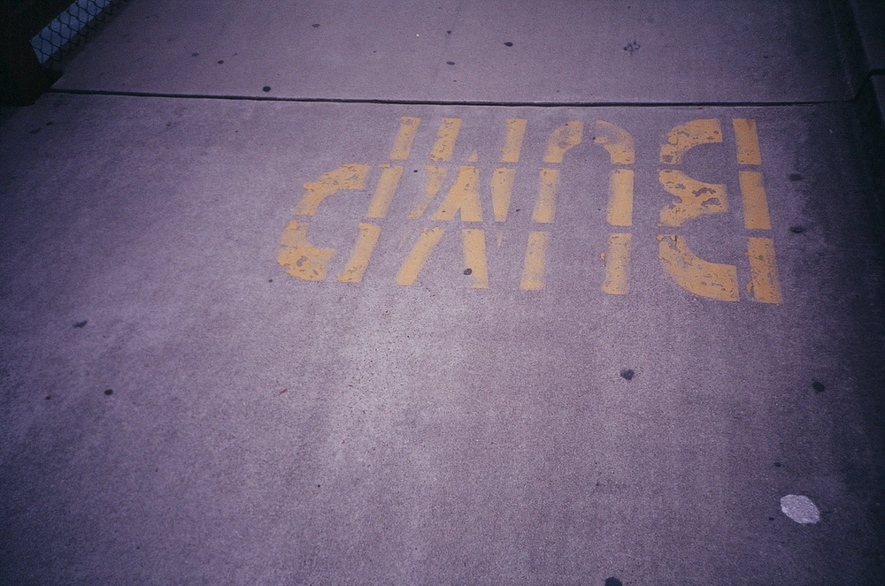

---
categories:
- lettre
letter: "bonjouryannick"
date: 2021-12-02T19:47:51.905078Z
newsletter: true
resources:
  - src: "*.webp"
tags:
- la lettre
emoji: 💌
color: rosewater

title: "27 - Larmes, Cancer et changement climatique"
slug: "27"
---

-----

*C'est gentil d'être passé! J'espère que vous appréciez ce que vous lisez. Moi c'est Yannick, je suis plutôt indécis, j'aime les livres et vous raconter tout et n'importe quoi*

*Vous lisez [Bonjour](https://yannickschutz.com/bonjour), une newsletter sur tout et rien écrite par [Yannick](https://yannickschutz.com/now).*

-----

👋

Bonjour,

> Ça fait du bien de pleurer

C'est ainsi que commençait une chronique radio l'autre jour. J'étais au volant, et je me suis empressé de la dicter à Siri. C'était une sorte de déclic, j'avais compris que je devais vous en parler.

J'ai toujours eu la larme facile, je dois bien vous l'avouer. C'est bien simple, la mort de Mufasa me fait toujours le même effet. Je ne suis pas un de ces hommes qui ne pleure pas ou du moins qui le cache. Je suis plutôt un barrage qui serait toujours plein dont il faut ouvrir les vannes et laisser couler un petit peu. Un robinet ayant toujours une goutte qui coule. C'est bien simple, je peux pleurer devant n'importe quel film, ou ces derniers temps, devant beaucoup de news.

Cette chronique radio, en plus, c'était avec des invités pour un film qui parle de cancer. Bingo! Les larmes viennent seules au volant. Pour ceux qui ne connaissent pas ma vie, le cancer et moi, on est pas potes et je suis plutôt orphelin à cause de lui. Mais bon, c'est du passé ça. Cela m'a permis de développer une philosophie de la mort et du deuil.

C'est marrant, parce que j'ai pu retrouver cette pensée dans un livre. [Un livre qui parle de surf](https://www.librairiesindependantes.com/product/9782203192393/), comme par hasard. La boucle est bouclée. Ma pensée sur le deuil est simple. En gros, la douleur ne disparait jamais, elle va et vient comme les vagues. Comme les vagues, parfois c'est petit, parfois c'est jour de tempête. Comme un surfeur, tu essaies toujours de rester sur ta planche, de ne pas te faire emporter. Certains jours, la vague t'emporte et te dépose sur le rivage. Ton but, rester debout sur la vague.

Voilà, je vous ai bien miné le moral? Perso, ça va. Cela me fait du bien de vous parler de ceci. En fait, c'était surtout pour vous rappeler que cela fait du bien de verser quelques larmes. Mais on va passer à autre chose, non? Des choses plus légères.

## 📚

J'ai envie d'une baignoire. Je ne prend jamais de bain mais depuis cette semaine, je veux me prélasser dans un grand bain chaud. La cause? Un manga. Suggéré par Riad Sattouf sur France Inter, lu par Cloé et finalement par moi-même. Le pitch? Un architecte romain, de l'époque de l'empereur Hadrien, doit dessiner des bains et à chaque projet, il finit par se cogner, plonger au fond d'un bain ou autre et se retrouve au Japon actuel d'où il pompe les idées modernes avant de retourner d'où il vient. J'ai lu le premier tome, c'est bien barré, surtout quand tu commences à le lire à l'envers. C'est bourré de petits détails et faits historiques. Le titre? [Thermæ Romæ](https://www.recyclivre.com/shop/289460-1906141-thermae-romae-vol-1-mari-yamazaki-9782203049093.html#/26-etat-bon) de Mari Yamazaki.

Je continue de lire [Humankind](https://www.librairiesindependantes.com/product/9781408898956/) qui parle du fait qu'au fond l'homme est bon. Ça fait du bien ce genre de lecture. Pour le moment, il apporte surtout un regard nouveaux sur des expériences psychologiques qui avaient pour but de montrer que l'homme est mauvais. C'est bien écrit et agréable. [Son premier livre](https://www.librairiesindependantes.com/product/9782757886717/) était vraiment top aussi, cela m'a poussé vers celui-ci. J'aime son ton optimiste. Et à voir ce que le monde nous sert, il faut pas oublier de voir le verre à moitié plein.

Pour continuer dans l'optimisme, je vous conseille [cet article](https://www.wired.co.uk/article/climate-crisis-doom) de Wired intitulé "Stop Telling Kids They’ll Die From Climate Change". Ils y aura sans doute des dégats mais le but principal de l'article est d'amener les gens à adopter un autre discours qui encourage l'action. Le changement climatique est un de nos gros fléaux, si pas le plus gros. Mais ce n'est clairement pas en ayant un discours pessimiste poussant à l'inaction et glissant vers l'inévitable que l'on s'en sortira. Cela parle aussi des news et de la mauvaise image qui est dépeinte par ce flux incessant de nouvelles, le plus souvent mauvaises. Est-ce que au final, cela irait mieux que l'on ne le dit, faut quand même pas pousser. Mais c'est pas pour autant que l'on doit baisser les bras et succomber.

Et pour finir, l'auteur de In Waves dont je parle plus haut a illustré la nouvelle édition des [Jours barbares](https://www.librairiesindependantes.com/product/9782364685963/) que je me suis, bien sûr, empressé de commander. Ce qui me laisse avec mon ancienne édition. Je me suis dit que ce serait chouette de faire un petit concours pour vous le faire gagner car ce livre est top. Donc, si vous voulez avoir une chance de gagner mon ancienne édition, envoyez moi une photo et un texte sur ce que vous voulez. Je tirerai au sort dans deux semaines hors de la liste des gens qui auront répondu!

Voilà c'est tout, bonne journée à vous,

Yannick

💌
