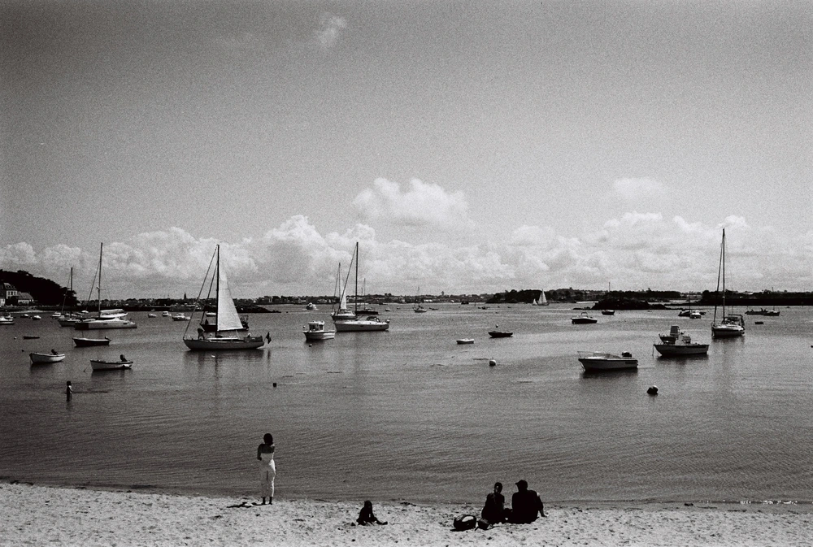

---
categories:
- lettre
letter: "bonjouryannick"
date: 2022-01-26T02:47:00Z
newsletter: true
resources:
  - src: "*.webp"
tags:
- la lettre
emoji: 💌
color: red

title: "28 - Nouvel an, parcs et jeux vidéos"
slug: "28"
---

> Cette newsletter a été écrite rien que pour vous. Oui, vous. Merci d'être là.
> Je suis votre hôte aujourd'hui et je m'appelle [Yannick](https://yannickschutz.com) et cette lettre, c'est [Bonjour](https://yannickschutz.com/bonjour).
> Si vous ne savez pas de quoi elle parle, moi non plus. Mais là, l'amour du grand air et du pad de jeux vidéo se fait sentir.
> Appréciez le moment et profitez de la vie

👋

Bonjour,

En lisant les 100 trucs cool de Greg, j'ai pensé aux quelques uns qui me manquaient.

> ✍️ 94. On a des tickets pour un festival
>  95. Je n'ai pas pris l'avion
>  96. J'ai supprimé Facebook
> 97. On a été sur l'île de Batz, pas encore Ouessant, on y travaille
> 98. J'ai fait un [super resto](https://labutte.fr) pour l'anniv de Cloé avec une farandole de beurres
> 99. Il a neigé sur les Monts d'Arrée et on a été à pied à l'école
> 100. Je me sens plus à l'aise avec mes choix

C'est fou comme se souvenir, c'est compliqué. Mais c'est chouette de prendre le temps d'apprécier les petites choses et  les grosses. Une liste folle de moments, les souvenirs tels une bobine de fil que l'on déroule. Y'en a d'autres qui continuent d'arriver, comme si quelqu'un avait ouvert les vannes de mon barrage à souvenirs. C'est un super moyen de positiver. Est-ce que u final, apprécier ce que l'on a, n'est pas le meilleur moyen d'être heureux. (Vous avez deux heures, je ramasse les copies ensuite)

Enfin, bonne année (un peu tard) à vous et merci de rester dans le coin pour 2022. L'année des élections en France qui donnent envie de se barrer au fin fond de la nature sans télé, ni téléphone. Tout quitter pour vivre dans les parcs nationaux américains. Je pense aux grands parcs à cause d'un lien partagé sur Twitter cette semaine. [Une chouette typo](https://nationalparktypeface.com) qui imite celle des panneaux sur les sentiers de randonnée des parcs. Ce lien, comme l'article des 100 trucs cool, à commencer à dérouler des liens souvenirs. Comme [ce superbe bouquin](https://standardsmanual.com/products/parks) qui est une collection de cartes, brochures et autres objets graphiques liés aux parcs. Un jour, il sera mien. Tout cela me redonne aussi envie de jouer à [Firewatch](https://www.firewatchgame.com) que je n'ai jamais fini. Ou de commencer [A short Hike](https://ashorthike.com), j'adore ce genre de jeu feel good. Je ne sais pas si vous aviez testé [Alba a wildlife adventure](https://www.albawildlife.com) mais j'avais adoré.

C'est fou comme de fil en aiguille, tu déroules des idées et tu changes de sujet. C'est agréable de voir comment notre cerveau peut parfois lier des choses en quelques cases et se rappeler d'autres. Comme quand le mot de wordle ou du sutom vous vient tout naturellement. C'est ces petites choses qui me font admirer les capacités de nos cerveaux. On se prend vite au jeu.

Je vous laisse avec cette belle petite liste de liens qui vous feront respirer le bon air. Si vous voulez, vous devriez aussi aller voir [ce nouveau t-shirt](https://everpress.com/every-f-thing-1) fait sans regarder par l'ami Damien. Tu pourras le porter cet été dans les meilleurs Club Med de la planète.

En attendant plus de belles choses, je vous salue bien bas.

Bon mercredi,

Yannick

💌
