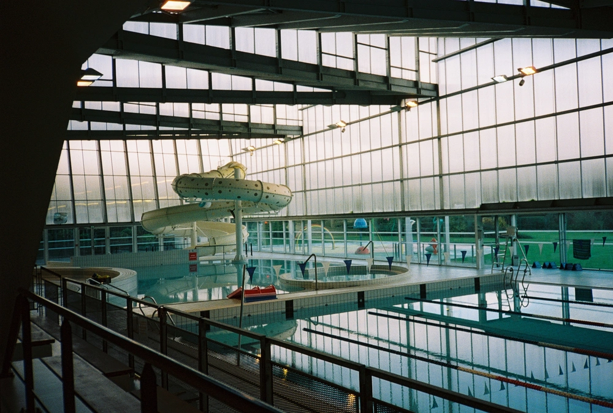

---
categories:
- lettre
letter: "bonjouryannick"
date: 2022-02-24T03:47:00Z
newsletter: true
resources:
  - src: "*.webp"
tags:
- la lettre
emoji: 💌
color: rosewater

title: "29 - Camping de luxe, volcans et Horcruxe"
slug: "29"
---

​​
---

_Cette newsletter est écrite par [Yannick](https://yannickschutz.com/now). Il va encore vous raconter sa vie et ce qu'il a vu/lu/entendu. Il est celui qui vous raconte ses histoires. Soyez prêt! Et merci d'être là. Si vous aimez, n'hésitez pas à la partager. Sinon, ne la partagez pas._

---

👋

Bonjour,

Je reviens d'une semaine de vacances à Lanzarote. Je me suis dit que c'était le bon moment pour vous écrire. Je n'oublie pas, je suis juste tête en l'air. C'est dur de se tenir à quelque chose. Je repense aux mots de Craig Mod dans [son review de son programme de Membership](https://craigmod.com/essays/memberships_work/). En gros, il propose aux gens qui pensent à faire une newsletter payante, de commencer par se tenir à l'écriture pendant 3 mois. Et franchement, c'est pas simple en fait. Il me faudrait une rigueur que pour le moment je n'ai pas. Au moins, tout avance, la cabane est hors d'eau, hors d'air et isolée. La suite peut continuer.

En vacances, j'ai eu la joie de shooter presque 10 rolls. Ils viennent d'arriver chez [Mori](https://morifilmlab.com), ce moment où tu deviens trop impatient. Cette île était magique, une belle découverte. On y a passé une semaine dans un hôtel du sud de l'île. On avait loué une voiture et on voyageait avec les amis, Greg, Marion et la petite famille. Si vous voulez un aperçu de l'île, allez voir [cet article](https://liliinwonderland.fr/voyage-lanzarote-que-voir-que-faire-sur-lile-aux-volcans/). Mais attendez le mien surtout. Ou allez voir les [photos](https://twitter.com/gregmignard/status/1495842664956190728) [postées](https://twitter.com/gregmignard/status/1495405639203446790) par Greg sur Twitter. Une belle ambiance, un plein de vitamine D en échange d'une petite portion de mon âme. Cette île est mon Horcruxe.

On est en train de voir pour une descente dans les Landes en van pour avril, on a remarqué que le sud, c'est pas trop ça niveau spots sauvages. Les enfants ont trop hâte de repartir en van et de dormir dedans. Nous aussi en fait. Alors, on regarde les campings du sud, qui rouvrent juste à temps pour les vacances de printemps. On trouve de tout. Mais on a surtout été surpris par un camping ⭐️⭐️⭐️⭐️⭐️ qui propose des emplacements VIP. Avec leur cuisine et sanitaires privatifs... mais surtout un jacuzzi. Assez fou de se dire que des gens payent le double pour cela... Je n'ai pas du tout la même approche, faites moi payer le double pour avoir moins justement. Enfin, peut-être pas le double. Faut quand même pas se moquer du monde. En plus, Louise ne pourrait même pas aller dedans, donc devoir passer son temps à l'en empêcher, c'est plutôt à eux de me payer le double pour cet emplacement!

Tiens pour boucler sur Craig Mod au début de cette lettre, j'ai remarqué ces derniers temps que j'avais un crush infini pour les street photographers japonais. Non, mais regardez moi ces couleurs! J'ai commencé [un moodboard](https://kinopio.club/moodboard-QVYh20AQeyvEA3CS3l2TB) et j'ai l'impression qu'il déborde de cette nostalgie japonaise que je ne connais que par les écrans. C'est assez fou et cela me donne tellement envie d'aller là-bas. Je vois et j'écoute des retours d'amis sur ce pays et sincèrement, il me faudrait quelques mois pour tout faire je pense mais c'est fou comme ces images et ces histoires ont une force. La puissance du récit est telle que je n'ai qu'une envie, pouvoir créer mon propre récit sur ce pays, sur ma vision de ce pays. J'ai eu pareil avec les [photos](https://www.instagram.com/p/CZujtifA5Tf/) de Jérémy et [New-York](https://www.instagram.com/p/CZ7cp33sWrC/). Comme quoi l'image et l'histoire, c'est ce qui fait le destin des hommes depuis la nuit des temps. Wow, ça pourrait être une petite lettre . Mais cela sera pour plus tard, je baille. Il est temps de finir.

Bon jeudi,

Yannick

💌
