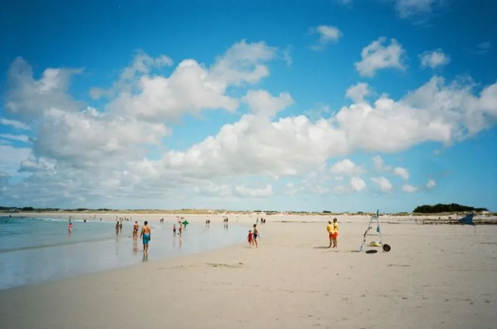

---
categories:
- lettre
letter: "bonjouryannick"
date: 2020-10-31T00:00:00Z
newsletter: true
resources:
  - src: "*.webp"
tags:
- la lettre
emoji: 💌
color: rosewater

title: "3 - Plastique, Colibri et Water family"
slug: "3"
description: "Hello à tous. Merci de toujours lire cette petite lettre. Aujourd'hui, je voulais vous présenter mon côté qui se préoccupe de la planète. Ce Yannick là se trouve cool et se considère comme un micro activiste."
---

👋🏻

Hello à tous. Merci de toujours lire cette petite lettre. Aujourd'hui, je voulais vous présenter mon côté qui se préoccupe de la planète. Ce Yannick là se trouve cool et se considère comme un micro activiste.  Parce que sans Terre, y'a plus de Terriens. Pas bête l'animal.  

Alors comment peut-on aider cette belle bleue? Je viens de recevoir un chouette mail de [Surfrider](https://surfrider.eu/), une association qui se bat pour la protection de l'océan. Dans ce mail, ils partagent leur nouvelle appli en collaboration avec Microsoft qui permet de recenser les déchets trouvés en bordure de cours d'eau. Le nom est chouette aussi [Plastic Origins](https://plasticorigins.eu/). Car, comme vous le savez ou non, tout déchet en bord d'eau finit dans l'océan.  D'ailleurs [ces graphismes](https://graphics.reuters.com/ENVIRONMENT-PLASTIC/0100B275155/index.html) de Reuters sont assez impressionnants sur notre quantité de plastique consommé. J'adore cette comparaison par rapport à des monuments connus. Mais c'est assez horrible. 

Cela fait quelques années que nous faisons notre part, comme disait le colibri. Du [nettoyage de plages](https://yannickschutz.com/juste-deux-minutes/) aux ramassages de [déchets en randonnée](https://yannickschutz.com/randonnee-propre/), on ne sort jamais sans un sac. C'est simple et cela permet d'aider. D'ailleurs, Surfrider organise des nettoyages de plages en groupes (Sauf durant les pauses confinements bien sûr). Vous pouvez les retrouver sur [Initiatives océanes](https://www.initiativesoceanes.org/). Sinon remplissez les bacs à marées. C'est assez simple. N'oubliez pas vos déchets et tout ira bien.

Cette année, via [Léa Brassy](https://leabrassy.com/), j'ai aussi découvert la [Water Family](https://waterfamily.org/). Je suis en train d'organiser leur passage dans l'école de Tom. Je me réjouis de voir les enfants du coin sensibilisés aux problèmes de l'eau. Leur méthode est top et j'aimerais pouvoir être dans la classe quand cela arrivera. Ils sont pas mal présent un peu partout en France et vous pouvez même suivre leur apprentissage pour partager cette bonne parole qui au moins n'implique aucun bain étrange ou signe ésotérique.

Vous l'aurez compris, j'essaye de m'investir et je voulais vous partager ces coups de coeur. On ne sait jamais, cela pourrait vous inspirer à donner du temps ou un franc. Enfin, un euro, je sais qu'on est plus en 1980. D'ailleurs j'y étais pas. Mais donc que ce soit en installant une app, en ramassant les déchets, en éduquant vos amis ou en en donnant quelques euros, on peut tous aider facilement et à notre mesure.

Voilà, pour la peine, je suis sorti de mon format bi-mensuel car j'avais trop envie de vous parler de ceci. Sur ce, je retourne à ma lecture. Mon but est de commencer enfin à lire [Tools for grassroots activists](https://www.patagonia.com/product/tools-for-grassroots-activists-paperback-book/BK740.html) de chez Patagonia. D'ailleurs, je vous conseille leurs superbes reportages. Ils sont dispos sur [Youtube](https://www.youtube.com/c/patagonia). 

Je sais que le temps va être étrange et que peu de choses pourront être faites avant 2021 mais partager ceci maintenant me semblait utile pour juste planter la graine, vous laisser le temps de la faire grandir au chaud durant le confinement et peut être fleurir au moment du déconfinement. En plus, vous êtes chez vous et je vous fournis de la chouette lecture.

J'espère que cela vous aura plu. N'hésitez pas à m'envoyer des retours. Partagez cette lettre comme ça, vous aurez déjà fait votre part. 

À bientôt et bon confinement à tous,

Yannick 

😘
