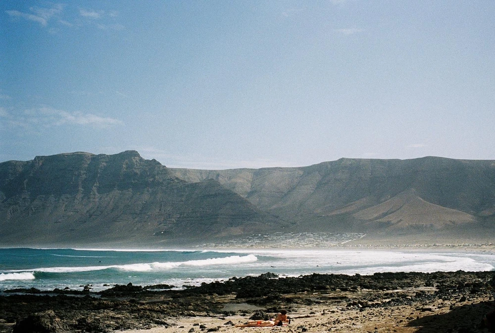

---
categories:
- lettre
letter: "bonjouryannick"
date: 2022-03-20T13:23:05.478094Z
newsletter: true
resources:
  - src: "*.webp"
tags:
- la lettre
emoji: 💌
color: rosewater

title: "30 - Dave Grohl, des magazines et un mont analogue"
slug: "30"
---

---

*Cette newsletter est écrite par [Yannick](https://yannickschutz.com/now). Il va encore vous raconter sa vie et ce qu'il a vu/lu/entendu. Il est celui qui vous raconte ses histoires. Soyez prêt! Et merci, d'être là. Si vous aimez, n'hésitez pas à la partager. Sinon, ne la partagez pas.*

---

👋

Bonjour,

Le temps passe, on oublie d'écrire. Les semaines passent et on s'habitue à ne pas envoyer la petite lettre. Trop occupé à faire d'autres choses. Je ne vous oublie pas, promis. On est juste entré dans la phase active de la cabane et puis la nature se réveille. Aujourd'hui, c'est le printemps. Le retour des jours plus longs. Ne pas finir ses journées dans le noir. C'est reparti, l'envie de faire des choses remonte avec la vitamine D.

Ces derniers temps, j'ai pris le temps de repasser sur mes photos des deux dernières années et de préparer un petit zine. Il est bientôt prêt. J'ai trouvé un imprimeur, je me suis amusé dans Affinity Publisher et j'ai fait des aller retours avec des amis pour un retour bien constructif sur la mise en page, les mots et autres. Cela prend un paquet de temps. Pas mal de soirées passées à comprendre les logiciels et autres manipulations à faire. J'ai hâte de le partager avec vous. Cela sera une petite édition limitée à 50 exemplaires. J'espère réitérer la chose sur d'autres projets que j'ai en tête.

## 📔 - Magazines

J'ai pris le temps de rattraper mon retard de lecture sur tous les magazines que je reçois. J'ai un faible pour ceux-ci. Entre le volume 14 de [Les others](https://www.lesothers.com/magazine/volume-14), le volume 11 de [Beside](https://shop.beside.media/products/issue-11), le premier [Emocean](https://emocean.surf) ou le premier [Daughters of the sea](https://daughtersofthesea.org), j'avais de quoi lire. Rajoutez mon abonnement à [Surfers Journal](https://www.surfersjournal.fr) et là vous voyez le nombre de pages à lire. Je continue à lire quotidiennement des romans, essais et autres. Mais je feuilletais à peine ces magazines. Session de rattrapage importante donc. J'ai d'ailleurs commencé à accepter le fait de sauter des articles. Je prend des notes et j'ai des petits post-its pour me rappeler des articles que j'ai adoré. Tout un programme de réorganisation! J'aime montrer mon support à des éditeurs indépendants. C'est une bénédiction et un malheur. Il y en a tellement de bons que parfois il faut faire un choix.

## 🎶 - Musique

J'ai fini la lecture de la [biographie de Dave Grohl](https://livre.fnac.com/a16204804/Dave-Grohl-The-Storyteller). Ce mec est vraiment fascinant. J'adorerais le rencontrer et passer des soirées avec lui. Toujours est-il que cela m'a fait re écouter la discographie complète des Foo Fighters. J'ai d'ailleurs appris que le nom du groupe était lié aux OVNIs. Et puis je suis aussi tombé sur plusieurs vidéos géniales dont ce [concert complet à Los Angeles](https://www.youtube.com/watch?v=KlZFS6HR6P8) qui finit avec une version de Everlong avec Nancy Bushell à la batterie. Cette petite fille qui [l'avait défié à la batterie](https://www.youtube.com/watch?v=q-PQeh46zPg&list=PL0B-SSjYdybBRF4tbXLAl4WDBhOQbydod), ou cette [vidéo avec Kiss Guy](https://www.youtube.com/watch?v=TjVOWOKa-lY). Ce gars est juste super drôle et spontané je trouve. Les covers qu'ils font sont fantastique et je prend vraiment plaisir à redécouvrir ce groupe. Leur [Carpool Karaoké](https://www.youtube.com/watch?v=5Xe0Qd6bUFo) m'avait bien fait marré à l'époque. Cela vous fait quelques heures de vidéos. Hésitez pas à me partager vos favorites.

## 📚 - Lectures du soir

J'ai commencé cette semaine le bouquin [Respire](https://www.mrjamesnestor.com), la version française de Breath. Je suis bon en traduction non? C'est un bouquin que je voulais lire depuis un moment. Depuis mes débuts avec la pleine conscience, je savais que la respiration avait un rôle important dans nos vies. Peut-être même avant, car si tu ne respires pas suffisamment longtemps, en fait... tu meurs. Et oui, vous ne le saviez peut-être pas mais voilà. Ce livre est une vraie plongée dans votre nez. Ce livre me donne plein de références et exercices pour le futur. Je vous le conseille vraiment.

J'ai aussi enfin lu [Le mont analogue](https://www.lemonde.fr/series-d-ete/article/2021/08/14/le-mont-analogue-un-puits-de-science-et-de-prescience_6091435_3451060.html), un livre fantastique d'exploration montagnarde et aventures scientifiques qui n'a pas de fin... Son auteur est décédé avant de le finir. Je le savais au début mais quand il se coupe, tu n'as vraiment pas envie qu'il se termine comme cela. Tu as envie de savoir la fin. Je vous le conseille terriblement.

Bon, j'ai lu [d'autres livres](https://yannickschutz.com/books) aussi dont je vous parlerai sans doute.

Voilà, c'est déjà tout, profitez bien du début du printemps, passez dans le coin! Et à bientôt.

💌

Yannick
