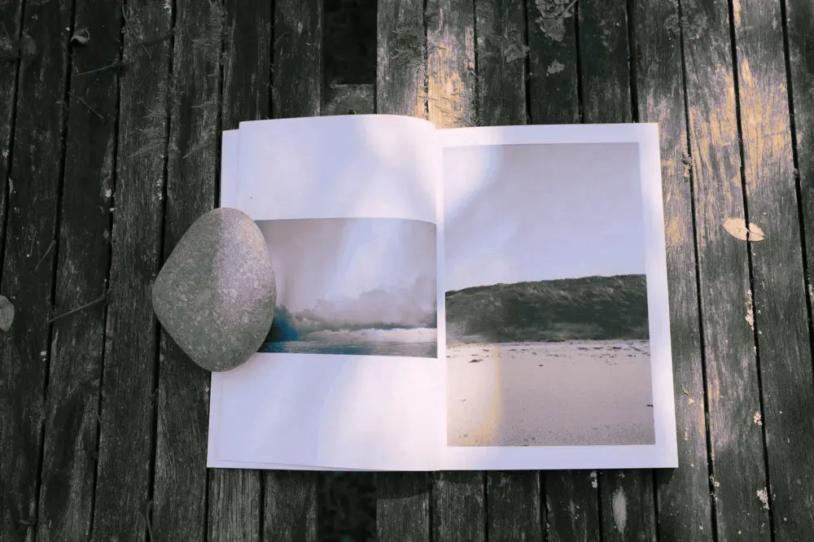

---
categories:
- lettre
letter: "bonjouryannick"
date: 2022-04-04T08:30:28.131753Z
newsletter: true
resources:
  - src: "*.webp"
tags:
- la lettre
emoji: 💌
color: rosewater

title: "31 - des ping, de la respiration et un magnifique zine que vous voulez absolument"
slug: "31"
---

*Cette newsletter est écrite par [Yannick](https://yannickschutz.com). Il va encore vous raconter sa vie et ce qu’il a vu/lu/entendu. Il est celui qui vous raconte ses histoires et a [imprimé ce zine](https://yannickschutz.com/shop/a-thousand-tides). Soyez prêt! Et merci, d’être là. Si vous aimez, n’hésitez pas à la partager. Sinon, ne la partagez pas.*

✌

Bonjour,

C'est lundi, l'internet a décidé de ne pas marcher. C'est bien simple, cela me donne du temps pour vous écrire ces quelques mots. J'étais tranquillement en train de préparer un colis pour mon labo photo favori, quelques films, une photo et un peu de sucreries. Faut bien les nourrir et là paf, Internet ne va plus. Comment pourrai-je imprimer le timbre? Je ne sais pas, voici un mystère à résoudre.

Hop, je marche au salon, oui madame, on ne court pas à l'intérieur. Je redémarre la box 4G, ça devrait le faire. Je redescend au bureau, [`ping 1.1.1.1`](https://1.1.1.1), toujours rien. Je remarche au salon. Comme la république en marche mais sans le président. On redémarre le WiFi. Oui les deux sont séparés ici. Je redescend, re`Ping 1.1.1.1` → réponse. C'est bon l'internet est de retour. Est-ce que cela va retarder l'envoi de cette lettre? Sans doute. Me revoilà distrait par l'impression du timbre et finir mon envoi. Attendez-moi je reviens.

Voilà, je suis de retour. Je vous ai manqué? L'ellipse marche mois bien dans une lettre. Sauf, si bien sûr, comme moi, vous êtes allé vous faire une tisane, un café, une ligne de coke. Biffez les mentions inutiles. Là, je vois le désordre sur mon bureau, je pense que mes pensées sont comme ce dernier (en désordre pour celles qui ne suivent pas). J'avoue avoir du mal ces derniers temps à écrire un flux continu sur le blog sur un seul sujet. J'ai des tonnes de brouillons avec des bullet points. C'est déjà un début. Peut-être que la trame narrative viendra ensuite. Je suis très théorie du récit ne trouvez-vous pas? *[NOFX](https://open.spotify.com/album/6Z8BYH27wINoUk4QMUx7gh?si=_7Y2ExR5RuiRiAgDUDA8Gw) passe en fond musical* Au fait si vous vous demandiez, oui j'ai imprimé le timbre et fait une belle enveloppe. Il faut soigner ses envois. Distraire et amuser les gens, c'est important. Sourire c'est bénéfique pour tout le monde.

J'étais encore parti, comment ça va vous depuis tout à l'heure? Je pense qu'il est temps que je sorte un des livres de ma pile de lecture. [Stolen Focus](https://stolenfocusbook.com/) semble totalement adapté. J'en ai lu des bouquins pour reprendre mon attention à toutes ces distractions. Et au final, je pense que j'ai juste donné mon attention à un livre plutôt qu'un flux infini qui est fait pour me faire rester. Au final, c'est déjà bien mieux. Dans toute la liste, mon favori, reste [How to do nothing](https://www.penguinrandomhouse.com/books/600671/how-to-do-nothing-by-jenny-odell/), je devrais le relire, mes vieilles habitudes de scroll reviennent un peu trop ces derniers temps. Si vous n'avez pas le temps de lire le livre, [Cette vidéo](https://www.youtube.com/watch?v=dveUrpp6vs8) peut suffire et si vous n'avez pas le temps, méditez pendant deux heures. Voilà c'était mon petit passage pleine conscience, qui revient bien pour moi et m'aide ces derniers temps.

J'ai aussi fini de lire [Breath](https://www.mrjamesnestor.com/) de James Nestor. Il est vraiment top et permet de repenser sa respiration. Chose que l'on pense naturelle mais qui au final est le centre de tellement de choses. Je vous le conseille si cela vous intrigue. Je connais plein d'adeptes de certaines des méthodes décrites dans le livre. C'est fascinant. J'ai envie de lire d'autres bouquins mentionnés dans celui-ci maintenant. Ils sont dans ma liste.

Et vous, vous avez lu quoi ces derniers temps? Moi j'ai lu "Nom" de Constance Debré et "Le Mont Analogue", sauf la fin, de René Daumal, mais je vous en parlais déjà la dernière fois. Tout comme "Respire" d'ailleurs. Mais parfois la répétition a du bon.

Oh et super nouvelle aussi, j'ai pas fait que procrastiner ces derniers temps, j'ai aussi publié **[💸 mon premier zine de tous les temps](https://yannickschutz.com/shop/a-thousand-tides)**. Un condensé d'air marin et de mes photos favorites de ces deux années de pandémie. J'en suis vraiment fier et je vous l'enverrai partout dans le monde si vous le voulez! D'ailleurs l'en tête, c'est lui ce beau zine. Je sais que je ne met que des photos analogiques normalement, ne m'en voulez pas trop! Je l'ai passé dans un [filtre dither](https://ditherit.com/) et tout. D'ailleurs en fait, cela vous fait deux photos pour le prix d'une cette semaine!

Voilà c'est à peu près tout pour cette semaine.

Bonne semaine,

Yannick

💌

P.S.: Si tes amis sont anglophones, [🇬🇧 la page du zine est aussi en anglais](https://yannickschutz.com/en/shop/a-thousand-tides)
