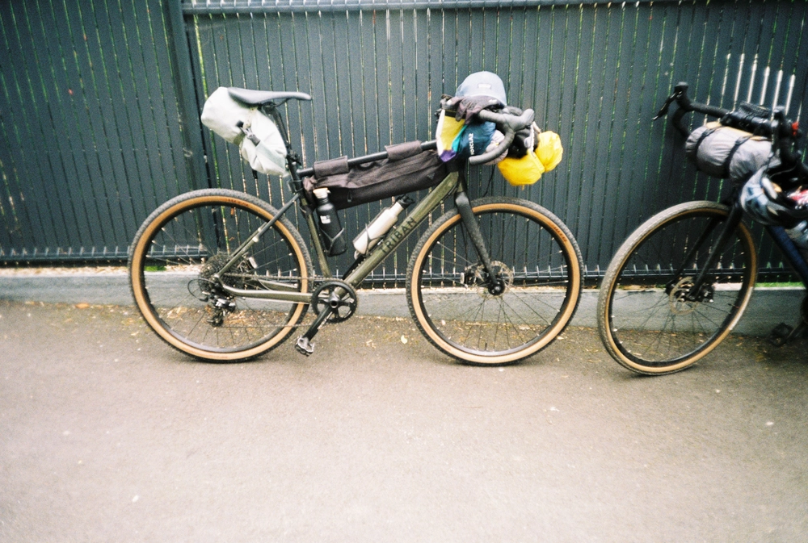

---
categories:
- lettre
letter: "bonjouryannick"
date: 2022-05-20T20:37:32.798090Z
newsletter: true
resources:
  - src: "*.webp"
tags:
- la lettre
emoji: 💌
color: rosewater

title: "32 - La côte, des aquariums et 100km"
slug: "32"
description: "Cela fait presque deux mois que je ne vous ai pas envoyé de petits mots doux. Les jours ont rallongé entre temps et pourtant je n'ai pas pris le temps de vous écrire. Vous m'en verrez fort désolé."
---

*Cette newsletter est écrite par [Yannick](https://yannickschutz.com). Il va encore vous raconter sa vie et ce qu’il a vu/lu/entendu. Soyez prêt! Et merci, d’être là. Si vous aimez, n’hésitez pas à la partager. Sinon, ne la partagez pas.*

✌

Bonjour,

Cela fait presque deux mois que je ne vous ai pas envoyé de petits mots doux. Les jours ont rallongé entre temps et pourtant je n'ai pas pris le temps de vous écrire. Vous m'en verrez fort désolé. La vie est ainsi. Mais au final je suis là! C'est ce qui compte, non? Deux mois, deux semaines, deux jours, tant que ça arrive. On ne va pas pinailler.

Que s'est-il passé pour que je ne daigne vous écrire? Rien de spécial en fait. Mon premier zine est soldout et a reçu un accueil auquel je ne m'attendais pas! Si, ça c'est un peu spécial quand même. Merci à toi si tu l'as chez toi. Si la carte postale ne te plaît pas, tu peux me l'envoyer. Tu peux aussi l'envoyer à ta grand-mère, cela lui fera plaisir. J'en suis sûr.

J'étais trop occupé à (essayer de) surfer ces derniers temps. J'avoue y aller autant que possible. Cela m'a d'ailleurs donné [envie d'écrire un rien sur le surf](https://yannickschutz.com/le-surf). Je n'arrivais pas à mettre des paragraphes et une structure sur cette nouvelle passion et donc j'ai préféré y mettre des émotions. Quand je parle de mes débuts en surf, j'aime à dire que d'où je viens, c'est pas courant le surf. L'est de la Belgique ne s'y prêtant pas forcément. Même si j'avais un ami qui en faisait. Je ne le comprenais pas à l'époque. Désolé Benoît, je comprend maintenant ton enthousiasme! D'ailleurs sur la communauté belge, j'ai lu un [chouette article sur un shaper de Ostende](https://www.vice.com/fr/article/g5q943/atelier-de-planches-surf-ostende), ville plus connue pour son marché aux poissons que pour ses vagues. J'ai toujours eu du mal avec la côte belge, lui préférant le côté sauvage chez les Hollandais. Mais à voir cette culture du surf de mer du nord, j'ai bien envie d'y retourner un de ces 4 pour y faire quelques photos. Faudrait déjà que je remonte en Belgique vous me direz, pas faux, touché même.

Entre temps, j'ai aussi eu l'occasion d'aller à [mon premier festival du film surf de Brest](https://brestsurffilmfestival.com). De super rencontres, de la papote et parfois des films aussi. Mais surtout une expérience folle le premier soir. Nous étions dans les aquariums d'Océanopolis, enfin pas vraiment dans l'eau. Il y avait un concert. Jusque là rien d'anormal. Sauf que ce concert, pour ne pas déranger les poissons était silencieux. Je me suis donc retrouvé, et tous les autres aussi, avec un casque wifi diffusant le concert live dans mes oreilles. Une expérience proche d'une prise de drogue. Caler devant les phoques avec une musique dans les oreilles qui semble totalement adaptée aux animaux est juste un moment magique. Enlever le casque et entendre juste légèrement le violon, encore plus dingue. Je vous le conseille à tous.

J'ai aussi eu l'occasion de faire un sacré tour en Finistère en vélo. 163km sur deux jours. Moi qui n'avait jamais fait plus de 20km. Quelle affaire. Je m'étais super bien préparé... J'avais gonflé mes pneus et mis de la crème anti irritations prêtée par les amis. Voilà toute ma préparation. [Est-ce que je suis fier d'avoir fait 100km en un jour?](https://www.komoot.com/tour/763561273?ref=wtd) Assez. Est-ce que je voulais que cela s'arrête après 80km? Assez. Est-ce que j'ai dit à Cloé que le lendemain elle devrait sans doute venir me rechercher et que je ne pourrais pas roulé le lendemain? Sans doute! Est-ce que le lendemain j'ai mangé un hot-dog avec [Jérémy](https://jeremyjanin.com), [Grégory](https://gregorymignard.com) et [Yves](https://yvesquere.com) a mi-chemin entre Roscoff et [Douarenn](https://douarenn.fr)? Bien sûr! Est-ce que la suite se trouvera en histoire sur le blog dans quelques jour? Si j'arrive à écrire cet article. Je vais reprendre ce paragraphe comme intro. Rien ne se perd, tout se transforme.

Voilà, je vous devais quelques nouvelles. Sachez que tout roule. Entre les activités, le boulot, le retour des beaux jours et la cabane qui avance encore et toujours, les journées sont bien remplies et je vais essayer de pas oublier de vous envoyer des mots doux!

Bon samedi,

Yannick

💌
