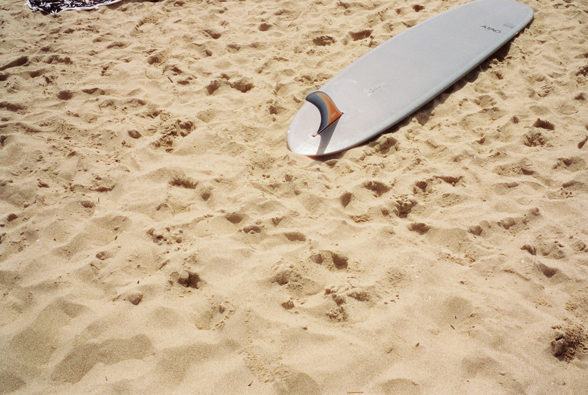

---
categories:
- lettre
letter: "bonjouryannick"
date: 2022-06-20T16:20:03.674615Z
newsletter: true
resources:
  - src: "*.webp"
tags:
- la lettre
emoji: 💌
color: rosewater

title: "33 - Super 8, wikilinks & du papier"
slug: "33"
description: "Aujourd'hui, je viens de poster une première vidéo sur instagram, je n'avais jamais fait cela. Je me sens un peu vieux parfois. Je dis une, car ce n'est pas moi qui l'ai filmée, ni éditée."
---

*Cette newsletter est écrite par [Yannick](https://yannickschutz.com). Il va encore vous raconter sa vie et ce qu’il a vu/lu/entendu. Soyez prêt! Et merci, d’être là. Si vous aimez, n’hésitez pas à la partager. Sinon, ne la partagez pas.*

✌️

Bonjour,

Aujourd'hui, je viens de poster [une première vidéo sur instagram](https://www.instagram.com/p/Ce_0rD1JPwA/), je n'avais jamais fait cela. Je me sens un peu vieux parfois. Je dis une, car ce n'est pas moi qui l'ai filmée, ni éditée. En plus d'avoir raconté [poétiquement sur son blog](https://jeremyjanin.com/breizhpacking/), Jérémy a capturé nos trognes en super 8 pour ce trip. Il fait de belles vidéos pleines de jolis sentiments. Je vous conseille son super passage sur [New York à la super 8](https://youtu.be/thGmMVeycDw), elle m'a donné le smile et l'envie de voir une ville. En fait, il fait vraiment tout ça très bien. Je vais avoir du mal à faire aussi bien pour raconter ce petit trip. Mais bon je tenterai quand même. J'aime écrire. Purée, ce premier paragraphe fait vraiment groupie. Ça doit être sa nouvelle petite moustache 🥸. Pour en rajouter un petit peu sur le vélo, Grégory vient de sortir aussi [son article de blog](https://gregorymignard.com/breizhpacking/) sur ce biketrip. Je vous le conseille aussi bien sûr. Bon me reste plus qu'à arrêter de procrastiner et écrire le mien. J'ai un paquet de photos à vous montrer aussi. Peut-être d'ici la prochaine lettre.

Je vous écris comme j'écrirai à n'importe quel pote. Ce ton pourrait peut-être déplaire, mais je préfère faire simple. Le but ici, est de vous partager des moments. D'ailleurs, je repense à [mon top 100 de 2021](https://yannickschutz.com/100-trucs/) et je vois que j'ai déjà commencé à maintenir le top 100 de 2022. Parfois, y'a des choses qui tiennent. Je pense que c'est aussi parce que j'ai arrêté de changer d'outil tous les 4 matins pour mes notes et mes écrits. Je reste fidèle à iA writer.

iA vient, d'ailleurs, de sortir [une superbe version 6](https://ia.net/writer) avec quelques ajouts que j'utilise pas mal. Les wikilinks, les content blocks, principalement. En gros, c'est ma base de données pour mes notes autour des rolls de photos argentiques et je fais des "contact sheet" après chaque dev. Cela me permet d'avoir un aperçu rapide et propre de mes photos par pellicule. C'est sans doute too much pour beaucoup d'entres-vous mais moi, ça me plaît. J'kiffe toujours autant de prendre des notes en Markdown. J'en parlais d'ailleurs plus tôt avec Grégory. Oui, je parle de tester Notes quand même parfois pour quelques détails. Mais bon, on ne se refait pas. Mon usage de ia pourrait faire un post tiens. Dites-moi si cela vous tente.

Bon, je parlais de vous écrire comme j'écris à n'importe qui. Mon cerveau a dévié. Il fait ça souvent ces derniers temps. Plutôt dur de rester focus sur une tâche. Sans doute pour cela que cette petite lettre se fait plus rare. Je passe du coq en pattes. Vous ne m'en voudrez pas je l'espère.

Après le "succès" de mon premier zine, je réfléchis à des formats plus alternatifs à mettre dans les mains des gens. J'aime le côté anti conformiste du zine, je pense que mon premier était trop propre au final. Proche d'un livre quasiment. J'aimerais me lâcher plus pour les suivants. Ce qui fait qu'en fait j'ai commencé à en accumuler pas mal ces derniers temps. Je me suis dit que cela pouvait vous plaire d'en voir quelques uns. Je vous en liste sans ordre ici, juste au cas où, comme moi, vous aimez lire et surtout, écouter des histoires. Je suis tombé sur [Grainzilla](https://grainzilla.bigcartel.com/product/girlzilla-2-1) à cause de [Stéphanie](https://www.instagram.com/a.reserve.of.the.past/), un format journal papier assez sympa. J'ai une tendance à aimer les contre-cultures et alternatives, je suis tombé sur [Seawitches](https://www.seawitcheszine.com) et [Blu.](https://www.alinearnold.com/shop/blu) tous deux parlant du surf féminin en dehors des sentiers battus du bronzage et bikini. Je recommande chaudement. J'ai aussi reçu un super zine sur un biketrip en Finistère par [Benoit Frehel](https://www.instagram.com/benoitfrehel/), voyager chez soi comme disait l'autre ou encore, je vis où tu vas en vacances. Vraiment une chouette petite sélection. J'en ai d'autres et d'autres sont à venir, je vous en parlerai peut-être plus longuement sur le blog. Car je commence à m'étaler et ce mail devient long.

Passez une belle semaine,

Yannick

💌
