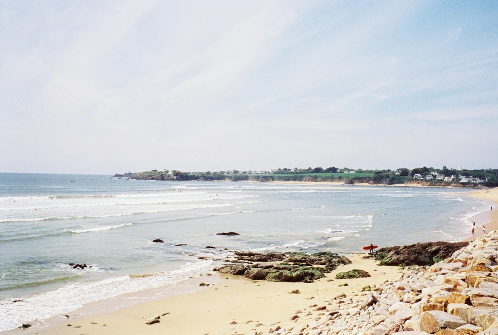

---
categories:
- lettre
letter: "bonjouryannick"
date: 2022-07-14T13:52:11.655476Z
newsletter: true
resources:
  - src: "*.webp"
tags:
- la lettre
emoji: 💌
color: rosewater

title: "34 - Du chaud, du corail et pas de banger"
slug: "34"
description: "C'est l'été, la canicule et la Bretagne sèche. C'est une première et ça sent pas la dernière à voir notre trajectoire. Cette lettre commence bien non? Notre bon vieux Berlingo n'a plus de clim' en plus."
---

*Cette newsletter est écrite par [Yannick](https://yannickschutz.com). Il va encore vous raconter sa vie et ce qu’il a vu/lu/entendu. Soyez prêt! Et merci, d’être là. Si vous aimez, n’hésitez pas à la partager. Sinon, ne la partagez pas.*

✌

Bonjour,

C'est l'été, la canicule et la Bretagne sèche. C'est une première et ça sent pas la dernière à voir notre trajectoire. Cette lettre commence bien non? Notre bon vieux Berlingo n'a plus de clim' en plus. Le belge qui a déménagé en Bretagne pour la météo a l'impression d'être sur La Croisette remplie de cidre plus qu'autre chose. On me souffle dans l'oreille que ce lundi, on frôlerait les 40 degrés. Encore heureux qu'on a de la vieille pierre pour nous tenir frais. Bon j'en reste là pour le climat, je vous redirige vers [Bon Pote](https://bonpote.com) ou [Climax](https://www.climaxnewsletter.fr/articles/) pour plus d'informations. D'ailleurs, ces derniers lancent [un zine](https://www.climaxnewsletter.fr/climax-fanzine/). Du climat, du papier et un format sympa, je suis pour.

Cette semaine, j'ai lu [ce super article de Beside](https://beside.media/fr/nouveaux-recits/responsabilite-changements-climatiques/). J'ai une petite tendance à me flageller le cerveau sur le changement climatique, mon impact, etc. Cet article, bien qu'ayant déjà lu des récits similaires, a été une vraie bouffée d'air pour moi. On en oublie que la vraie cible, ce n'est pas "moi". Nous sommes bien peu de choses sauf lorsque nous nous regroupons. Ce côté puissance de la communauté et rappel de qui est le gros pollueur aide à se sentir à l'aise avec les gestes que l'on fait déjà et les erreurs de chacun. On est tous imparfaits, ensemble nous faisons un grand tout imparfait mais puissant. Et on est vraiment moins imparfait que ces grosses sociétés sans âmes.

Je viens de lire/regarder aussi la seconde édition de [Slow is fast](https://eu.patagonia.com/fr/fr/product/slow-is-fast%3A-on-the-road-at-home-second-edition-by-dan-malloy%2C-kanoa-zimmerman-and-kellen-keene-paperback-book/BK721.html). Un bouquin photo d'un trip en vélo le long de la côte californienne. Dan Malloy y retrouve des fermiers et autres artisans le long de la route. Beaucoup de photos et quelques beaux textes. Je vous le conseille. Il frappe juste dans ma case récit photo adoré. Il lui manque que la couverture en tissus et le pressage. Je retiens deux citations du livre.

> Growing your own food and feeding people is activism

---

> We were deeply nostalgic for the road trips of 20 years ago, when a good photograph was not the destination but evidence of a good adventure.

Cette seconde met des mots sur mon approche de la photo. Je me sens toujours mal de ne pas aimer les bangers comme on dit. Je ne m'y retrouve juste pas. Je n'arrivais pas à vraiment le définir. Cette simple envie de documenter des belles choses, de les figer pour le futur. Cela sera plus simple et plus cohérent pour moi dorénavant. Le chemin plus que la destination.

D'ailleurs, je vous parlais la dernière fois de mon escapade en vélo avec les amis. Depuis j'ai écrit [mon petit article dessus](https://yannickschutz.com/breizhpacking/). J'ai aussi reçu [les superbes créations de Jérémy](https://www.instagram.com/p/Cfb5ZYDgp6G/) pour mon vélo. Ce corail est magnifique. Ça m'a donné d'autres idées de pochettes, sacoches et autres pour le futur. Que ce soit pour le café, le surf ou les films. On verra ce qu'on fera de ces idées.

Je vous laisse sur ces beaux mots.

Joyeux anniversaire à tous les [Fetnat](https://fr.wiktionary.org/wiki/Fetnat) et bonne fin de semaine,

Yannick

💌
