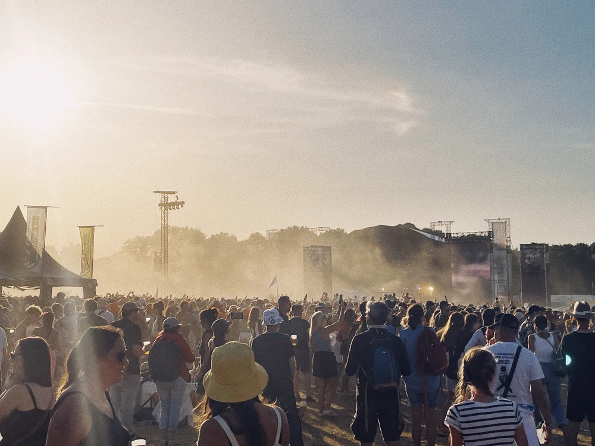
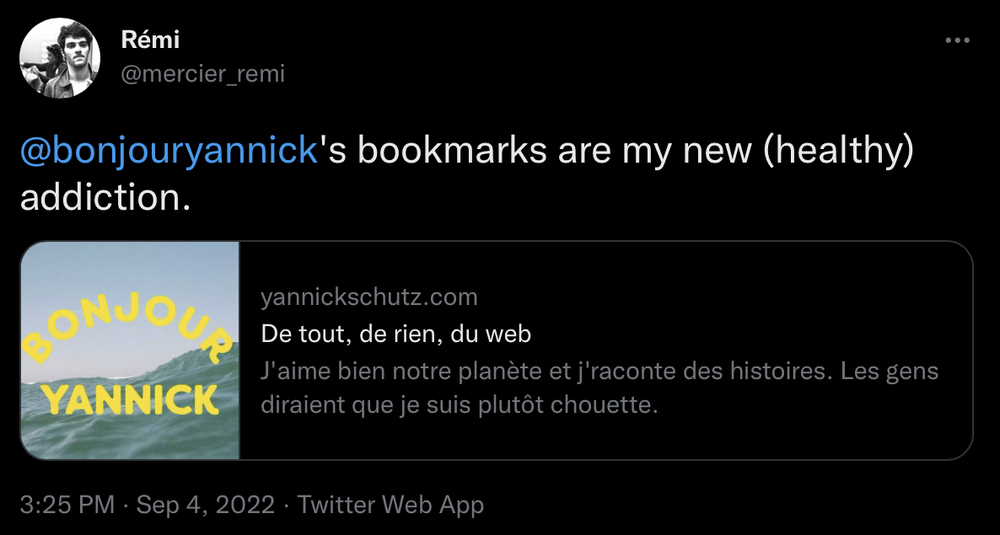

---
categories:
- lettre
letter: "bonjouryannick"
date: 2022-09-06T21:03:16.742159Z
newsletter: true
resources:
  - src: "*.webp"
tags:
- la lettre
emoji: 💌
color: rosewater

title: "35 - marche rapide, non sens et des essais"
slug: "35"
description: "On se rapproche doucement de mon âge (cfr le numéro de la lettre). Souvent, j'ai envie d'écrire puis j'oublie. Où alors, je pense n'avoir rien à dire"
---

---
*Cette newsletter est écrite par [Yannick](https://yannickschutz.com). Il va encore vous raconter sa vie et ce qu’il a vu/lu/entendu. Même si en fait il n'a pas grand chose à dire. Merci, d’être là. Si vous aimez, n’hésitez pas à la partager. Sinon, ne la partagez pas.*

---

✌️

Bonjour,

On se rapproche doucement de mon âge (cfr le numéro de la lettre). Souvent, j'ai envie d'écrire puis j'oublie. Où alors, je pense n'avoir rien à dire. Mais en fait, tant que l'on ne commence pas, on n'a effectivement rien à dire. Écrire, c'est facile. Cela sort tout seul. Mais il faut commencer. Je me rend compte que j'ai souvent postposé ces derniers temps. J'ai eu des idées. Elles sont juste restées dans un carnet à l'état de ligne mal écrite me permettant de me rappeler, peut-être. Comme pour beaucoup de choses dans ma vie, je ne sais pas vers où va cette lettre. On verra bien. Une rivière arrive toujours quelque part. Au pire, on est tranquille dans un lit et on se laisse flotter. Ca finira à la mer.

Je suis désolé chers lecteurs. Je vous ai laissé sur votre faim. Je me suis d'ailleurs moi-même laissé aller sur la fin. Je vois que j'ai un brouillon d'une lettre qui parle de mon été. Des vieilles charrues, de palpation et de marche rapide. J'en ferai peut-être quelque chose. Je ne sais pas on verra. C'était un chouette été en tout cas. J'espère que le tien aussi. J'ai repris le boulot et la dernière session de surf ressemblait à l'automne. J'assume donc que l'été c'est fini.

Je vous ai déjà dit que je gardait tous les liens qui me plaisaient et que je les archivais. Je fais ça pour moi, mais [en public](https://yannickschutz.com/bookmarks). Et là, paf un tweet qui me dit que c'est utile. Et là, je me sens non pas comme un coq. Mais juste heureux d'avoir partager. Heureux aussi que cela plaise. Cela flatte un rien mon égo.

 

Ces derniers temps, je n'ai pas lu beaucoup de bouquins. Donc je ne vous en parlerai pas. Je viens quand même de commencer [le dernier livre de Sally Rooney](https://en.wikipedia.org/wiki/Beautiful_World,_Where_Are_You). Et j'aime toujours autant sa prose. Je ne vous le conseille pas encore, j'ai lu 10% selon mon Kindle qui tombe en ruine.

En parlant de choses qui tombent en ruines, je tape une partie de ma lettre sur un macbook qui a 7 ans et dont la lettre g à tendance à se doubler. Je pense à en changer mais reviens souvent sur ma décision. Il est quand même temps. C'est comme écrire avec un mauvais stylo sauf que là c'est le sale clavier papillon d'Apple. Et ça n'a rien de joli. Peut-être pour ça que j'écris moins ces temps-ci. Penses-tu, lecteur, qu'il y a un lien entre outil et production? Fait-on de plus belles choses avec de beaux outils fonctionnels?

Je divague, je ne sais toujours pas où je vais. Cet été, j'ai été en Normandie en revenant de Belgique. Sur un coup de tête, on a loué une tente de trappeur et fait du feu dans [un camping Huttopia](https://europe.huttopia.com/site/les-falaises-normandie/). Et bien, c'était sans doute le moment le plus reposant de mon été. Et ce, malgré les ronflements du Hollandais d'à côté. Je vous conseille totalement les campings Huttopia. Pub non rémunérée. J'espère avoir bientôt les photos de mon été. Je ne sais plus ce que j'ai fait au final et je laisse aux photos qui arriveront le soin de me raviver le peu de mémoire qu'il me reste. Ma mémoire est quelque peu comme ces falaises qui s'effondrent sans crier gare. Il en reste toujours des morceaux mais pas toujours les plus jolis.

> Fiou, cette lettre commence à durer, c'est quand qu'il donne des liens?

Je ne sais pas mais sur le temps que tu as pris pour lire cette lettre, [ton téléphone t'a traqué](https://www.nytimes.com/interactive/2019/12/19/opinion/location-tracking-cell-phone.html). Et si tu n'as pas encore assez, sur l'été, j'ai commencé à utiliser [imgs.so](https://imgs.so/bonjouryannick) et c'est plutôt joli et minimaliste et complimente aussi bien [glass.photo](https://glass.photo/yannick). En fait, j'ai envie de partir d'instagram et je teste plein de concurrents plus jolis les uns que les autres. J'en parle d'ailleurs un rien dans ma révision de ma page [now](https://yannickschutz.com/now).

Wow en fait, j'avais pas grand chose à dire. Mais merci de me lire. C'est promis, l'été m'a ressourcé et je reviens avec du mieux très vite.

Bon mercredi,

Yannick

💌
