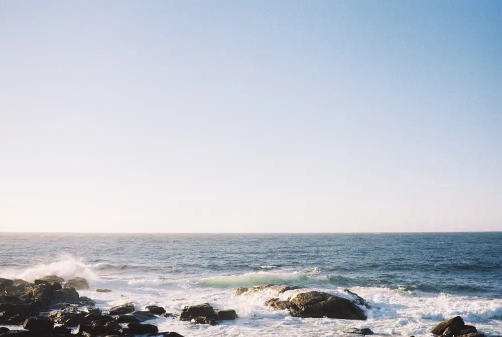

---
categories:
- lettre
letter: "bonjouryannick"
date: 2022-10-02T18:23:38.003715Z
newsletter: true
resources:
  - src: "*.webp"
tags:
- la lettre
emoji: 💌
color: rosewater

title: "36 - Du skate, de la nage et la terre comme seul actionnaire"
slug: "36"
description: "C'est 2022 et Yannick commence enfin à écouter des podcasts. Je suis un peu lent sur l'adoption des tendances ou alors trop en avance parfois."
---

*Cette newsletter est écrite par [Yannick](https://yannickschutz.com). Il va encore vous raconter sa vie et ce qu’il a vu/lu/entendu. Soyez prêt! Et merci, d’être là. Si vous aimez, n’hésitez pas à la partager. Sinon, ne la partagez pas.*

✌

C'est 2022 et Yannick commence enfin à écouter des podcasts. Je suis un peu lent sur l'adoption des tendances ou alors trop en avance parfois. Je vous en parlerai peut-être une prochaine fois. Un peu plus tôt, j'écoutais un super podcast avec [Stacy Peralta](https://wearelookingsideways.com/podcasts/episode-190-stacy-peralta). Si vous ne le connaissez pas, une belle approche sur ses débuts est de regarder [Lords of Dogtown](https://fr.wikipedia.org/wiki/Les_Seigneurs_de_Dogtown) que je dois d'ailleurs re-regarder pour plusieurs raisons. La première c'est parce que j'aime le skateboard, la seconde c'est parce qu'on prépare un road trip en Californie pour l'an prochain et la troisième c'est juste parce que je me souviens que c'était un chouette film. C'est en général suffisant non? En plus, en fait Stacy Peralta l'a écrit. Il est aussi le directeur de [The Yin & Yang of Gerry Lopez](https://www.patagonia.com/stories/the-yin-yang-of-gerry-lopez/video-121485.html), un film que je me réjouis de voir et aui tourne en ce moment.

Enfin, j'en reviens au podcast. Comme je disais. J'étais  en train d'écouter ce podcast We are looking sideways et puis à sa fin, surprise, j'ai enchaîné. J'étais au volant, je ne pouvais pas l'arrêter en fait. Et là, j'ai eu l'hyper bonne surprise de découvrir [Bonnie Tsui](https://www.bonnietsui.com/) et son livre [Why we swim](https://www.penguin.co.uk/books/442072/why-we-swim-by-bonnie-tsui/9781846046605) qui rejoint directement la pile des livres que je dois lire. Moi quand on me dit que c'est une lettre d'amour à l'eau, j'ai envie de la lire. Même si en fait, on n'est pas censé lire les lettres d'amour des autres. Je suppose que si elle l'a publié c'est pour qu'on la lise. Et me voici donc en train de vous suggérer des livres sans même les avoir lu... Mais pour qui se prend-il?

Tiens, hors sujet mais bon, vous aviez remarqué que le film dont je parle plus haut est en fait un film Patagonia? Vous savez pourquoi je prend cette liberté narrative non? Je suis toujours super heureux d'un move fait par Yvon Chouinard il y a peu. Vous voyez maintenant? Non toujours pas? Alors, allez lire ceci: [Earth is our only shareholder](https://www.patagonia.com/ownership/). Y'a eu un paquet d'articles et franchement, on peut être sarcastique sur le truc, mais j'espère surtout que ça va ouvrir la voie à d'autres boîtes, un peu comme le [1% for the planet](https://onepercentfortheplanet.org/) ou le [B-Corp](https://www.bcorporation.fr/). C'est pas parfait mais ça va dans le bon sens. Et bouger c'est ce qu'il y'a de mieux avec manger 5 fruits et légumes par jour. Retour donc à l'histoire.

J'étais en route pour une session de surf plutôt ventée mais amusante quand même. Tom avait cours. Dès qu'il a cours, j'y vais aussi. Ne pas rater des occasions! je n'ai jamais autant bougé que ces dernières années depuis qu'on est en Bretagne. Et franchement cela fait du bien. Je prend même du plaisir à me changer alors qu'un sale vent de nord arrive et qu'il pleut des cordes. C'est un signe... [Du fun de type 2](https://goeast.ems.com/three-types-of-fun/) peut-être. Voire même de type 1 en fait. C'est un peu maso mais ça marche. La Bretagne a reperdu une grosse partie de ses touristes, les parkings se sont vidés et franchement, c'est agréable de ne plus tourner ou marcher 10 minutes en combi sous 30 degrés! Pas si maso que cela au final. Je ne sais pas pourquoi je vous parle de ceci mais en tout cas, venez bouger avec moi ou allez bouger avant qu'il ne soit trop tard!

Et donc tout ça pour vous dire que aujourd'hui, Tom avait cours de surf, je l'ai conduit. Il lisait j'ai donc mis un podcast et y'en a eu deux en fait. J'ai surfé mais y'avait du vent et je me suis dit que je devais vous le raconter. C'est cool non?

Sur ce, je vous laisse.
Bon dimanche soir et bonne semaine,

Yannick

💌
