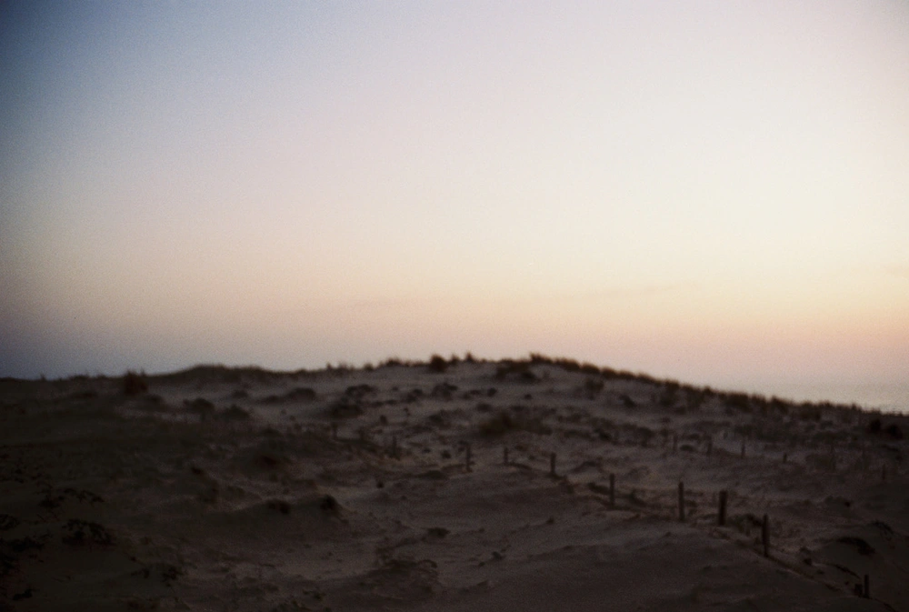

---
categories:
- lettre
letter: "bonjouryannick"
date: 2022-11-01T12:43:43.839801Z
newsletter: true
resources:
  - src: "*.webp"
tags:
- la lettre
emoji: 💌
color: rosewater
title: "37 - Fusion, Marketing et capitaines"
slug: "37"
description: "J'allais commencer à écrire cette lettre quand un petit bruit dans le salon m'a fait réalisé que j'avais oublié de couper la platine vinyle"
---

*Hello, moi c'est [Yannick](https://yannickschutz.com). Je ne suis pas du tout régulier dans cette lettre et c'est peut-être tant mieux. Je ne sais pas pourquoi je l'écris. Souvent vous remplacez une séance chez un psy ou un appel à un ami je pense. Donc merci merci d’être là. Si vous aimez, n’hésitez pas à la partager. Sinon, ne la partagez pas.*

✌

Bonjour,

J'allais commencer à écrire cette lettre quand un petit bruit dans le salon m'a fait réalisé que j'avais oublié de couper la platine vinyle, je me lève donc pour l'éteindre, et je me rend compte que le vinyle qui tourne a dû tourner deux jours en fait. Purée, je me dis que c'est du luxe déjà d'écouter un vinyle mais alors le laisser tourner dans le vide deux jours... C'est carrément Versailles.  Quand je pense que je remonte les bretelles des enfants quand ils oublient les lumières... Je mérite un remontage en bonne et due forme. Puis après tu penses au Qatar et ses navettes pour la coupe du monde, aux jets privés etc. Peut-être que eux aussi devraient avoir un papa qui leur dit que c'est pas Versailles ici.

*Dehors, il pleut. C'est un peu une pluie folle d'ailleurs.*

Aujourd'hui dans ma boîte aux lettres, un paquet Amazon vide. C'est une première. Je pense que c'est en fait du marketing de la part de [Damien Aresta](https://damien.cool/) pour ses prochaines [newsletters](https://damienaa.substack.com/). Une photo et pas de mots. Cela me donne envie de relancer la série [détail](https://yannickschutz.com/details). Je vais préparer ça et relancer bien vite. Donc si ça te dit, souscris! Sinon tu penses que je devrais [fusionner les deux](https://media.giphy.com/media/PvDM6QHuLPCxi/giphy.gif)? On parle pas mal avec Greg et Jérémy de toutes ces possibilités hors réseaux sociaux. J'adore le côté expérimental que cela peut avoir. J'adore expérimenter en fait.

En parlant des deux capitaines, je ne sais pas si vous avez lu mais je vous passe des liens. Jérémy parle de sortir de sa zone de comfort et de revoir tout à travers les yeux de la première fois, dans [sa dernière réflexion](https://jeremyjanin.com/changer-de-regard/). Et Grégory, lui, parle de son [expérience en Islande](https://gregorymignard.com/le-paradoxe-islandais/). Plutôt enrichissant des deux côtés.

Pour le côté expérimentation, je suis sorti de Day One cette semaine car je ne voulais pas payer un abonnement que je n'utilise que très peu. J'ai donc décidé de migrer tout vers du Markdown, mon format de plaine de jeux favori. Et donc j'ai importé tout dans Obsidian et une partie que j'aime beaucoup, c'était la météo et la géolocalisation dans Day One. J'ai donc créé un template qui le fait pour moi. Une belle Rube Goldberg machine si vous voulez mon avis. Mais vous pouvez le [lire dans la langue de Shakespeare](https://yannickschutz.com/2022-10-27-obsidian-templater-daily/). Oui j'ai encore une autre partie sur mon site qui est plutôt cachée. J'adore jouer avec le Markdown, je vous le disais.

Bon, il est temps d'allumer un bon feu.

Bonne Toussaint, Lendemain d'Halloween et autres Dia de los muerto.

Yannick

💌
