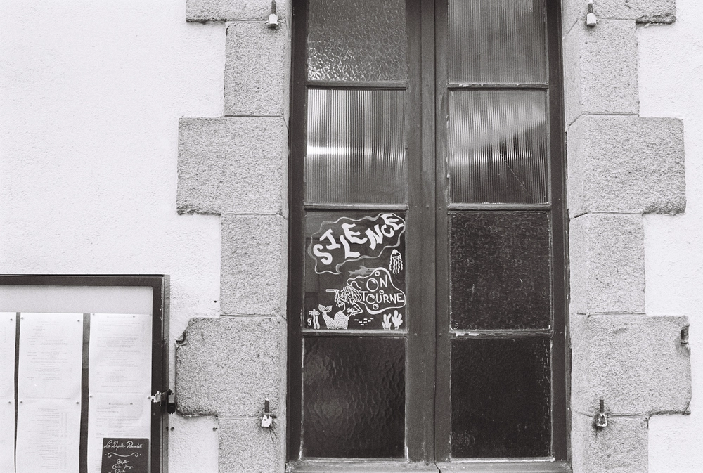

---
categories:
- lettre
letter: "bonjouryannick"
date: 2022-12-05T22:24:12.434Z
newsletter: true
resources:
  - src: "*.webp"
tags:
- la lettre
emoji: 💌
color: rosewater
title: "38 - Des scripts, de la pensée magique et moins de liens"
slug: "38"
description: "J'avais envie de commencer en parlant un peu de moi. Je sais, je ne fais que ça. Moi, moi & moi. Un peu d'auto promo."
---

*Hello, moi c'est* [*Yannick*](https://yannickschutz.com)*. J'ai oublié d'être régulier car au final je pensais à ce que j'allais lire. Je parle de mes lectures, mes pensées et parfois je vous montre que je code un peu. Merci d’être là. Si vous aimez, n’hésitez pas à la partager. Sinon, ne la partagez pas.*

✌️

Bonjour,

J'avais envie de commencer en parlant un peu de moi. Je sais, je ne fais que ça. Moi, moi & moi. Un peu d'auto promo. Dans la lettre 37, je vous parlais du projet [détail](https://yannickschutz.com/details). Et bien, c'est reparti. J'ai programmé des photos et e-mails jusque septembre 2023. J'ai pu abuser de mes aptitudes techniques pour automatiser une grosse partie. Même si pas mal de petits ajustements seront à faire. Suite à un retour, j'ai décidé d'ajouter le lieu de prise de vue approximatif, l'appareil et le type de pellicule. Fini le "une photo et c'est tout" au final, y'a un peu plus et je vous le met quand même. Si tu n'es pas encore inscrit, la photo 20 sera envoyée ce vendredi. Il est encore temps, [vas-y](https://yannickschutz.com/details).

Si tu veux un peu plus de détails techniques, sur l'automatisation, je peux te faire ça avec plaisir. Grosso modo, j'ai utilisé l'API de [ma newsletter](https://buttondown.email) et un script local pour passer sur un dossier de photos exportées et renommées. Après j'ai copié et traduit, j'aurais pu automatiser cette partie là aussi. Enfin, je m'en rend compte maintenant. Le script est dispo [ici](https://gist.github.com/ys/7955038d5f4cff4ed23d116f7884d59b). C'est super hacky, mais bon. Ça a bien marché au final.

Je vous ai déjà parlé de [mon livre favori qui parle de deuil (et de surf)](https://www.ajdungo.com/new-project-1). D'ailleurs son édition spéciale est si belle que cela rend mon image du deuil mentalement plus belle. J'en ai un second maintenant... Je viens de finir ["L'année de la pensée magique"](https://www.grasset.fr/livres/lannee-de-la-pensee-magique-9782246712510) et sincèrement ce livre m'a boulversé. Je suis quelqu'un d'assez sensible, je le cache souvent derrière de l'humour, parfois déplacé. Ce livre a juste secoué mes émotions. Son écriture est magnifique. J'avais lu un recueil d'articles de Joan Didion avant celui-ci. J'ai attendu avant de lire ce livre. Je n'étais pas prêt, à voir sa plume, de lire son livre sur le deuil. Je savais que cela serait quelque chose qui me toucherait et j'avais vu juste. Rien que d'y repenser, des frissons. J'aimerais pouvoir mettre pareils mots sur mes pensées ordinaires.

Si tu veux voir d'autres choses que j'ai lu, va voir [ici](https://yannickschutz.com/books). #publicitémalplacée. J'oublie d'y mettre des lectures plus courtes ou des mangas. Mais globalement c'est plutôt à jour. Un autre truc synchronisé avec du scotch et un bout de papier. Et aussi des [scripts sur GitHub](https://github.com/ys/bonjour/blob/main/.github/workflows/flat.yaml#L30-L36). Cela faisait un moment que je n'avais pas vraiment parlé tech tiens. Deux d'un coup, peut-être même trois.

Je viens d'ailleurs de tester comme tout le monde le chatGPT. Mais wow pour des petites choses basiques, il est bon. Je lui ai fait générer un script pour avoir la houle et le vent via [magicseaweed](https://magicseaweed.com/) API et franchement, j'aurais écris ça dans un premier jet. Puis il m'a dicté comment le faire avec Shortcuts pour iOS. Je ne sais pas quoi penser encore de tout cela. Cela va trop vite, ça me chamboule et j'ai un avis comme [Mercredi dans la nouvelle série Netflix sur elle-même](https://www.youtube.com/watch?v=Q73UhUTs6y0). "Je ne veux pas être esclave de la technologie" mais moi c'est parce que je sais que j'ai plutôt une tendance addictive. Mon avis sur la série par contre? J'aime bien mais on a vu que un seul épisode.

Je me pose plein de questions sur la technologie et les outils que j'utilise dernièrement d'ailleurs. Je suis passé à [Arc](https://arc.net/gift/8bb8e300). Et ça me remet en face de choix que je prenais pour acquis comme quel read later j'utilise, comment je garde et accumule des liens pour plus tard. Mais plus profondément, cela me fait me poser la question de l'intérêt même du read later. On bookmarke pour combler du temps. La liste grandit et boom, impossible de tout lire, de tout voir. Je passe mon temps à procrastiner en bookmarkant et en accumulant de la lecture. J'ai donc remis cela en perspective et là j'applique une théorie beaucoup plus expéditive. Au final, cette technique me permet de moins consommer et de plus produire. Si Arc arrive à me faire changer ce paradigme, c'est un vrai plus. J'ai déjà explosé ce paradigme pour ma lecture de livres, je n'ai plus de queue infinie de livres à lire. Et si je faisais simplement pareil pour le web? Au final, cela me rend du temps que de ne pas accumuler ces liens. Cela m'enlève aussi le stress du "que lire et quand lire". J'ai adopté une approche plus punitive grâce aux tabs éphémères de Arc et je pense que ce changement me plaît. On verra si cela tient ou non. Mais au final, "Je ne veux pas être esclave de la technologie" car au fond [l'addiction est là par design](https://twitter.com/cuisineanxious/status/1599714661519462400/photo/1)

Bon, je vais vous laisser là dessus.
Passez un bon mardi,

Yannick

💌
