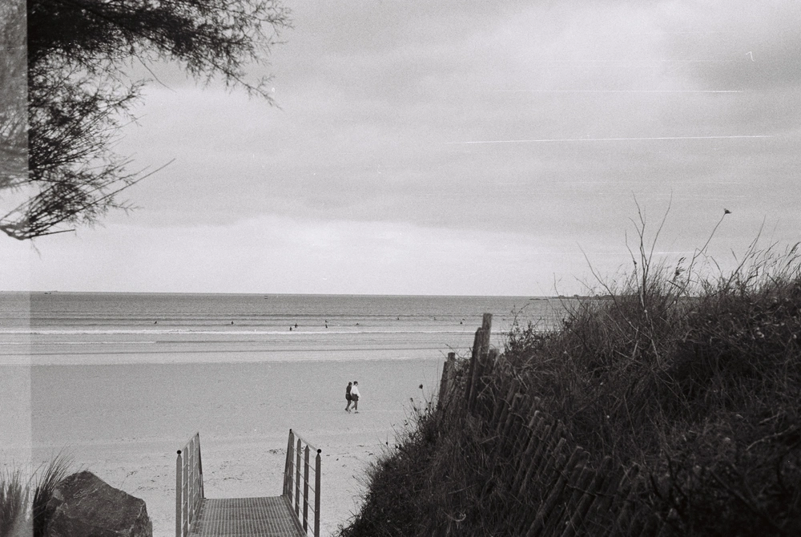

---
categories:
- lettre
letter: "bonjouryannick"
date: 2022-12-13T21:48:24.561Z
newsletter: true
resources:
  - src: "*.webp"
tags:
- la lettre
emoji: 💌
color: rosewater
title: "39 - Hésiter, Résister, Exister"
slug: "39"
description: "Aujourd'hui, j'ai surfé. C'était sans doute ma plus courte session de toutes. Non pas à cause du froid . J'ai juste décidé de sortir sur une dernière vague que cette grande mer me donnait."

---

*hello, moi c'est [Yannick](https://yannickschutz.com). je ne suis pas du tout régulier dans cette lettre et c'est peut-être tant mieux. je ne sais pas pourquoi je l'écris, souvent vous, lecteur, remplacez une séance chez un psy ou un appel à un ami je pense. donc merci merci d’être là. si vous aimez, n’hésitez pas à la partager. sinon, ne la partagez pas. Oops, deux en une semaine, il doit vraiment vouloir papoter.*

✌️

Bonjour,

Aujourd'hui, j'ai surfé. C'était sans doute ma plus courte session de toutes. Non pas à cause du froid . J'ai juste décidé de sortir sur une dernière vague que cette grande mer me donnait. Je vous parle de cette session, parce que j'ai failli ne pas y aller. Je commençais ma journée en me disant que les routes seraient trop verglacées. Je décide d'aller faire un tour avec le chien à la place. Tour classique dans les petits chemins de traverse qui entourent notre village. Là, je me retrouve face à un renard qui nous observe. Il se sent observé, recule et recommence à nous observer. Un hasard de le croiser là, pourtant il illuminera mon matin.

Je rentre, me réchauffe avec [un café](https://mokcoffee.be/collections/coffee/products/kenya-ducha-aa-only-filter) et là, coup de fil de [Yves](https://yvesquere.com) pour voir si finalement je vais au Dossen pour surfer. Je ne pensais pas y aller mais le destin est farceur et Cloé m'envoie en parallèle un texto me disant que les routes "ça va" et que je pourrais aller surfer. Je me décide à tout emballer et y aller. Arrivé au Dossen, la houle ne rentre pas. Certains arrivent de plus loin que moi en espérant et repartent bredouille. Je papote un peu avec Yves, on va revoir. Et là, voyant mon hésitation, il a une phrase simple mais forte: "Tu n'as rien à perdre à rentrer dans l'eau même si les vagues sont petites et que les séries se font attendre. Au pire, tu auras été à l'eau et ça te fera du bien". Je cours vers la voiture, me change. Il a raison le bougre.

Me voilà, seul au Dossen avec des petites séries jusqu'au genou. Et 50 minutes plus tard, je sors, un roll fini avec le Canon prima AS1. Pourquoi je vous raconte cela? C'était juste les deux moments forts de ma journée. Le hasard a fait que je puisse avoir les deux alors que j'ai failli en avoir aucun des deux. Le karma est drôle avec nous souvent.

Ça va? Vous êtes encore là? Beaucoup de mots sans liens. Tiens, tu as vu [la dernière photo de Détail?](https://yannickschutz.com/details/020/) Maintenant, oui.

Cette semaine, j'ai commencé à mettre en page un second zine. Je fais la course aux devis, prix et idées de papier, couverture, couture. J'adore ce moment. Je suis un rien geek du papier même si je reste en surface pour le moment. J'ai trouvé une idée de nom à ces séries de zines sur des moments. "Nothing special" tu me dis ce que tu en penses quand tu veux! C'est une exclu d'ailleurs que je te dise cela. Ouais, cadeau de fin d'année. Même si je ne sais pas encore si j'en ferai plusieurs exemplaires, si je le vendrai ou non. Je lui ai quand même donné un petit nom.

En parlant de zine, je lisais [cet article de Robin Rendle](https://www.robinrendle.com/notes/an-internet-of-zines/) sur Arc. Ce nouveau browser que j'ai quand même plutôt bien adopté. Et le titre de cet article a fait mouche. "An Internet of zines", Cela fait mouche dans le sens où je vois mon site comme un zine, un lieu de DIY et d'expérimentations, cette lettre est une sorte de mini zine aussi. Du perso, à ma sauce que je vous ressert. C'est amusant de laisser aussi à chacun son truc plutôt que tous avoir cette interface de Twitter ou autre. Tu te souviens des [premiers geocities, des tumblr et autres](https://twitter.com/dustin/status/1597675775565914113)? Je viens d'avoir accès à un test marrant basé sur Arc où tu peux mettre en page ton Twitter, le personnaliser.

Et là, la pièce tombe aussi. Ce browser, c'est neuf, différent mais c'est surtout contrebalancer la norme. Si tu regardes bien, je ne parle pas du browser ici mais d'une diversité sur Internet. Ne pas se retrouver dans une normalisation et centralisation. Amener le DIY du mouvement punk et des zines sur le web. "You got to take the power back". Si tu as pas encore de site et que tu en veux un, je serai heureux de t'aider et t'aiguiller, ton profil sur X réseaux sociaux, cela ne t'appartient plus.  [Ce n'était pas à propos de la machine à laver leur rage.](https://twitter.com/dustin/status/1597675775565914113)n peut le faire avec la version française si tu préfères: "Résiste, prouve que tu existes, cherche ton bonheur partout, va.". Oui, madame, ici on plait aussi à la ménagère de plus de cinquante ans. On ratisse large pour l'audience.

Il a décidé d'écrire trop aujourd'hui? Oui. D'abord je fais ce que je veux, c'est ma newsletter. Au fait, tu préfères plus de petites lettres ou moins? Des plus longues ou des courtes?

Je vais m'arrêter là, j'ai envie d'aller fouiller les internets pour trouver d'autres coffee shops à rajouter sur ma liste pour notre road trip en Californie. Si tu as des recommandations, je suis preneur bien que la liste grandisse vite.

C'était un plaisir de te voir me lire.

Bonne soirée,

Yannick

💌
