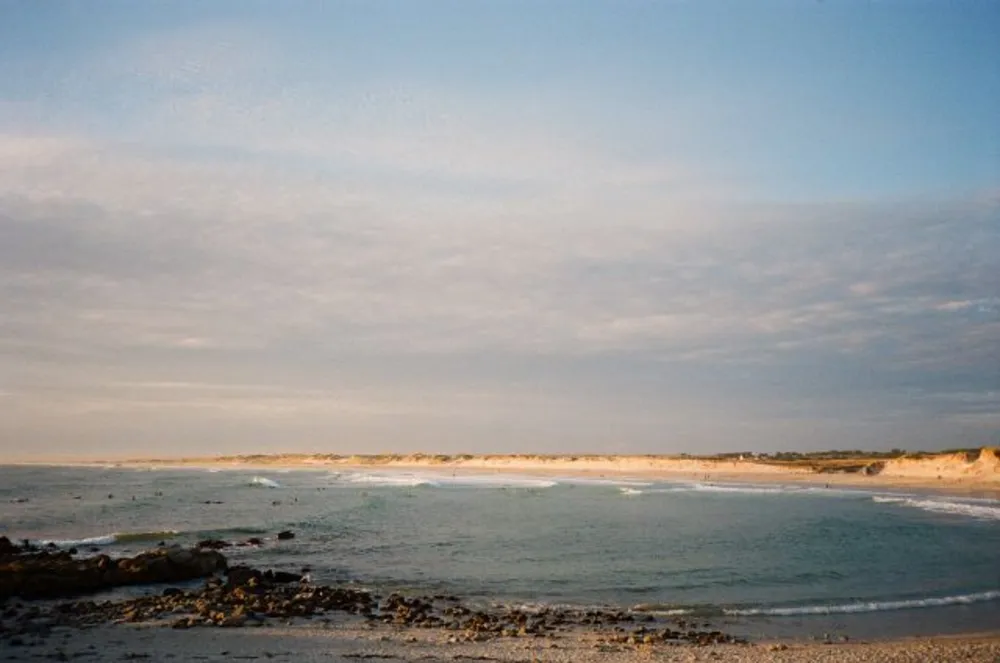

---
categories:
- lettre
letter: "bonjouryannick"
date: 2020-11-07T00:00:00Z
newsletter: true
resources:
  - src: "*.webp"
tags:
- la lettre
emoji: 💌
color: red

title: "4 - Deux mains, omakase et apprentissage"
slug: "4"
description: "Moi c'est Yannick, j'ai jamais vraiment été doué de mes mains... Mis à part pour taper sur un clavier ou avec un pad de super nintendo. Mais depuis, j'essaye et je m'améliore."
---

 
👋🏻

Bonjour à vous tous. Merci de continuer à lire cette petite lettre. Moi c'est Yannick, j'ai jamais vraiment été doué de mes mains... Mis à part pour taper sur un clavier ou avec un pad de super nintendo. Mais depuis, j'essaye et je m'améliore. Pas pour rien que je dise que le futur est digital. J'aime l'ambiguïté francophone liée à ce terme, les doigts ou numérique? Enfin voilà. J'avais envie de vous parler de faire. Oui faire, comme les anglais disent "makers gonna make".

Hier soir, j'ai fini un livre assez court mais inspirant et plein de bon sens. J'adore quand un livre mélange le savoir faire à la pleine conscience et au bonheur et ce bouquin là m'a donné le sourire et m'a fait mettre sur ma liste de Noël certains outils qu'il me manque encore. Ce livre est écrit par un fabriquant de planches de surf en bois, [James Otter](https://ottersurfboards.co.uk). Le livre vient des magnifiques éditions "The Do Book co." que je recommande sur plein de sujets, c'est concis et positif. Celui-ci, comme vous vous en êtes peut-être douté, s'appelle ["Do make, the power of your own two hands"](https://thedobook.co/products/do-make-the-power-of-your-own-two-hands). Le titre me fait penser à [la chanson super inspirante de Ben Harper](https://youtu.be/aEnfy9qfdaU). Après la lecture de ce livre, j'ai deux envies: faire et aller faire une planche de surf chez lui.

Cette semaine, en parlant de faire, j'ai aussi finalement cédé à des ventes de cours en ligne venant du site espagnol [Domestika](https://domestika.org/). Ils sont chouettes aussi. Ce n'est pas mon premier cours en ligne et je ne vous dirai pas lequel j'ai pris ici. J'avais aussi déjà appris via [Yodomo](https://yodomo.co/) qui a des super kits. J'adore le principe Omakase de ces kits. Tu n'as pas à penser, ils te fournissent le tout pour que tu sois prêt à faire. Pour ceux qui ne sont pas familier avec le terme Omakase, cela vient des restos japonais quand tu laisses le choix au chef de te faire ce qu'il pense être le plus adapté. Une version plus poétique du "Comme vous le sentez".

Je ne sais pas si vous avez des chouettes sources pour l'apprentissage ou même si vous aimez cela. Mais personnellement, j'adore apprendre et donc je suis très friand de ce genre de contenu. Alors n'hésitez pas à envoyer vos favoris.

J'espère pouvoir vite vous montrer des choses que j'aurai fait de mes propres mains. Notre maison en a déjà certaines, entre les cuillères taillées, mon apprentissage à la rénovation, que ce soit le parquet de la chambre de Tom dont je suis plutôt fier ou les boîtiers de dérivation électriques sans m'électrocuter. Je reviens de loin et je suis assez fier. Je pense que mon père serait fier aussi en fait. Et je pense que ça aussi, cela me motive beaucoup.

En attendant de vous lire, n'hésitez pas à me partager vos créations. Peut-être même que j'inclurai un florilège de ceux-ci dans le prochain bonjour. En attendant, portez-vous bien, soyez inspirés et apportez de la bonté autour de vous.

Bon samedi,
Yannick
 

😘
