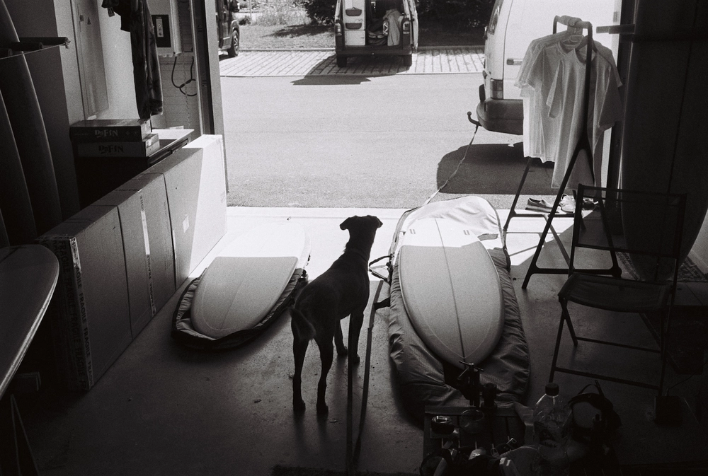

---
categories:
- lettre
date: 2023-01-13T17:34:42.564Z
newsletter: true
tags:
- la lettre
emoji: 💌
title: "41 - Vitamine D, Papier et Kickflip"
color: red
slug: "41"
resources:
  - src: "*.webp"
description: "Nouvelle année, meilleurs voeux. Je ne sais pas vous mais moi comme chaque année maintenant, je dormais quand les feux d'artifices ont sans doute explosé."
---
*hello, moi c'est [Yannick](https://yannickschutz.com). je ne suis pas du tout régulier dans cette lettre et c'est peut-être tant mieux. je ne sais pas pourquoi je l'écris, souvent vous, lecteur, remplacez une séance chez un psy ou un appel à un ami je pense. donc merci merci d’être là. si vous aimez, n’hésitez pas à la partager. sinon, ne la partagez pas. Oops, deux en une semaine, il doit vraiment vouloir papoter.*

 

Nouvelle année, meilleurs voeux. Je ne sais pas vous mais moi comme chaque année maintenant, je dormais quand les feux d'artifices ont sans doute explosé. D'ailleurs, ils explosent encore ou pas? On était au Maroc pour passer le nouvel an, ils le fêtent comme nous. Y'avait aussi des bouteilles cassées le lendemain matin. Mais mieux que les français en fait. Y'a pas eu de voitures incendiées etc.

On était au coeur de la medina de Essaouira pour passer la semaine entre Noël et nouvel an. Une parenthèse accueillante en terme de vitamine D. Il faut dire que en Bretagne pour le moment, on hydrate plus qu'autre chose. Je ne m'étalerai pas ici sur cette paranthèse, car je compte le faire en long et en large sur le blog sans doute. Vous me connaissez, ici je préfère divaguer que de rester sur un seul sujet.

Je sais que dans la dernière lettre, je vous parlais de mes goals pour 2023. Et bien, j'ai fait une découverte sur mon fonctionnement. Au final,pour l'année réellement, tout se résume à ces deux points
- Dire non plus souvent aux demandes extérieures, plus m'écouter, moins me laisser aller, [moins de distractions](https://www.newyorker.com/magazine/2021/12/20/can-distraction-free-devices-change-the-way-we-write)
- Dire oui plus souvent à moi-même. M'écouter beaucoup plus et prendre de soin de moi.

Ca ne change pas ces goals spécifiques que je me suis mis. Mais cela me permet de choisir en permanence, facilement si je veux dire oui au scroll, oui à des demandes, oui à quoi que ce soit. Dire non, me permet de récupérer du temps pour ce que je désire. Dire non n'est pas toujours simple. Mon but est de simplement prendre soin de moi. Et franchement, ça me plait.

J'ai commencé 2023 en demandant des devis pour des futurs zines que j'vous montrerai bientôt. J'ai quasi tout de prêt, des sujets variés des publics visés différents. J'ai juste peur d'avoir trop de projets et d'ennuyer les gens en les sortant trop vite. Si vous avez un avis, hésitez pas.

Je vais sans doute continuer à bosser avec [Ex Why Zed](https://exwhyzed.co.uk) pour ceux-ci. J'ai bien aimé la qualité du premier et aussi leur support est top. J'ai plusieurs tailles de zines, plusieurs formats, mises en page et tout ça. Je me suis bien amusé à mettre en page, imaginer tout ceci. J'ai pris le temps de refeuilleter un paquet de mes zines pour voir ce que les autres faisaient. Au final, je ne suis pas un designer. Mais c'est un process hyper intéressant. Ne pas regarder uniquement les zines photos, regarder de tous les côtés. C'est génial de découvrir le boulot de plein de gens, croiser les domaines et essayer de faire quelque chose qui me ressemble.

Dans les autres préparatifs de l'année, on a commander une imprimante portable pour le road trip. Un truc pas totalement super précis mais qui imprime sur du papier zink. Le but est de pouvoir imprimer et coller facilement des petites photos dans le carnet de voyage qu'on a prévu. On était parti sur la selphy de Canon au début. Mais la taille pour le voyage nous rebutait. Puis le prix des prints stickers était trop haut et le reste c'est du 10x15. Donc, on aurait du toujours les imprimer par deux car le 10x15 est trop grand pour le carnet. On verra ce que donne cette petite HP, on a imprimer deux trois photos de tests et c'est prêt pour être glissé dans un sac. C'est pas plus grand que ma main. Donc parfait sachant que les enfants vont avoir des besoins. Et qu'on veut se garder un max de place pour les souvenirs qu'on ramènera. *(Hello les surf shops...)* C'est la première fois qu'on pense tenir un carnet de notes de route. En même temps, c'est notre premier gros road trip à l'étranger. On verra comment ça se passe. Si vous avez des chouettes exemples, je suis preneur. Je vais sans doute commencer une autre liste...

J'ai maté quelques vidéos de skate ces derniers temps, surtout des courtes instructives sur Instagram. J'ai aussi adoré [la dernière de antihero](https://youtu.be/vbj2PsBFADQ), si vous avez une demi-heure, c'est un vrai plaisir. Prendre le temps de regarder une vidéo plus construites que les reels et autres courts formats, m'a fait réaliser que donner plus d'attention à des formats un rien plus long amenait un calme plus grand et un plus grand amusement que les courtes vidéos que l'on enchaîne au final sans grande saveur. Quand j'avais 17 ans, je skatais quasi tous les jours. Par contre, j'ai jamais réussi à rentrer un kickflip. Ni même un heelflip correct. Ils passaient de temps à autre. Souvent, je tombais. Je me rappelle même avoir eu la jambe qui ne répondait plus et devoir finir de rentrer tranquillement en glissant sur mes fesses devant le Delhaize. Un foutu caillou. Et pourtant, cela ne m'empêche pas d'être borné et de me dire que je finirai par le rentrer ce kickflip... Comme ça, si [Tony Hawk passe dans le coin](https://www.youtube.com/watch?v=ob0dI05Xz8s). J'aurai des goodies. Bon, par contre, je n'aurai jamais le [niveau de ce kid](https://www.instagram.com/yuzuk2609ikarin/).

Au fait, j'ai lancé les précommandes d'un [petit zine intimiste](https://yannickschutz.com/shop/100-cool-zines/).

Passez une belle semaine,

Yannick

💌
