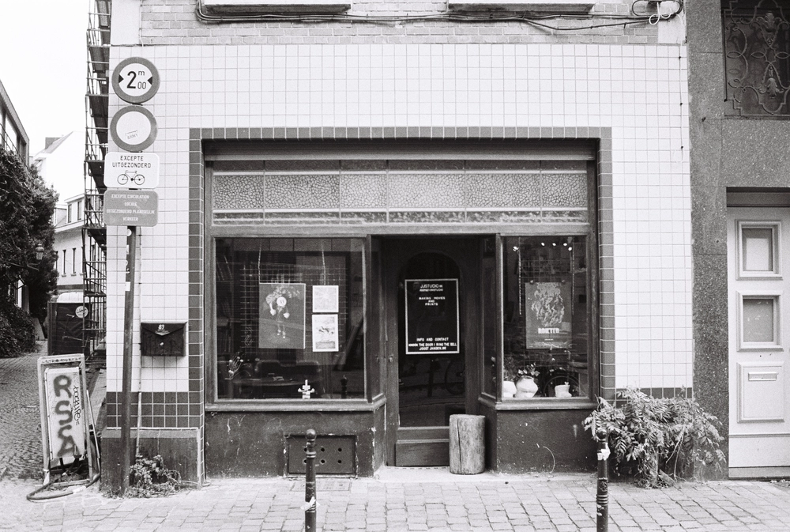

---
categories:
- lettre
date: 2023-02-01T02:34:42.564Z
newsletter: true
tags:
- la lettre
emoji: 💌
title: "42 - Monnaie, carafe et lenteur"
color: rosewater
slug: "42"
resources:
  - src: "*.webp"
description: "Comme disait un grand poète du nom de Léonard de Vinci, le bonheur ne se trouve pas en lingots mais en petite monnaie. Pourquoi dit-il ceci vous demandez vous? J'ai envie de vous parler des petits bonheurs de mon quotidien. J'aime rendre les choses simples et communes belles et extraordinaires, c'est du moins ce que j'essaye de faire en photo. Et je me rend compte que plein de petits bonheurs simples font une vie belle, plutôt qu'un gros bonheur une fois dans sa vie."
---
*hello, moi c'est [Yannick](https://yannickschutz.com). je ne suis pas du tout régulier dans cette lettre et c'est peut-être tant mieux. je ne sais pas pourquoi je l'écris, souvent vous, lecteur, remplacez une séance chez un psy ou un appel à un ami je pense. donc merci merci d’être là. si vous aimez, n’hésitez pas à la partager. sinon, ne la partagez pas. Oops, deux en une semaine, il doit vraiment vouloir papoter.*

 

✌️

Bonjour,

Comme disait un grand poète du nom de Léonard de Vinci, le bonheur ne se trouve pas en lingots mais en petite monnaie. Pourquoi dit-il ceci vous demandez vous? J'ai envie de vous parler des petits bonheurs de mon quotidien. J'aime rendre les choses simples et communes belles et extraordinaires, c'est du moins ce que j'essaye de faire en photo. Et je me rend compte que plein de petits bonheurs simples font une vie belle, plutôt qu'un gros bonheur une fois dans sa vie.

Vous le savez, j'aime le café. Si vous ne le saviez pas, maintenant oui. Et cette semaine, j'ai reçu ma livraison habituelle et mensuelle de 2 tonnes de café. J'y avais seulement glissé une petite surprise pour moi-même en plus. Une carafe [Slow Coffee de chez Kinto](https://kinto-europe.com/collections/slow-coffee-style). Et juste la déballer m'a amené plus de bonheur que prévu. Bien sûr, la regarder en ce moment, en écrivant cette lettre m'amène du bonheur. Mais en vrai, un détail que vous auriez peut-être loupé a retenu mon attention, dans la boîte, un petit papier anodin. Je suis souvent du genre à ne pas regarder les modes d'emplois et autres. On le fait tous. Surtout pour une carafe, je ne suis pas idiot mr Kinto. Mais toujours est-il que cette fois, je l'ai lu. Je l'ai même collé dans mon carnet après. Cela commence comme ceci: "Le guide de l'expérience du café lent". J'en ai déjà des frissons. La suite, une liste de façons de trouver des petits bonheurs dans le rituel du café.
- Faites le pour vous même, si vous avez la place faites le pour deux.
- Regardez la pluie tombée et perdez vous dans vos pensées en le buvant
- Etc.

Vous voyez le genre. Et bien cela me refait chaud au coeur rien que de le relire. Donc je me disais que j'allais vous demander quels étaient vos bonheurs simples. Que cela soit dans le café ou ailleurs. On se rappelle tous de Amélie Poulain qui plonge sa main dans les grains. Mais vous, qu'est ce qui vous tire un sourire facile?

L'autre page du feuillet de ma carafe commence par "La richesse de la lenteur". J'aime ce luxe de la lenteur. C'est un luxe aujourd'hui. Et je pense que ces dernières années, j'ai passé mon temps à essayer d'optimiser mon temps pour la lenteur. Une sorte d'anti productivité. J'ai lu trop de bouquins sur la productivité pour encore y croire. J'ai l'impression de l'avoir déjà dit. Parfois se répéter permet de faire passer le message. Mais une liste simple me le prouve l'amour du longboard plutôt que le shortboard, l'amour du café filtre plutôt que la Nespresso, l'amour de la marche plutôt que la course. Dans un des [podcasts de Francis Chouquet](https://anchor.fm/petit-journal-crea), comme beaucoup, il parle de ne pas avoir le temps de faire certaines choses qui lui amènent du plaisir. Le temps, on l'a, il est immuable. Par contre, c'est notre décision de le prendre ou non. C'est assez surréel au départ de se rendre compte de cela. Un luxe, je vous le disais. Je pense que tout est parti d'un livre sur la productivité, [Slack: Getting Past Burn-out, Busywork, and the Myth of Total Efficiency](https://www.momox-shop.fr/tom-demarco-slack-getting-past-burn-out-busywork-and-the-myth-of-total-efficiency-gebundene-ausgabe-M00932633617.html). Oui un livre de management. En deux mots, cela parle de toujours laisser du temps dans son travail pour avoir du temps pour l'imprévu. Ne jamais se charger à 100%. C'est une doctrine de notre vie avec Cloé. Bien avant de lire ce livre. On a optimisé pour l'imprévu, pour pouvoir se permettre de dire oui à des choses qui nous faisaient exploser de joie. Le temps étant notre resource la plus rare, était-ce un choix de fou que de vouloir pour voir choisir? Laisser de l'espace partout n'allait-il pas nous mener à l'ennui? Je vous laisse deviner, mais la lenteur et l'ennui sont des valeurs qui me guident. Cela n'empêche rien dans la vie, cela permet au contraire.

Je sonne comme un coach de vie là. Y'a un créneau à prendre dans cette douce France. La France où partir à l'heure, c'est quitter tôt. La France qui met sur un piédestal le burnout. Une partie est en train de se réveiller, embrassez l'ennui, embrassez la lenteur, embrassez le ne rien faire. Mettez le [livre de Gael Faye sur l'ennui](https://livre.fnac.com/a17166066/Gael-Faye-L-Ennui-des-apres-midi-sans-fin) dans la bibliothèque de vos enfants. Lisez le et regardez dehors.

[Mon café](https://mokcoffee.be/collections/coffee/products/kenya-kiangundo-pb) est froid, je pense que je vous ai assez tenu la jambe pour aujourd'hui. J'étais parti pour vous parler de l'arrivée de [mon dernier zine à la maison](https://yannickschutz.com/shop/100-cool-zines/), de l'envie de vous faire une lettre mensuelle papier qui arriverait dans votre boîte réelle sans doute avec une photo, j'étais parti pour parler de tout ça. Mais cette carafe de café juste à côté de mon ordi aura décidé pour moi. Promis, j'essaye d'être plus présent parce que en fait j'adore vous écrire ces petits mots.

Passez un bon jeudi,

Yannick

💌
