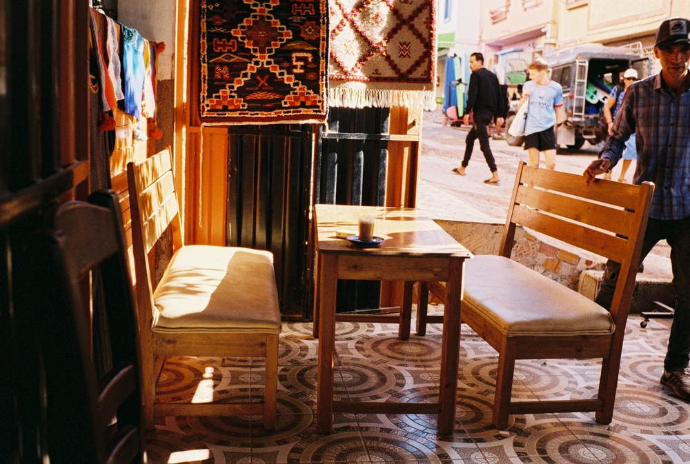
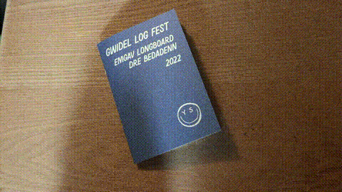

---
categories:
- lettre
date: 2023-03-01T02:34:42.564Z
newsletter: true
tags:
- la lettre
emoji: 💌
title: "43 - Jatte, magazines & jolie houle"
color: rosewater
slug: "43"
resources:
  - src: "*.webp"
  - src: "*.gif"
description: "Je viens de faire couler une jatte de café comme dirait mon père. 250g d'eau et 13g de café. Un bon début de journée au Kalita. Le sol est gelé, au moins il ne faudra pas laver les pattes du chien après sa balade. Les minutes passent et je fixe la vapeur que produit mon café. C'est sans doute ceci que les gens décrivent comme une journée qui démarre calmement."
---

*hello, moi c'est [Yannick](https://yannickschutz.com). je ne suis pas du tout régulier dans cette lettre et c'est peut-être tant mieux. je ne sais pas pourquoi je l'écris, souvent vous, lecteur, remplacez une séance chez un psy ou un appel à un ami je pense. donc merci merci d’être là. si vous aimez, n’hésitez pas à la partager. sinon, ne la partagez pas. Oops, deux en une semaine, il doit vraiment vouloir papoter.*

 

✌️

Bonjour,

Je viens de faire couler une jatte de café comme dirait mon père. 250g d'eau et 13g de café. Un bon début de journée au Kalita. Le sol est gelé, au moins il ne faudra pas laver les pattes du chien après sa balade. Les minutes passent et je fixe la vapeur que produit mon café. C'est sans doute ceci que les gens décrivent comme une journée qui démarre calmement.

*🎶 Allons aux États-Unis, direction Californie 🎶*

Louise a reçu [un magazine sur la côte ouest des États-Unis](https://lesminimondes.fr/boutique/magazines-enfant-unite/le-magazine-enfants-usa-west-coast-des-4-ans/), elle y a appris une chanson. Je l'entend la fredonner. D'ailleurs ces magazines, on avait déjà commandé celui sur le Maroc avant d'y aller... Je vous les conseilles, peut-être pas forcément en abonnement mais en chouette intro pour les enfants sur vos voyages. [Les mini-mondes](https://lesminimondes.fr) suivent les Duchemin. Y'a un paquet de trucs autour mais au final, un petit magazine sur un pays et sans aucune pub, c'est frais et j'aime beaucoup. Dernièrement on était justement en train de revoir les abonnements des enfants. Tom adore la science et apprendre, donc on est passe de Science et vie aux [Curionautes](https://milan-jeunesse.com/magazine-curionautes-des-sciences). Je n'ai pas trop aimé leur offre de réabonnement papier qui était plus chère que en ligne et plus chère qu'un premier abo. Trop de prix différents, je sais que c'est chose commune quand même. On verra si cela lui plaît aussi. On cherche toujours le premier magazine de Louise, sans doute un classique ou alors [le Graou](https://www.maison-georges.com/page/magazine-graou) qu'on vient de tester. On verra. Si vous avez des suggestions, hésitez pas.

Ces dernières semaines, j'ai commencé à beaucoup ralentir sur certaines choses. Je vous en parlerai sans doute plus longuement dans un temps certain. Toujours est-il que comme par [un biais de confirmation](https://en.wikipedia.org/wiki/Confirmation_bias), je tombe sur des articles fantastiques qui aident et appuient mes choix. Je pense à cela car je vois ma liste de [bookmarks](https://yannickschutz.com/bookmarks). Dans celle-ci, se trouve un article nommé ["Faire de l'espace pour le fun dans le capitalisme"](https://mentalhellth.xyz/p/making-space-for-fun-under-capitalism) (Superbe traduction littérale Yannick). Cet article parle justement de refaire de la place pour les choses qu'on aime dans la vie, ici la passion dévorante du surf (Quel hasard). J'aime beaucoup certains passages qui résonnent en moi où l'auteur parle du travail comme un levier pour le fun et non une définition d'identité. C'est un des gros soucis que je vois dans la tech actuellement et depuis toujours, être son travail, ne faire que un avec son métier. Je vois beaucoup d'autres soucis avec la tech mais c'est un des points importants. En tout cas, je compte adopter de cet article une des phrases: "Quand la houle arrive, j'y vais". On verra ce que cela donnera.

En parlant de mes bookmarks, je les ai aussi refait et j'importe maintenant depuis une source externe, [Are.na](https://www.are.na/bonjour-yannick/things-i-liked-m5k8vfut4uy). J'adore la simplicité de cette interface et la facilité de créer des collections visuelles diverses. Je vous en parlerai sans doute plus longuement avec un peu plus de recul. Le choix des concepteurs de directement fournir une API et de pousser les gens au remix sur leur base me plaît énormément.

Voilà, c'est déjà tout.

Enfin, presque, je vous avais dit que je préparais plusieurs zines, [le petit dernier sur du surf est sorti](https://yannickschutz.com/shop/gwidel-log-fest/). Il est disponible [avec](https://yannickschutz.com/shop/gwidel-log-fest-with-print/) ou [sans](https://yannickschutz.com/shop/gwidel-log-fest/) print. Foncez.

Bon Mercredi,

Yannick

💌
