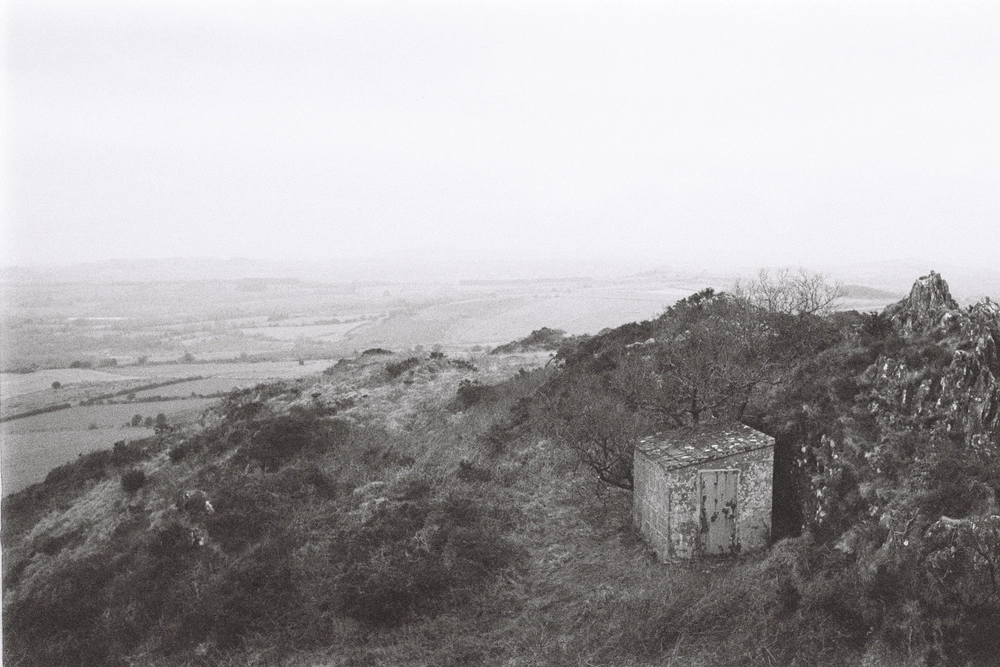

---
categories:
- lettre
date: 2023-03-12T02:34:42.564Z
newsletter: true
tags:
- la lettre
emoji: 💌
title: "44 - Karma, Ollie et Ilford HP5+"
color: rosewater
slug: "44"
resources:
  - src: "*.webp"
  - src: "*.gif"
description: "Ces derniers temps, j'écrivais sans visibilité sur qui lisait ou non mes dires que cela soit sur la newsletter ou le blog. J'ai eu par contre la joie de recevoir de super commentaires. Cela justifie en quelques sourires le pourquoi de ce beau bazar. Merci à vous de continuer à me lire et merci de parfois me le dire. Vous êtes trop bienveillants."
---

*hello, moi c'est [Yannick](https://yannickschutz.com). je ne suis pas du tout régulier dans cette lettre et c'est peut-être tant mieux. je ne sais pas pourquoi je l'écris, souvent vous, lecteur, remplacez une séance chez un psy ou un appel à un ami je pense. donc merci merci d’être là. si vous aimez, n’hésitez pas à la partager. sinon, ne la partagez pas. Oops, deux en une semaine, il doit vraiment vouloir papoter.*

 

✌️

Bonjour,

Vous connaissez ce gars qui se décide enfin à ne plus acheter d'appareils photos et d'[avoir son M6](https://yannickschutz.com/leica-m6) pour le road trip en Californie qui commence dans 20 jours? Il était hyper content. Et le karma, lui, ne voulait pas trop le laisser tranquille. J'avais décidé d'envoyer mon appareil pour voir quelles réparations seraient à faire. Et il se trouve que ma cellule est morte en fait et que la réparation sera plus grosse que prévue, pas de petit réglage. Sauf que le shop a un délai de 3 mois. Donc me voilà, à trois semaines du road trip, sans appareil prévu. Vous imaginez ma détresse et mon état mental là... Sinon? Cela ressemble à une scène de Vice et Versa où tous les personnages appuient sur tous les boutons. C'est le chaos. J'ai plusieurs idées en fait, mais va falloir être rapide. Et ça, c'est pas mon fort.

Ces derniers temps, j'écrivais sans visibilité sur qui lisait ou non mes dires que cela soit sur la newsletter ou le blog. J'ai eu par contre la joie de recevoir de super commentaires. Cela justifie en quelques sourires le pourquoi de ce beau bazar. Merci à vous de continuer à me lire et merci de parfois me le dire. Vous êtes trop bienveillants. C'est pareil sur [les zines, les prints et autres](https://yannickschutz.com/shop). Les ventes sont pas folles mais toujours belles. Je pense essayer de trouver un moyen d'être présent dans des lieux physiques beaucoup plus que sur le net bientôt pour ceux-là aussi. La vraie vie c'est la vie quand même. Au plaisir de vous croiser quelque part pour vous mettre mes prints dans les mains. Si vous avez des évènements autour de la photo, du surf ou de la mer et que vous pensez que cela serait un bon match, dites-moi. Peut-être même faire une expo?

Je vais finir par un petit chapitre décousu pour vous partager des liens que j'ai bien aimé ces derniers temps. J'ai une planche de skate de chez Enjoi, je viens de changer les roues pour mieux rouler, j'ai pu m'amuser hier [aux Capucins à Brest](https://www.ateliersdescapucins.fr/fr) avec. Un super plateau tout lisse en intérieur où j'ai pu cruiser tranquille avec Tom et Louise. J'ai réussi à claquer quelques ollies et 180 back. C'était un vrai plaisir. Mais donc, Enjoi était le roi des super pubs papiers, [Monster Children en a fait une petite sélection et j'ai adoré ça](https://www.monsterchildren.com/articles/enjoy-ads). Pas forcément politiquement correct, je vous l'avoue.

En repensant au M6, j'ai déjà partagé sur Twitter mais [cette série de vidéos sur des héros du skate](https://www.youtube.com/watch?v=nD0VM0NWwSA&list=PLarwq93oldzQ7jebYkhYA6bagabds-Xib) et leur usage du Ilford HP5+ est juste parfaite. Je connaissais surtout Jason Lee. Joe Brook par son travail mais pas forcément son histoire et Ray Barbee fut une découverte qui m'a foutu une bonne claque. Je vous les conseille. Et pour compléter, [Cette vidéo sur Ed Templeton](https://vimeo.com/42242442?embedded=true&source=vimeo_logo&owner=1689513) m'a vraiment aidé à penser le futur juste avec le M6. Je vous les conseille vraiment.

Ces liens sont souvent présents sur ma page de [bookmarks](https://yannickschutz.com/bookmarks). Qui comme je vous le disais la dernière fois viennent maintenant de Are.na. Je prend toujours autant de plaisir avec ce service. J'y agrège des [coffee shops](https://www.are.na/bonjour-yannick/coffee-shop-enhrz-ziidk), [des livres](https://www.are.na/bonjour-yannick/on-paper-yjfbcwrkly4) et [des surf shops](https://www.are.na/bonjour-yannick/surf-shops). Entre autres choses, je vous laisse découvrir le reste.

Voilà je m'arrête là pour cette semaine, j'espère que cela vous a plu.

Passez un bon dimanche

Yannick

💌
