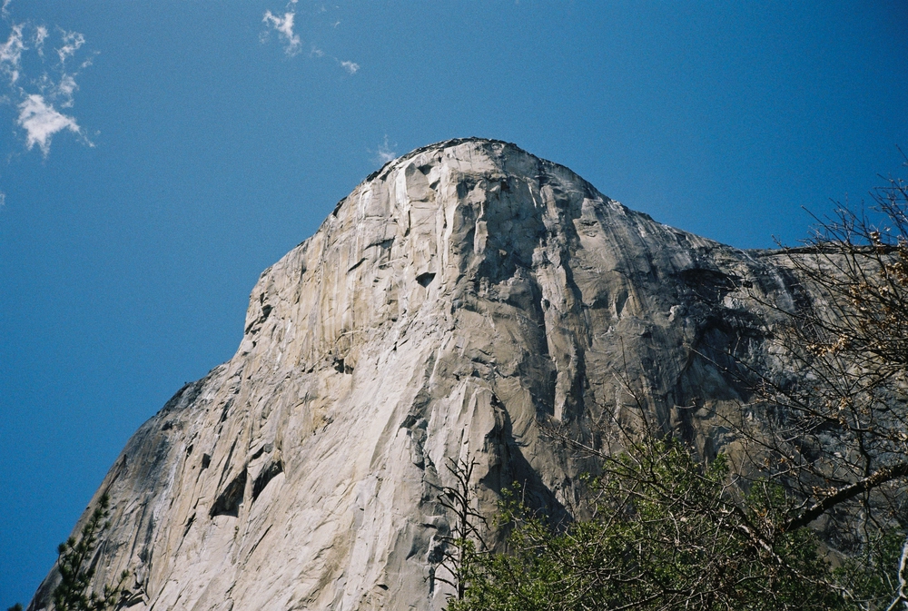

---
categories:
- lettre
date: 2023-06-01T02:34:42.564Z
newsletter: true
tags:
- la lettre
emoji: 💌
title: "45 - Coyote, Demi frame et un café"
color: rosewater
slug: "45"
resources:
  - src: "*.webp"
  - src: "*.gif"
description: "C'est déjà le mois de juin, je me retrouve à peu écrire ces temps-ci. Je ne sais pas pourquoi, c'est les saisons sans doute. Trop occupé ailleurs, je ne rempli ni mes carnets, ni mon site web. Je tweete peu, je poste peu sur Instagram, la vie est ailleurs en ce moment. C'est sans doute une bonne chose en fait... Je profite donc d'une petite pause midi pour vous envoyer quelques nouvelles."

---

*hello, moi c'est [Yannick](https://yannickschutz.com). je ne suis pas du tout régulier dans cette lettre et c'est peut-être tant mieux. je ne sais pas pourquoi je l'écris, souvent vous, lecteur, remplacez une séance chez un psy ou un appel à un ami je pense. donc merci merci d’être là. si vous aimez, n’hésitez pas à la partager. sinon, ne la partagez pas. Oops, deux en une semaine, il doit vraiment vouloir papoter.*

 

✌️

Bonjour,

C'est déjà le mois de juin, je me retrouve à peu écrire ces temps-ci. Je ne sais pas pourquoi, c'est les saisons sans doute. Trop occupé ailleurs, je ne rempli ni mes carnets, ni mon site web. Je tweete peu, je poste peu sur Instagram, la vie est ailleurs en ce moment. C'est sans doute une bonne chose en fait... Je profite donc d'une petite pause midi pour vous envoyer quelques nouvelles.

Depuis la dernière lettre, on a fait un voyage incroyable en Californie. J'ai un article qui est en cours, enfin j'y ai mis quelques notes. Je vous les met ici histoire de vous le présenter en deux deux. *On a vu un ours qui se faisait un petit casse croute au pied d'un arbre, on a vu un coyote effrayé par les voitures quittant Tunnel View juste après le couché de soleil et avoir attrapé leur dernière photo du jour, on a vu des lézards faire des pompes pour nous impressionner et ne pas nous approcher. On a entendu des serpents à sonnettes qui se prenaient pour des arroseurs automatiques ou l'inverse. On a entendu on ne sait quoi comme bête passer derrière nous dans Yosemite. On a vu des Morphos bleus dans une forêt tropicale artificielle. On a vu un alligator blanc, des centaines d'écureuils, des baleines à bosses, des dauphins, du mal de mer et j'en passe*. Voilà comment cela commence. Je pourrais ne publier que ça et y mettre des photos. C'était tellement intense. J'ai tant à raconter, je devrais écrire, écrire et écrire encore.

Je n'avais au final que un Contax T3 et un Kodak Ektar H35 pour faire des photos et les diptyques étaient drôles à faire. Le Contax, bref, il est comme on s'y attend, facile et le rendu est fou. Je vais d'ailleurs déroger à mon habitude et vous glisser deux, trois photos. C'est ma lettre, je fais comme je le veux non? Le Contax, je n'avais pas vu son rendu avant le jour du vol... C'était hyper stressant, je ne savais même pas si il marchait bien ou pas... Parfois, on fait juste confiance aux gens et des miracles arrivent. Le jour du vol, je reçois le mail de [Mori](https://morifilmlab.com). J'ouvre, charge et regarde sur le Dropbox. Sauvé, il marche à mort et sort des bombes hors du quotidien. Limite trop facile. Après 35 films à l'autre bout du monde, je confirme, il est magique ce compact.

En parallèle au voyage, on a eu les premiers invités à [Douarenn](https://douarenn.fr). Du stress avant l'ouverture, comme prévu. Des retours magiques comme on l'espérait, l'endroit plait et ça nous plait que ca plaise. Enfin vous voyez le genre. On continue de peaufiner des détails dedans. Je pense à faire un kit café spécial pour le gîte que je mettrais à disposition des plus initiés au café. Je ne sais pas ce que vous en pensez, mais un bon moulin et un bon porte filtre, ça me change les vacances. C'est d'ailleurs le genre de kit que j'ai dans le van pour toutes nos sorties.

J'entend les oisillons qui nichent au coin de la porte d'entrée, je pense qu'il est temps de vous laissé un peu. Je n'avais pas grand chose à dire en fait, je voulais juste vous envoyer quelques photos.

Passez un bon jeudi,

Yannick

💌

