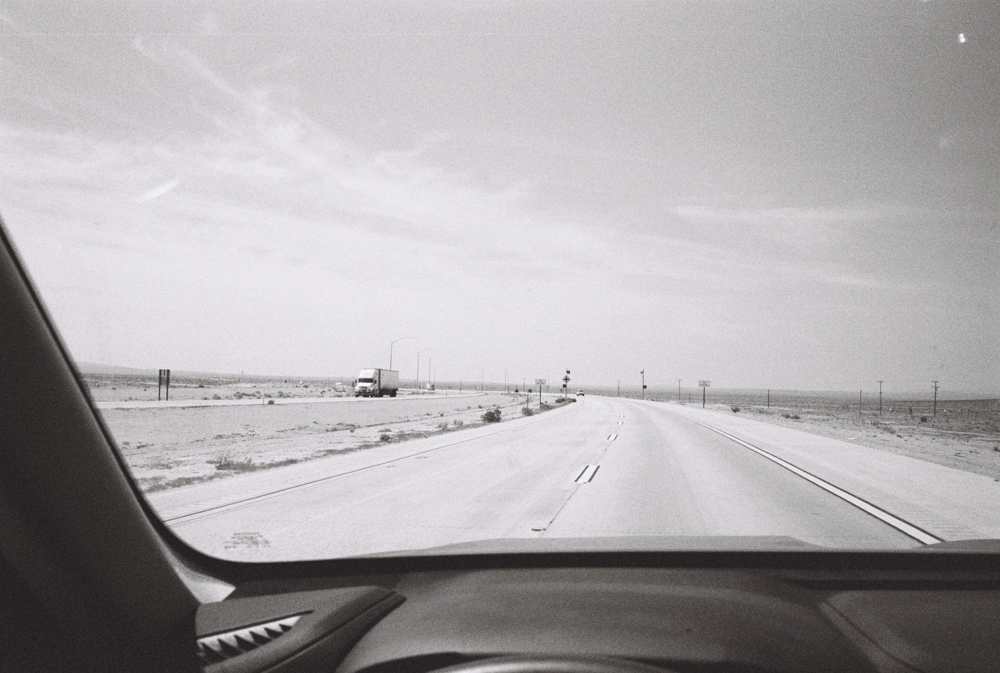

---
categories:
- lettre
date: 2023-07-13T21:23:44+02:00
newsletter: true
tags:
- la lettre
emoji: 💌
title: "46 - Joyeux anniversaire, putain de cancer, déconnexion"
color: rosewater
slug: "46"
resources:
  - src: "*.webp"
  - src: "*.gif"
description: "L'été est arrivé, il pleut le matin, fait beau l'après-midi. Les enfants sont à la maison. Les deux s'occupent. Je me dis qu'il est temps d'écrire. Cela fait un mois que je vous ai envoyé la dernière lettre."
---

*hello, moi c'est [Yannick](https://yannickschutz.com). je ne suis pas du tout régulier dans cette lettre et c'est peut-être tant mieux. je ne sais pas pourquoi je l'écris, souvent vous, lecteur, remplacez une séance chez un psy ou un appel à un ami je pense. donc merci merci d’être là. si vous aimez, n’hésitez pas à la partager. sinon, ne la partagez pas.*

 

✌️

Bonjour,

L'été est arrivé, il pleut le matin, fait beau l'après-midi. Les enfants sont à la maison. Les deux s'occupent. Je me dis qu'il est temps d'écrire. Cela fait un mois que je vous ai envoyé la dernière lettre.

Aujourd'hui, on est le 13 juillet. C'est un jour un peu spécial pour moi. L'anniversaire de mon père. Il aurait eu 72 ans. Je l'entends encore me traiter de con. Sa voix, seulement, je ne suis plus sûr, elle commence à s'atténuer. Comme si il était au fond d'une grotte et que le son avait du mal à me parvenir.

Je crois qu'avec le temps, je suis devenu un expert en deuil. J'ai l'impression d'avoir une sorte de devoir moral envers mes proches qui perdent des proches. Je leur répète mon discours habituel. "Le deuil, c'est comme les vagues, ça va, ça vient. Il faut juste rester sur sa planche. Parfois, une vague plus grosse vous renverse, il faut juste remonter sur la planche." Je tiens ce discours du magnifique et poignant bouquin ["In waves"](https://www.ajdungo.com/new-project-1) par [AJ Dungo](https://www.ajdungo.com). Bouquin que je m'empresse d'expédier aux dits amis... Pour ceux qui ont vu ["La vie aquatique avec Steve Zissou"](https://fr.wikipedia.org/wiki/La_Vie_aquatique), c'est un peu comme le moment où Steve décide de commander un bonnet rouge et un speedo à son fils. Une sorte de rite, les voilà dans le club.

Comme pour Steve, le deuil il fait mal. Tu as envie de te venger de cette saloperie de requin qui a emporté son pote. Alors pour te venger, tu fais [des dons](https://don.ligue-cancer.net/lamourlaligue/~mon-don?_cv=1), parfois tu es juste présent pour les amis, les écouter et leur parler. Parfois, simplement tu pleures ou tu écris. Putain de maladie...

C'est un jour pour commencer ses vacances...

Je ne pars pas cet été. On reste en Finistère. On accueille les gens qui décident de venir visiter. D'ailleurs, il vous reste une semaine en août pour venir. Si tu es libre [du 18 août au 26](https://checkout.lodgify.com/douarenn/fr/#/475377/20230818,20230826,4/-), viens, on est bien. Purée, y'en a qui vont croire que je vous ai d'abord attristé pour mieux vous vendre le truc après. C'est pas ça du tout. Juste que je parle de tout de rien, je suis décousu encore plus qu'un vieux plaid de ma grand-mère. Je devrais terminer la lettre ici, que tu sois un peu confus chère lectrice. Mais il n'en sera rien.

J'ai envie de te partager quelques liens sympa avant de déconnecter un peu pour les vacances. Genre [cette vidéo de Wes Kremer](https://www.youtube.com/watch?v=bbUGVFEO9Yc) qui justement vit une vie un peu déconnectée. Ou alors [cette interview de Lewis Arnold](https://climateandboardsports.substack.com/p/i-would-like-surfers-to-say-im-not) qui parle de Néoprène et de cancer... On y revient... Ou alors ce magnifique mini guide de Beside sur [Comment s'offrir du temps pour penser](https://beside.media/fr/atelier/comment-soffrir-du-temps-pour-penser/). Je pense que je reste pas mal focalisé sur ce sujet de moins être esclave des réseaux et mieux déconnecter. Même si au final, je ne sais pas si je suis très doué. Voilà comme tout en fait, c'est un chemin et parfois on se trompe.

Je vous laisser méditer là dessus.

Passez un bon vendredi,

Yannick

💌
