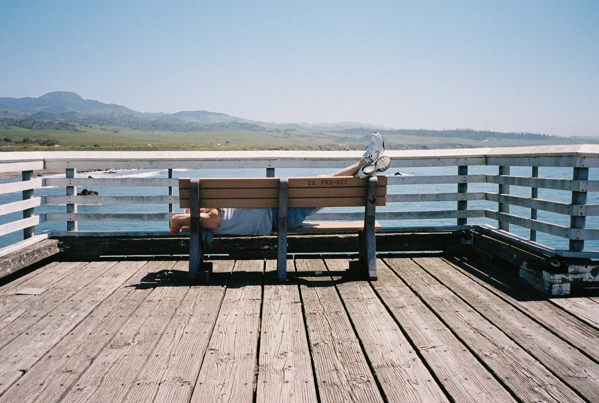

---
categories:
- lettre
date: 2023-10-04T20:23:44+02:00
newsletter: true
tags:
- la lettre
emoji: 💌
title: "47 - L'ennui, des mickeys et un héron"
color: rosewater
slug: "47"
resources:
  - src: "*.webp"
  - src: "*.gif"
summary: "C'est marrant comme dès que je met des règles, je les transgresse. Une lettre toutes les deux semaines, J'en ris encore... Comme si mon cerveau allait me laisser faire cela"
---

*Hello, moi c'est [Yannick](https://yannickschutz.com). je ne suis pas du tout régulier dans cette lettre et c'est peut-être tant mieux. je ne sais pas pourquoi je l'écris, souvent vous, lecteur, remplacez une séance chez un psy ou un appel à un ami je pense. donc merci merci d’être là. si vous aimez, n’hésitez pas à la partager. sinon, ne la partagez pas.*

 

✌️

Bonjour,

Je n'écris pas assez ces temps-ci. Je ne sais pas si je ne sais pas quoi dire ou si je ne sais pas comment le dire. C'est marrant comme dès que je met des règles, je les transgresse. Une lettre toutes les deux semaines, J'en ris encore... Comme si mon cerveau allait me laisser faire cela. Ce n'est pas du tout que je glande, je regarde le brouillard le matin, j'écoute la bête entrer dans notre toit le soir, je bois du café la journée. Vous voyez, j'ai une vie plutôt bien remplie et pleine de surprises. Je ne sais pas quelle bête vient sous notre toit par exemple.

J'ai le cerveau en ébullition. Aujourd'hui, on m'a demandé si je ne m'ennuyais pas ici. Mais bien sûr que si! C'est d'ailleurs bien là le but. Si je ne m'ennuie pas, mon cerveau ne se perd pas et ma créativité devient mécanique. M'ennuyer est positif. Cela me fait divaguer, flâner dans la campagne ou même prendre un livre pour lire. Ce sont là des activités de la plus haute importance. Je porte l'ennui comme un étendard, mon Union Jack à moi, le blason de la famille. 

Merde c'était une super graine que cette question. Pardonnez-mon français comme diraient les américains, qui ne parlent pas français. Moi, je m'excuse de mon anglais pas parce qu'il est vulgaire. Parce que il est remplit de fautes, mais on m'a dit de pas m'excuser. Donc, je ne m'excuse plus.

Bon, toujours est-il que cela fait un bail que je ne vous ai pas écrit. Depuis l'anniversaire de feu mon père. Ca fait un bail, je vous le disais. J'ai eu le temps de me balader partout. J'avais envie de vous partager un peu de liens. J'en ai lu un paquet ces derniers temps. Et c'est cool, ça me permet de vous les partager.

Je flânais sur les internets en passant de lien en lien et de site en site quand mon curseur fût attiré par [ce site](https://guestbook.goodenough.us). Il était décrit sur un autre site comme "Printable guestbook". Mon cerveau se disait que cela serait un objet à vendre et à faire. Mais quelle erreur. Vous pouvez dessiner un petit quelque chose et une imprimante thermique l'imprime dans un bureau à Londres, je pense. Un feed YouTube live vous permet de voir votre oeuvre sortir et, plus tard, elle reçoit même [un lien](https://t.co/o7vDsZjXpS). Bon pas ce lien là car celui là, c'est le mien.

Je suis tombé sur ce lien de Steph Ango. Un petit rappel du comment bien acheter et ce que l'on devrait toujours priotiriser l'hors d'un achat. Il parle du coût par usage. Exemple simple, un t-shirt à 10€ qu'on met 2 fois contre un t-shirt de meilleure qualité qu'on mettra plus de fois. J'adore ce passage.

> The best things to splurge on are the things you use the most. If you sit on a chair eight hours a day, then a nice chair is probably a good investment.

Bien souvent, on parle du moins mais mieux. C'est exactement ceci. Que privilégier lors de l'achat. Parfois, cela ne sera pas le coût par usage mais le nombre de sourires que la chose nous procure. Tant que ces choix sont conscients, on devient de meilleurs consommateurs.

Et en dernier, un [trailer](https://www.youtube.com/watch?v=Q2aTi0BQXek) du dernier Miyazaki. L'homme qui faisait comme les chats. Il sait pas trop si il continue ou si il arrête. En tout cas, ce trailer me met déjà en joie et en pleurs pour le film. Cela à l'air d'être encore un magnifique drame dans un monde proche mais parallèle. J'ai hâte de le voir!

Voilà c'est déjà tout pour ce mercredi,

À bientôt et bonne soirée à vous,

Yannick
