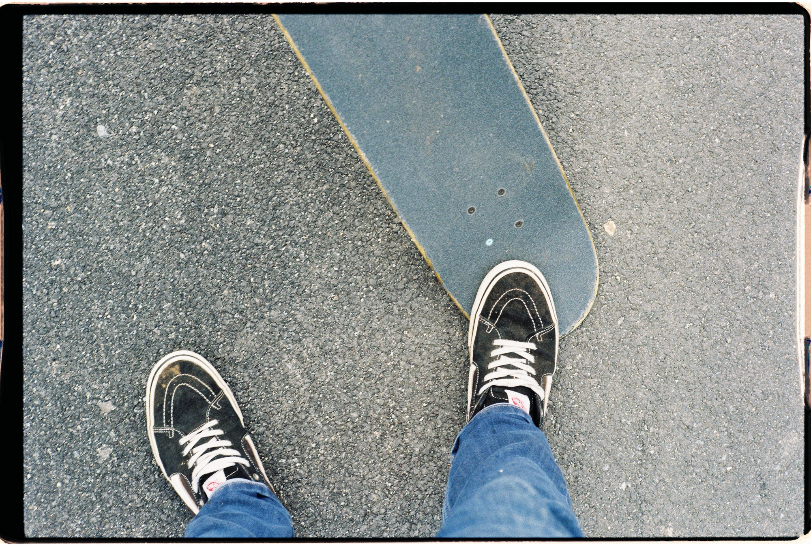

---
categories:
- lettre
date: 2023-11-21T02:23:44+02:00
newsletter: true
tags:
- la lettre
emoji: 💌
title: "48 - Cacao, casquettes et roulettes"
color: sapphire
slug: "48"
resources:
  - src: "*.webp"
  - src: "*.gif"
description: "Les fêtes de fin d'année approchent, c'est le moment de ressortir les gros pulls, les manteaux qui tiennent chaud et de faire tourner votre meilleure recette de chocolat chaud"
---

*Hello, moi c'est [Yannick](https://yannickschutz.com). J'adore vous envoyer des lettres quand je ne sais pas trop quoi écrire. Vous êtes mon émulation et une sorte de cadavre exquis de l'écriture. Cela tourne souvent autour de mes passions. Parfois pas. Merci de continuer à me lire et merci de donner un sens à ces mots tapés sur un clavier. Si vous aimez ceci, partagez-le. Je ne fais pas trop de pub, vous êtes ma pub aussi. Capitalisme pyramidal, mon amour.*

 

✌️

Bonjour,

Les fêtes de fin d'année approchent, c'est le moment de ressortir les gros pulls, les manteaux qui tiennent chaud et de faire tourner votre meilleure recette de chocolat chaud. La mienne? Du lait et du cacao à outrance. Manger la poudre de cacao, buvez le lait. Comme pour les gâteaux, je les mange avant cuisson. C'est la vie de bohème ça, mon bon monsieur.

Cette semaine, j'ai commencé quelque chose que je ne pensais pas forcément faire il y a un an. J'ai lancé ma micro-entreprise. C'est comme le micro-dosage mais pour les entrepreneurs, je pense. Tu micro-doses les impôts, le temps de travail et la rémunération. Ce n'est pas encore finalisé, mais le document est lancé. Je suis officiellement micro-indépendant en plus du travail normal. Je ne le quitte pas là. Donc, cela fait une troisième casquette officielle, je suis slasher comme ils disent les médias... J'ai hâte de pouvoir réaliser quelques projets et de ne pas me demander si c'est bien légal tout ça. Comme le boulanger-pâtissier ou le boucher-charcutier. Je vous laisse trouver la meilleure paire de jobs.

Ces derniers temps, je lis beaucoup sur le skate. Je regarde des vidéos avec Tom ou sans. Je poste des photos de ma fille sur un skate. Et donc, c'était normal pour moi d'[écrire sur la vraie petite reine](https://yannickschutz.com/on-skateboarding/). L'autre n'a que deux roues... C'est amusant comme certaines passions sont en boucle dans votre vie et en trame de fond sur beaucoup d'autres passions et façons de vivre ces passions. Je pense toujours que mon approche DIY, dans le software, dans la photo et dans la vie, vient de là. C'est un côté créatif mais parfois aussi hyper chaotique. L'avantage, c'est que quand tu as appris à sauter trois marches et que tu t'es planté 50x avant de réussir, rater un truc dans la vie est plus simple. Tu tombes, tu te relèves et ça repart.

En parlant d'échecs, mes [deux petits zines de début d'année](https://yannickschutz.com/shop/) en sont. En termes de vente, pas de production, ni d'amour. Je suis hyper content de ce que j'ai fait, mais c'est trop personnel pour les gens. Ou juste un mauvais timing. Ils n'ont pas eu la visibilité, la vente ou autre. Je m'en moque, cela ne m'empêche pas de les aimer, les donner et d'en faire d'autres. On me demandait des livres/zines sur notre trip en Californie. Je bosse sur une paire de zines. Elle se nommera ["Half Half"](https://en.wikipedia.org/wiki/Half_and_half#Canada_and_the_United_States). La référence est double voire triple selon les personnes concernées. Par exemple, si un magicien t'a déjà coupé en deux, ça fait trois. Sinon, c'est souvent deux. Je vous laisse aussi deviner le pitch de chacun, etc. J'ai hâte de le faire imprimer pour moi déjà. Puis on verra selon l'intérêt, si j'en fais une version publique. Sinon, vous serez les bienvenus à la maison pour les voir.

Cette semaine, j'ai regardé une [vidéo Red Bull sur le surf à San Francisco](https://www.youtube.com/watch?v=uaeamUAN8gU). J'aime beaucoup comment, même en surf, San Francisco se démarque de ses compatriotes californiennes. J'aime cet aspect plus intimiste, plus alternatif de la vision du surf. Je n'aime pas du tout le côté hyper commercialisé du sport. On peut revenir sur mon approche du skate qui est fort similaire. Je regrette d'ailleurs le manque de présence de productions plus alternatives dans les vidéos de surf. La preuve, je vous partage une vidéo Red Bull. On va croire que je suis sponsorisé.

Avec Tom, on a fini de regarder la vidéo de skate de Thomas Campbell. ["Ye olde destruction"](https://vimeo.com/341250403) est encore une fois filmé en 16mm principalement. Full noir et blanc, une production hyper soignée mais en même temps tellement barrée. J'apprécie vraiment l'approche de Mr. Campbell dans tout ceci. Ses vidéos de surf font un peu exception d'ailleurs dans mes favorites. On y voit des morceaux de skateparks se faire construire sur des voitures, des voitures devenir des morceaux de skateparks et autres joyeusetés. Je vous laisse découvrir la vidéo. Je découvre aussi [l'artiste responsable du style zine](https://sergejvutuc.com/) de la vidéo (Sergej Vutuc) et je dois vous avouer que ça me plaît. Tout n'est que boucles.

Bon mardi,

**Yannick**

💌
