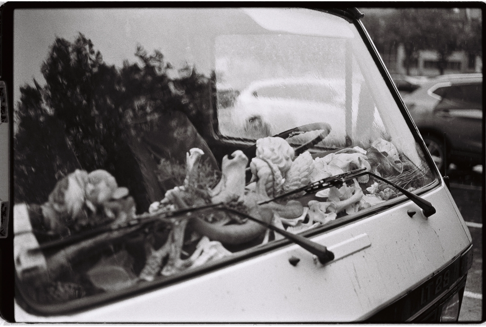

---
categories:
- lettre
date: 2023-12-07
newsletter: true
tags:
- la lettre
emoji: 💌
title: "49 - Des liens, des liens & encore des liens"
color: mauve
slug: "49"
resources:
  - src: "*.webp"
  - src: "*.gif"
description: "J'accumule des liens, par centaines. Certains d'entre vous vont sur la page pour les lire, d'autres ont le RSS. Mais parfois j'aimerais juste mettre un mot de plus sur les liens. Histoire de pas juste partager comme ça."
---

*Hello, moi c'est [Yannick](https://yannickschutz.com). J'adore vous envoyer des lettres quand je ne sais pas trop quoi écrire. Vous êtes mon émulation et une sorte de cadavre exquis de l'écriture. Cela tourne souvent autour de mes passions. Parfois pas. Merci de continuer à me lire et merci de donner un sens à ces mots tapés sur un clavier. Si vous aimez ceci, partagez-le. Je ne fais pas trop de pub, vous êtes ma pub aussi. Capitalisme pyramidal, mon amour.*

 

✌️
Bonjour,

J'accumule des liens, par centaines. Certains d'entre vous vont sur la page pour les lire, d'autres ont le RSS. Mais parfois j'aimerais juste mettre un mot de plus sur les liens. Histoire de ne pas juste partager comme ça.

On va essayer ça en 2024. En attendant, petite compilation de liens récents que j'ai aimé surfer. Un format un peu différent, pour une fin d'année.

On ne papote pas, on démarre. À vos onglets, prêts, partez.

1. On ne présente plus Jack Black. Alors quand on tombe sur une vidéo de lui qui fait le classique ["Do a kickflip"](https://yewtu.be/watch?v=TxjnJMc_qWs), on regarde et on rit.
2. Faire des cadeaux, ce n'est pas toujours le plus simple. La vidéo [The rule of Gifting](https://yewtu.be/watch?v=WqYIkm66RSI&t=1) est simple et donne des bons indices sur comment être un meilleur offreur. Si si, ça se dit.
3. Manuel Moreale fait des interviews de blogueurs. Ici [Robin Rendle](https://manuelmoreale.com/pb-robin-rendle) parle de son blog que je suis. J'adore. Tellement cool de lire sur les derrières de la scène. Et purée, cette [Rube Goldberg machine](https://en.wikipedia.org/wiki/Rube_Goldberg_machine) de Shortcuts!
4. Agencement et Valérie Damidot chez [Sylvain Paley](https://www.youtube.com/watch?v=6jrmHeAixPE). J'adore son ton, ses nouvelles vidéos sont un petit délice de simplicité et c'est toujours cool de voir l'agencement chez les gens. J'adore ça. Vous aviez vu mon [channel sur les décos de maison](https://www.are.na/bonjour-yannick/home-8yncj170c-4)?
5. [Skario Kart](https://gamegrooves.bandcamp.com/album/skario-kart-a-ska-tribute-to-mario-kart-64), Nintendo version ska. Sérieux, Internet régale avec des trucs comme ceux-ci.
6. Je ne sais pas ce que vaut [ce site](https://you-are-laurel-right.neocities.org/), j'attends le 15 mars pour voir. Mais je ne suis pas déçu.
7. Cette [page web](https://syllabusproject.org/syllabus-for-taking-an-internet-walk/) vous explique comment ne pas rester sur les nationales du web. Si en voiture, vous aimez les petites routes, sortez de Google et allez voir sur les internets aussi.
8. Une [vidéo Red Bull](https://www.youtube.com/watch?v=uaeamUAN8gU&t=1375s) sur le surf à SF, sa culture, le type de communauté, les spots, son histoire. Un vrai petit plaisir de marginalité dans ces communautés qui s'homogénéisent.
9. [Faire ton site photo comme un livre](https://pjonori.blog/posts/photo-site-design/). Le mix du tangible adapté au net. Faites de la place pour les photos et laissez-leur l'espace de s'exprimer.
10. J'ai toujours envie de faire des livres. J'adore cet objet. Et [ce livre](https://londonbookarts.org/collections/tools/products/japanese-bookbinding-instructions-from-a-master-craftsman) en plus d'être beau semble utile.
11. Je découvre cette [magnifique marque](https://www.makr.com/info/about/) via [Aurélien](https://www.instagram.com/aurelienbacquet/). C'est beau, je n'ai pas besoin d'un nouveau portefeuille mais cela donne envie en tout cas.
12. Un des trucs les plus importants que j'ai appris ces dernières années, c'est sans doute que [tu ne choisis pas ce qui t'arrive, mais tu peux choisir comment tu réagis](https://foryou.micro.blog/2023/10/04/you-can-choose.html). Tu peux rire de ton malheur, tu peux être triste de ton bonheur. C'est toi qui choisis les réactions.
13. Bon, on a fait une [magnifique cabane](https://douarenn.fr) cette année. Et j'adore les petits espaces. Alors, [cet appart](https://www.nevertoosmall.com/episodes/jourdain-paris/) c'est totalement ma came. Au final, les chambres de bonnes à Paris, cela peut être inspirant aussi.
14. [La solitude](https://craigmod.com/roden/086/), parfois on la hait, parfois on l'adore. Craig Mod s'exprime de manière tellement touchante et belle sur son "aloneness". Prenez une minute aussi pour mater [son nouveau livre](https://shop.specialprojects.jp/products/things-become-other-things-1st-ed/). C'est de l'art.
15. C'est l'heure d'apprendre à faire un [kickflip](https://www.youtube.com/watch?v=9siogRgZo3Y) - Pardon, une [vrille](https://ma-veille-juridique.com/liste-relative-au-vocabulaire-du-sport-glisse-urbaine-termes-expressions-et-definitions-adoptes/) au planchodrome urbain.
16. [Les tentatives de Lego](https://www.wired.com/story/lego-haunted-by-its-own-plastic/?mc_cid=fa04558169&mc_eid=561e2e9468) de faire des briques plus vertes. Incroyable de se dire que leur recette la plus polluante reste la plus propre vu la durée de vie de l'objet.
17. [Les idées sont juste des idées](https://goodenough.us/blog/2023-08-23-bad-ideas-are-fun/), elles peuvent être pourries, ça reste des idées. Parfois, y'a des bonnes.
18. Les [trends](https://www.trendymood.com/lutter-contre-luniformisation-des-images/), c'est trendy et puis ça passe. Faites ce que vous aimez.
19. [Une palette de couleurs pastel](https://github.com/catppuccin/catppuccin) pour tous vos outils sur les ordinateurs. Je l'utilise sur mon site d'ailleurs. Parce que je bosse trop sur ordinateur.
20. [Parler de caca avec son voisin](https://marleegrace.substack.com/p/i-quit-instagram), c'est mieux que des petits cœurs sur les réseaux. Marlee Grace a ce don pour parler de tout ça avec simplicité.
21. [Une série de podcasts sur la vie de Miki Dora](https://www.pushkin.fm/podcasts/lost-hills/lost-hills-season-3-the-dark-prince). Quand le monde du surf se fait true crime. Plutôt génial à écouter.
22. Arena, je vous le disais, doit être un de mes coins sociaux d'internet favoris, et leurs [motivations sont bonnes](https://www.are.na/blog/on-motivation). J'adore leur approche.

Vous êtes malins, vous n'en comptez que 22. Mais pensez hors de la boîte comme disait Steve.

Bon jeudi,

Yannick
