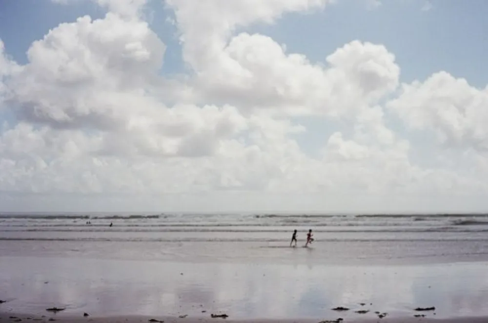

---
categories:
- lettre
letter: "bonjouryannick"
date: 2020-11-21T00:00:00Z
newsletter: true
resources:
  - src: "*.webp"
tags:
- la lettre
emoji: 💌
color: rosewater

title: "5 - Mauvaise religion, disette et chocolats"
slug: "5"
description: "Bonjour, Halloween est derrière vous, Noël arrive tout doucement. Il est temps de sortir les décorations, de couper le sapin et tout ça. Si le gouvernement le permet. "
---

👋🏻

Cette newsletter vous est envoyée par Yannick, il ne l’a pas écrite sur papier, mais il aurait pu.

Bonjour, Halloween est derrière vous, Noël arrive tout doucement. Il est temps de sortir les décorations, de couper le sapin et tout ça. Si le gouvernement le permet. Mariah Carey remonte dans le nombre d’écoutes Spotify comme chaque année. Je recommence aussi à écouter des albums de Noël, car j’adore cela. Mais vous n’êtes pas venus pour ça, n’est-ce pas. 

En fait, je meuble un peu car je ne sais pas de quoi vous parler. Tom vient de m’annoncer que l’on n’avait quasi plus de chocolats déjà. Il va être temps de sortir de notre grotte et aller en racheter. Je pense que c’est plutôt réconfortant le chocolat. 

 La lecture me réconforte beaucoup dans ces moments où l’on ne peut sortir autant que l’on voudrait. Je suis en pleine lecture de l’[histoire de Bad Religion](https://badreligion.com/dowhatyouwant) et c’est vraiment agréable. Je ne sais pas vous mais les biographies ont pour moi un aspect super intéressant qui me donne souvent envie de voyager que cela soit dans l'espace ou le temps. Là, par exemple, j'aimerais découvrir le Los Angeles des années 80. J'ai eu la chance d'y aller mais je ne savais pas du tout que Hollywood avait été le berceau d'une partie du punk californien avant de lire ce livre.

Le réconfort, ce n’est pas de mettre un bouton Reel et un bouton achat là où vous aviez les likes et la création de contenu, je parle de toi Instagram. Ce réseau change et me plait de moins en moins. Il est temps de me refaire [une petite disette numérique](https://yannickschutz.com/un-mois-de-disette/) de réconfort sans réseaux pour décembre. Comme ça, je finis l’année comme je l’avais commencée. Je pense avoir changé énormément mon approche aux réseaux sociaux et la productivité individuelle sur cette année particulière. Partir de ce culte et revenir à des choses réelles et tangibles. Ralentir et réfléchir, ne plus se faire avoir par la photo Instagramable. J'essayais depuis un moment de me défaire de cela. Je pense être arrivé à une utilisation satisfaisante de ce réseau. Beaucoup plus de mots que d'images.

Le réconfort, c’est écouter l’[enthousiasme de Sierra Prescott parlant de skateboard](https://www.youtube.com/watch?v=8Rglr-dwQkk) et de photos avec Matt Day. [Son livre](https://www.penguinrandomhouse.com/books/611662/shredders-by-sierra-prescott/) que je vais sans doute mettre sur ma liste de Noël. Et cela me donne fortement envie de remonter sur une planche aussi. Je recommence à proposer à Cloé que l'on construise une mini rampe dans le fond du jardin. Elle n'est pas contre. Je me vois avec Tom et des protections dessus. Comme le reste de mon équipe au boulot, me casser quelque chose. Rire et y laisser une dent.

Comme quoi le réconfort, c’est aussi simple que cela. Pas besoin de plus de chocolats. Mais j’irai quand même en rechercher. Et si vous n’avez pas encore toutes vos idées pour votre liste de Noël, je vous suggère [cette petite liste de Grégory](https://phototrend.fr/2020/11/cadeau-photo-liste-pere-noel-gregory-mignard/). Parce que moi, les listes me réconfortent. J'aime bien le contenu prémaché, les suggestions d'amis et de personnes que j'admire. C'est simple et cela m'évite de devoir distiller tout par moi-même. J'ai longtemps été un utilisateur assidu de The Wirecutter qui teste pour toi le meilleur truc. Mon imprimante vient de là entre autres. Et le plaisir ces derniers temps, c'est de voir que des gens choisissent ce que toi tu as choisi parce que ils te font confiance. 

Dernier point, la culture c'est encore et toujours du réconfort. Je vous invite à aller voir une exposition en live Instagram redifusé! C'est sur le profil de [Mathieu Lodin](https://instagram.com/matlodin). C'est une exposition photo sur l'attente. Je vous laisse découvrir cela. Avec le déménagement, les enfants et le cours de la vie, cela faisait un moment que je n'avais pas été voir une expo. Cela me manquait. Même si celle-ci n'avait pas le même goût que en vrai, c'était une approximation satisfaisante. Merci Mathieu.

J’espère que cette petite lecture vous a amené un peu de réconfort dans ce monde un peu flou.

Prenez soin de vous et à très vite,

Yannick

_P.S. Je pense avoir battu le nombre de fois où je disais réconfortant au cas où vous n’auriez pas remarqué._
 

💌
