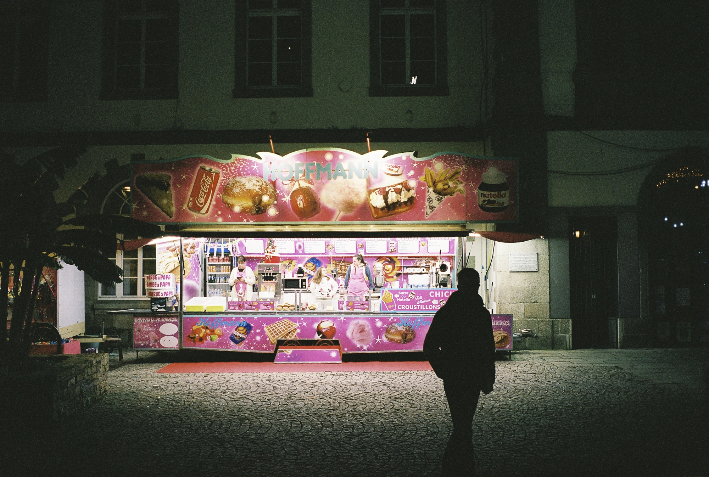

*Hello, moi c'est [Yannick](https://yannickschutz.com). J'adore vous envoyer des lettres quand je ne sais pas trop quoi écrire. Vous êtes mon émulation et une sorte de cadavre exquis de l'écriture. Cela tourne souvent autour de mes passions. Parfois pas. Merci de continuer à me lire et merci de donner un sens à ces mots tapés sur un clavier. Si vous aimez ceci, partagez-le. Je ne fais pas trop de pub, sauf cette fois. Capitalisme pyramidal, mon amour.*

✌️

Bonjour, 

Cette semaine, on a appris un truc révoltant pour l’école de mes enfants. Des gens ont fait des projections et ont décidé que le nombre d’enfants diminuait. Ils se sont alors dit que c’était intelligent de fermer une classe dans une toute petite école de village. En vrai, nous, on est sur le terrain. On est des locaux. On voit bien les parents arriver, les enfants aussi. On comprend que les gens veulent du calme du centre Bretagne. On les voit vouloir emménager et galérer à trouver des terrains. On les voit finir par s’y installer et s’y plaire. On le sait que les statistiques qu’ils n’arrivent pas à nous montrer, les projections et autres sont erronées. Un tableur, cela ne vit pas un lieu. Cette fermeture, c’est une coupe budgétaire plus qu’autre chose. Et donc, on a décidé de se battre contre ça. On commence avec une [pétition que vous devez tous signer](https://chng.it/gh6LSByTnR). En vrai, si vous ne signez pas, je vous aime quand même mais différemment. Mais on espère garder cette quatrième classe. On les aime, les professeurs de cette école.

J’avais pas vraiment pensé devoir commencer ma première lettre de l’année comme ceci ! Mais bon, c’est peut-être le plus important morceau de ma tête en ce moment. J’ai aussi fini 2023 sur des nouveautés... Vous saviez bien sûr que l’on avait lancé [Douarenn](https://douarenn.fr). Les réservations se passent bien, on commence à avoir de la visibilité inattendue, des articles de magazines et autres. Un vrai plaisir. Alors, je me suis dit, ne serait-il pas temps de lancer Bonjour dans le monde réel. Non pas en lettre physique, bien que je reviendrai sur cette idée plus tard. Mais en tant que photographe indépendant. Mon but est de raconter des histoires pour les marques de manière authentique. Comme je raconte notre vie en photos. Apporter ce petit truc aux marques et aussi mon but secret : être publié dans des magazines en faisant du photo reportage. L’ultime bénédiction serait d’être visible dans un des nombreux magazines qui remplissent mes étagères. On y croit.

J’ai aussi eu envie de pouvoir vous écrire une petite lettre papier mais rendre cela plus “exclusif”. J’ai donc créé une [page dédiée](https://ko-fi.com/bonjouryannick) avec une partie membres pour me supporter et je vous enverrais des trucs papiers, une carte postale, une lettre, un print, ou qui sait même le zine 2023 de mes 100 choses. J’ai juste envie de transposer au monde réel ce que je fais sur le net. Si vous ne pouvez pas vous le permettre, n’hésitez pas à me contacter. J’ai envie de partager ceci de toute façon et j’espère que les supporters aideront à rendre tout ceci plus réel.

Bon, je ne vais pas que demander de donner, signer, faire. Je vais quand même un peu partager d’autres choses ! Si vous n’avez pas encore vu, j’ai fait le [classique 100 trucs cools pour 2023](https://yannickschutz.com/100-trucs-2023/). Le [compte du Gwidel Log fest](https://www.instagram.com/p/C2c8BhqL84h/?img_index=1) a utilisé mes photos pour rebooter leur communication et cela me met en joie. Allez les voir, ils sont cools ! J’ai transposé beaucoup de mes newsletters de substack vers mon lecteur RSS cette semaine. Et j’ai lu [un article intéressant sur comment une série de flux RSS peut foutre la même anxiété que un flux de réseau social](https://gkeenan.co/avgb/rss-readers-make-me-want-to-jump-into-a-vat-of-acid). C’est en anglais mais le site est beau en plus. Je vous partage aussi [ce cartoon qui résume assez bien mes passions](https://poorlydrawnlines.com/comic/purpose/) ! Je vous laisse vous perdre dans ses posts. La semaine dernière, [Aurélien](https://www.instagram.com/aurelienbacquet/) partageait [ce podcast sur l’histoire du design des planches de skateboard](https://99percentinvisible.org/episode/the-double-kick/). Le vrai design, pas juste les dessins dessous. J’ai pas chômé dans mes lectures et autres. D’ailleurs, mes lectures du monde réel sont à retrouver sur la page [/books](https://yannickschutz.com/books) de mon site. J’suis dans Black Water pour le moment à cause de Cloé. J’ai décidé de lire ses livres Kindle avant d’en racheter.

Bon samedi,

Yannick
