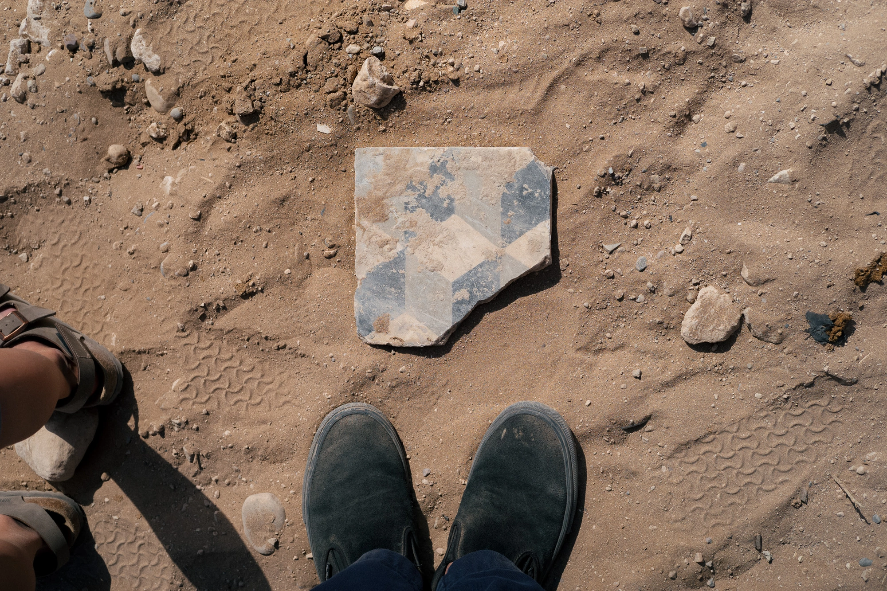

*Hello, c'est [Yannick](https://yannickschutz.com). Je pensais pouvoir écrire des lettres toutes les deux semaines, mais ma vie n'est pas aussi folle. Où alors, justement, elle l'est trop et je n'ai pas le temps. J'avoue écrire pas mal sur papier ces temps-ci. Peut-être que tu voudrais voir ça. N'hésite pas à me [supporter via mon ko-fi](https://ko-fi.com/bonjouryannick/tiers).*

✌ 

Bonjour,

Bienvenue aux nouveaux arrivants, j’espère que vous avez fait un agréable trajet jusqu’ici. Suite à un séjour au soleil, nous avons du mal à nous réajuster ici. Nous avons pris le temps de nous reposer un peu au [Maroc](https://yannickschutz.com/maroc-2024). Ou plutôt, d'y vivre des aventures. C’était pour moi l’occasion de tester un appareil numérique. Je n'avais pas pris plus que quelques photos avec le X100v de Cloé, ni utilisé de numérique depuis près de 4 ans. J'ai eu l'opportunité, via mpb, de tester quelques boîtiers avant de partir. Mais au final, rien qui ne restait. J’ai finalement trouvé un Leica m10-p qui m’a séduit sur Leboncoin. [Je vous en parlais d'ailleurs là-bas](https://yannickschutz.com/digital-quest/), dans la langue de Shakespeare ou de Trump pour les plus jeunes. 

Au Maroc, je me suis retrouvé à prendre plus de photos qu'avec un appareil à film. J’ai aussi pu me rappeler que numérique ne signifie pas auto-focus. Je me retrouve avec des ratés qui sont quand même beaux mais aussi, un paquet de belles photos. Je suis plutôt satisfait de ce choix. Maintenant, je me pose des questions sur l’usage du numérique ou du film dans mon quotidien et mon style documentaire. Bon sang, les éditions dans Lightroom, c’est fatigant. Même en utilisant des presets, je me retrouve à devoir choisir celui qui me plaît le plus et réajuster d’autres détails. Mon but sera de simplifier cette décision pesante et de ne pas avoir à choisir. Je n’aime pas cela. Soit j’accepterai les profils Leica ou alors cela me poussera à faire davantage de films. Nous verrons bien.

Durant ce voyage, nous avons également pu profiter des petits cafés qui fleurissent là-bas. Tom s’est découvert un amour naissant pour le café.  Moi, j'ai surtout pu rêver à mon projet d’ouvrir un café un jour. Cela reste l'une de mes envies de reconversion les plus fortes. Tom veut d’ailleurs y travailler. Commençons d'abord par être rentables sur [Douarenn](https://douarenn.fr). Cela démarre bien, il reste peu de dates pour l’été. C’est prometteur. Si vous voulez y venir, n’hésitez pas trop longtemps. Revenons au café. J'ai tellement d’idées, entre l’estafette café, le petit café avec un magasin d'objets/d’art qui me plaisent. J’ai tellement de sources d’inspiration dans le monde. Entre [Daydream Surf Shop](https://daydreamsurfshop.com/), [Galeria da Costa](https://www.instagram.com/galeriadacosta/), et tous les autres que j'ai enregistrés sur Are.na ou Raindrop. Ajoutons à ceux-là, [Daydream](https://www.instagram.com/daydreamhomegoods/) et [Hey Yallah](https://www.instagram.com/hey.yallah/) à Tamraght. Ces endroits sont tellement beaux. J’ai adoré y passer du temps, discuter et ressortir surcafféiné et surmotivé.

Je me rends compte, qu’avec cette déconnexion, j’ai oublié de vous partager quelque chose depuis la dernière fois. Je tiens à remercier ceux qui nous ont soutenus pour la pétition de la fermeture de classe à Berrien! La quatrième classe ne fermera pas, normalement. Je dis bien normalement, car tout peut toujours changer. Pas cette année du moins, espérons. Il semble que l’obstination des pouvoirs supérieurs fasse face à une possibilité constante. Il faut bien avoir un budget pour les petits uniformes qu'on veut leur imposer. Je me demande si c’est aussi Hugo Boss qui les fabriquera. Je divague.

Comme tu l'as peut-être lu dans l'introduction, j'ai introduit un [Ko-fi](https://ko-fi.com/bonjouryannick/tiers). Mon but est juste de payer les frais de cette newsletter et d'autres hébergements où j'écris. J'ai ajouté un niveau qui coûte moins cher qu'un café par mois si cela te dit. J'ai un peu suivi l'idée du [One a month club](https://oneamonth.club/), même si ici tout est gratuit pour vous. À votre bon cœur comme on dit. Merci à ceux qui me soutiennent déjà d'une manière ou d'une autre. Vous vous reconnaîtrez.

Il est temps de vous laisser profiter!

Bon dimanche,

Yannick
💌

