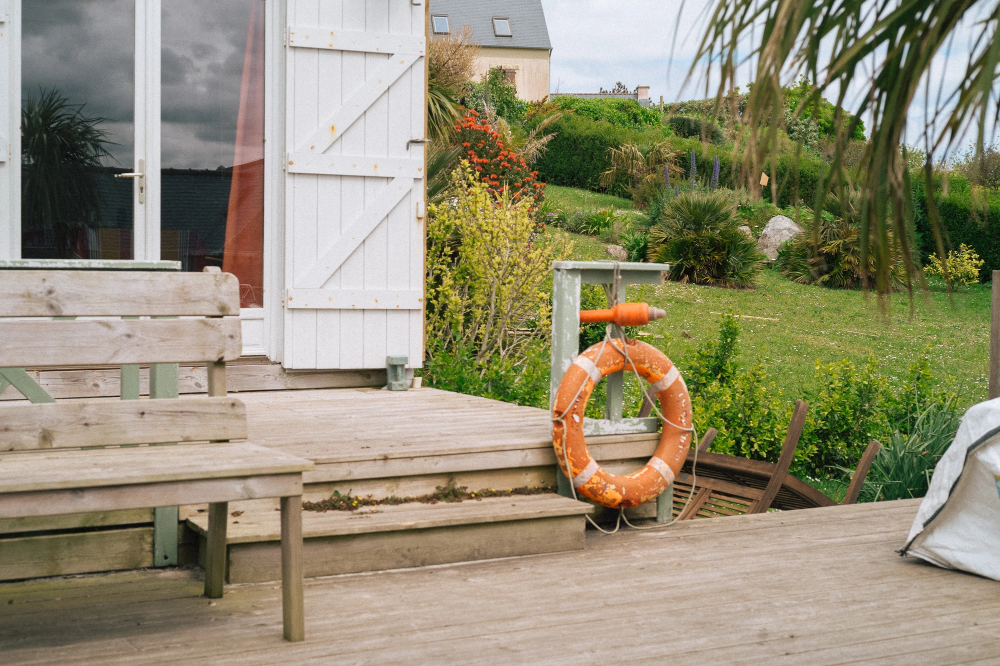

*Hello, c'est [Yannick](https://yannickschutz.com). Je pensais pouvoir écrire des lettres toutes les deux semaines, mais ma vie n'est pas aussi folle. Où alors, justement, elle l'est trop et je n'ai pas le temps. J'avoue écrire pas mal sur papier ces temps-ci. Peut-être que tu voudrais voir ça. N'hésite pas à me [supporter via mon ko-fi](https://ko-fi.com/bonjouryannick/tiers).*

Bonjour,

J'étais tellement absorbé par l'écoute de Hermanos Gutiérrez et la lecture de One Piece que j'en ai oublié de vous écrire pendant un certain temps. En réalité, c'est en partie vrai. La vérité, c'est que je n'ai pas beaucoup écrit cette année. Accaparé par le travail, le gîte, la famille et le surf, j'ai négligé l'écriture. C'est amusant comme la vie suit parfois des cycles différents. On prend le temps pour d'autres choses. Nos journées sont bien remplies. Elles sont belles, et le reste passe au second plan.

La semaine dernière, nous avons eu l'occasion d'aller voir le spectacle des Ogres de Barback avec les enfants. Leur représentation sous le chapiteau de Pitt Ocha est fantastique. J'avais oublié leur énergie scénique. Je me suis remis à écouter leurs albums et quelques lives. Celui avec la fanfare du Belgistan pour leurs 10 ans est particulièrement entraînant. Si leur tournée passe près de chez vous et que vous avez des enfants, je vous le recommande vivement !

Cela fait maintenant quelques mois que j'utilise le Leica M10-p, et j'adore toujours autant. Parfois, je me dis qu'un autofocus serait utile, mais je sais aussi que le fait de ne pas en avoir me force à réfléchir. Et c'est un plus pour mon cerveau, en fin de compte. Comme avec un carnet papier, je réfléchis en faisant au lieu de faire puis réfléchir. C'est ainsi que fonctionne mon cerveau. J'ai pu le tester récemment au [Gwidel Log Fest](https://instagram.com/gwidellogfest/) et pour prendre des photos du bain chaud de [Douarenn](https://douarenn.fr). Par rapport aux derniers rapports, je me sens plus à l'aise avec l'édition. Je doute toujours autant, mais j'ose davantage forcer certains traits qui parfois me plaisent, même si je ne les publie pas... oui, oui... Mais j'apprécie fortement cet appareil.

Je cherche toujours de belles optiques en 35, 50 et 85 mm à tester. C'est ainsi que je suis tombé sur [Mr Ding](https://mrdingstudio.com), sur [ce post](https://www.threads.net/@mrdingstudio/post/C4iQwNzr1FE) en particulier. Ils ont décidé de transformer une soixantaine d'objectifs du Contax T3 en optiques pour Leica. Je trouve l'idée tellement audacieuse. J'ai donc découvert ce monde des reproductions/transformations d'objectifs chinois. Pas de la production de masse, mais un travail d'orfèvre. [Light Lens Lab](https://lightlenslab.co), par exemple, se spécialise dans la reproduction des premiers summicron et d'autres brevets anciens de Leica. Les avis sur ces deux marques sont plutôt positifs. Certes, toujours un certain prix, mais une fraction de l'original.

Au Gwidel Log Fest, j'avais pris mon objectif 135 mm pour photographier le surf. Je pense que le viseur télémétrique montre ses limites pour la photographie de surf. 135 mm n'est vraiment pas assez pour capturer les surfeurs de près. C'est la première fois que je me dis qu'un téléobjectif serait intéressant. Il faut croire que je change. J'aurais peut-être dû prendre mon [Nikonos](https://yannickschutz.com/nikonos-v). Il commence aussi à prendre la poussière. Ne pas penser à l'emporter pour aller surfer, mais préférer simplement surfer. Il faut que je m'y remette. Mais je pense qu'un combo téléobjectif et Nikonos pour le prochain Log Fest serait cool. En réalité, je ne suis pas du tout déçu de ce moment passé à Guidel. Cela m'a permis de revoir des amis et d'en rencontrer d'autres. Le réseau de la mafia du longboard breton, quasiment.

Bon, je vous laisse retourner à vos occupations.
Merci de m'avoir lu.
Bon vendredi,

Yannick
