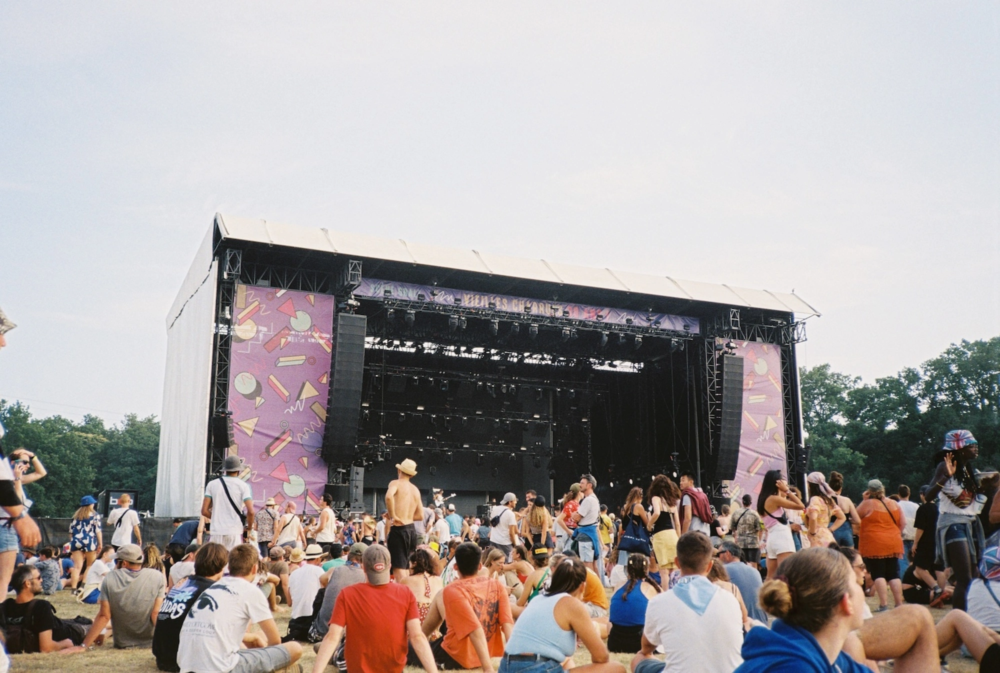

*Hello, c'est [Yannick](https://yannickschutz.com). Je pensais pouvoir écrire des lettres toutes les deux semaines, mais ma vie n'est pas aussi folle. Où alors, justement, elle l'est trop et je n'ai pas le temps. J'avoue écrire pas mal sur papier ces temps-ci. Peut-être que tu voudrais voir ça. N'hésite pas à me [supporter via mon ko-fi](https://ko-fi.com/bonjouryannick/tiers).*

Bonjour,

Je prends le temps entre deux choses pour vous écrire un petit mot. Plein de choses se passent en ce moment. J’ai fait mon premier photoshoot professionnel, merci Greg de m’avoir fait confiance. Le gîte entre en rythme d’été et le bain ne désemplit plus. Les légumes sortent, mais le soleil, pas trop. C’est l’été. Tom s’est fait une entorse, donc pas de surf pour lui cet été. Enfin, plein de choses. Et en même temps, j’en ai profité pour déployer un outil de gestion de petites lettres sur un serveur ici. J’espère que le template vous plaît et surtout que vous avez bien reçu cette petite lettre.

Cette année, le Blue Album de Weezer fête ses trente ans. Ils en profitent pour faire une [session studio avec Spotify](https://www.youtube.com/watch?v=P_vI3FV1H4U). Un vrai plaisir de les voir comme des enfants et de les écouter parler de cet album mythique. Dans les commentaires, on m’a fait remarquer que cet album est aussi vieux qu’un album des Beatles à la sortie du Blue Album. Ça retourne le cerveau et ne nous rajeunit pas vraiment.

Hermanos Gutiérrez viennent de sortir leur dernier album. J’ai eu la chance de l'avoir signé en vinyle bleu et vert. C’est une beauté en plus d’être un magnifique album à écouter. J’adore le design de leurs pochettes. Si vous voulez des recommandations par ces deux musiciens, je vous recommande ce [What’s in my bag chez Amoeba](https://www.youtube.com/watch?v=CwaRBtorP64), le célèbre magasin de musique US. Si vous ne les connaissez pas, je vous recommande [ce tiny desk concert](https://www.youtube.com/watch?v=wTqCthvtL8k) pour les découvrir. Ils sont sur le label de Dan Auerbach des Black Keys, [Easy Eye Sound](https://easyeyesound.com). Il produit d’autres groupes très chouettes. Je vous recommande de les écouter.

On continue dans la musique, mais on mixe avec du skate. Ce [podcast vidéo](https://www.youtube.com/watch?v=9FhkimD1YLY&t=6s) de Ben Harper au Nine Club est un plaisir à écouter aussi. Il faut y consacrer un peu de temps. Mais si vous aimez l’homme et la planche à roulettes, vous serez heureux de l’entendre en parler. On apprend qu’il fait vachement plus attention maintenant à ne pas abîmer ses mains en tombant, mais qu’il continue à pas mal skater malgré la notoriété et les tournées. J’adore vraiment ce podcast. Je me réjouis d’écouter [celui de Spike Jonze](https://thenineclub.com/blogs/episodes/spike-jonze). Je vous mets le lien même si je ne l’ai pas encore écouté.

Je vous laisse sur ces petits mots.

Bon jeudi à vous,

Yannick
