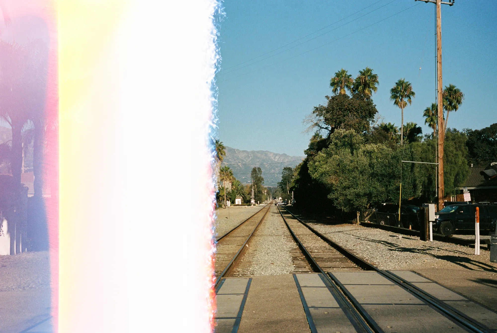

*Hello, c'est [Yannick](https://yannickschutz.com). Au cas où, je suis un photographe belge qui a trouvé refuge au fond du Finistère. N'hésite pas à me soutenir via [mon ko-fi](https://ko-fi.com/bonjouryannick/tiers?ref=bonjour.yannickschutz.com). Je me ferai un plaisir de t'envoyer un tirage.*

✌🏻

Bonjour,

C'est bientôt les fêtes de fin d'année, j'ai décidé de prendre de bonnes résolutions avant et de vous écrire. Cela me permet de faire de la dactylographie un peu. J'espère que vous allez bien ! Moi, avant de vous écrire, j'ai réfléchi et testé mille autres façons de vous envoyer cette petite lettre. J'ai tout migré sur 17 plateformes, testé Ghost, Substack et autres.

Au final, le mieux, je pense, c'est d'être dans votre boîte et sur mon site. Ailleurs, ce serait perdre la beauté de ce petit jardin. Comme par hasard, je tombe sur plein d'articles dans mon RSS qui parlent de ceci. Et je me retrouve dans ces mots de [Manuel Moreale](https://manuelmoreale.com/on-blogging-substacking-and-owning-digital-real-estate). J'ai envie de rester indépendant et pas de penser à la monétisation. Je vous laisse aussi découvrir ce concept d'[enshitification](https://pluralistic.net/2023/01/21/potemkin-ai/#hey-guys) si vous ne le connaissez pas encore.

> I’m fucking tired of living in a society where everything is monetised, where nothing is safe from speculation, where every passion has to be turned into a business.

Et puis ce petit poème du w3.

> What makes a cool URI?  
> A cool URI is one which does not change.  
> What sorts of URI change?  
> URIs don't change: people change them [^cooluris]

## 🔠

Je porte un amour assez gros aux chouettes typographies faites main ou le mono... Alors quand j'ai vu ce [pack de polices faites main par Matt Allen](https://matthewallenart.com/collections/hand-drawn-fonts) (Dont j'ai un super panneau kook peint à la main), je n'ai pas pu résister à vous le partager. Avant de, sans doute, craquer ! Dans la même veine, si vous ne connaissez pas encore, je vous recommande chaudement [mon pote Fran6](https://www.francischouquet.com). Il vient d'ailleurs de finir sa première expo ! **Trop fier de lui**. Vous pouvez voir l'[expo en replay](https://francischouquet.substack.com/p/video-tour-of-my-exhibition).

## 🎶 

J'ai écouté [une chouette playlist préparée par Ed Templeton](https://www.nts.live/shows/guests/episodes/ed-templeton-14th-october-2024). Les shows NTS sont assez cool. Ils ont ce superbe show [Skate Muzik](https://www.nts.live/shows/skate-muzik). Je vous le recommande. Ed Templeton, pour ceux qui ne le connaissent pas, c'est un skater, artiste, photographe, homme d'affaires avec Toy Machine. Et dans cette playlist, il repasse sur des chansons sorties de vidéos de skate mythiques. Un vrai plaisir pour les oreilles si vous aimez le punk, hardcore et autres musiques qui font bouger la tête.

## 📸 

J'ai la tête plongée dans les photos de Californie. J'attends toujours des pellicules qui sont en développement. J'ai pris pas mal de pellicules dites cinéma cette fois-ci. Je me réjouis de les recevoir. Affiner la sélection et envoyer à l'impression. Une série de 10x15 dans un premier temps imprimée par [Innocence](https://www.innocence-editions.com) (Pas de sponso, juste des chouettes impressions). Puis, j'ai envie de faire un petit zine sur ces deux voyages. Je ne sais pas comment cela se passe chez vous. Ici, on aime faire un zine privé pour chaque voyage et chaque année, on fait une rétro chez [Rosemood](https://www.rosemood.fr) car on aime leurs livres à couverture tissu. C'est un chouette moment pour repasser sur les photos de l'année, prendre du temps et apprécier les moments vécus.

J'espère que votre année fut belle ! N'hésitez pas à répondre et me raconter vos beaux moments.

À très vite,
Yannick
💌

[^cooluris]: w3 - https://www.w3.org/Provider/Style/URI

