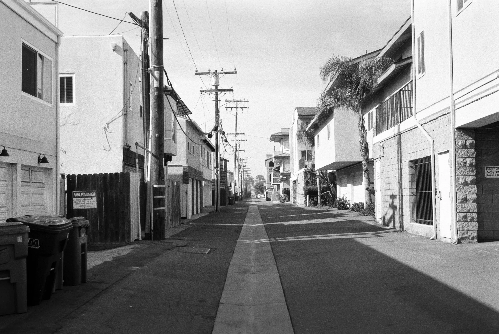

✌🏻
Bonjour,

Le mois de janvier vient de filer comme jamais. Je suis là avec ma gorge qui tousse et ma Bretagne qui souffle et pleut comme jamais. Je commence l'année plein de bonnes résolutions. En fait, une seule : combattre mon attitude qui me pousse à ne pas faire certaines choses qui me font du bien, avec des justifications très moyennes. Cela m'a permis de bien prendre le yoga en main et de m'accorder des instants de méditation que je me refusais inutilement avant. Cela me permet donc d'être vachement plus serein dans cette année que j'espère un peu folle. J'ai commencé à pitcher des projets photos à des marques qui me plaisent. Sans retour pour le moment, mais j'avance et j'aime ça. Un peu de pub pour Gladys et [sens collectif](https://sens-collectif.com). Merci ! Si vous voulez vous lancer en photo, c'est un chouette programme axé plutôt mindset et comment se vendre correctement. Cela m'a permis de lever certaines barrières que je m'imposais tout seul comme un grand.

🌍
Si comme moi, vous aviez été intrigué et conquis par le choix de Patagonia de faire de la planète leur seul actionnaire, vous allez sans doute apprécier [ce podcast en trois parties](https://www.wearelookingsideways.com/p/the-announcement-episode-1-decision) fait par Matt Barr de [Looking Sideways](https://www.wearelookingsideways.com). C'est en anglais, donc cela demande un peu de pratique, mais le contenu est fabuleux. La première partie parle de la décision en elle-même. La seconde parle de l'attention portée à cette décision et des retombées médiatiques sur le moment. La troisième est sur l'héritage possible d'une telle décision. Je dois encore finir la troisième partie sortie ce lundi.

🎶
J'ai calé sur [ce mix](https://www.youtube.com/watch?v=Vd7ssAtckko&themeRefresh=1) fait par une Japonaise tranquillement dans la cuisine de sa tante. La musique est assez groovy, des années 70-80 et franchement, j'ai refait une playlist Apple Music pour facilement réécouter car j'ai adoré. La femme me fait penser à une version japonaise de Cloé en plus. C'est tout un pan de YouTube à découvrir que ces mix d'une heure. Ça permet de varier des radios Spotify ou Apple Music, en sortant un peu de l'algorithme.

📰
[Cet article](https://www.theguardian.com/commentisfree/2025/jan/16/i-knew-one-day-id-have-to-watch-powerful-men-burn-the-world-down-i-just-didnt-expect-them-to-be-such-losers) sur les puissants de ce monde qui sont des gros losers est un plaisir à lire. Je n'ai pas grand-chose à rajouter à part : lisez-le.

🏄🏻‍♂️
Les amis Félix et El Druido ont sorti [une super vidéo de leurs sessions en Afrique du Sud](https://www.youtube.com/watch?v=EWkGYormb34). Un magnifique voyage à suivre avec eux. Il n'y a pas que des vagues, je vous laisse le découvrir.

☮︎
Je finis ces liens sur [ce super manifeste](https://substack.com/home/post/p-153445871) de Wesley Verhoeve. Il résume dans ce manifeste une série de valeurs que j'ai aussi par rapport à la photo et la créativité. Cela va de la résistance à l'algorithme à la physicalité des choses, en passant par la communauté et l'esprit rebelle. Personnellement, j'ai toujours voulu approcher la photo en ayant cet esprit DIY et punk. La culture du zine, la culture du partage et de l'envie de faire découvrir. C'est donc un plaisir que de lire ce manifeste écrit par un photographe que j'apprécie.

Voilà, c'est déjà tout pour nous.
Passez un beau mercredi,
Yannick
